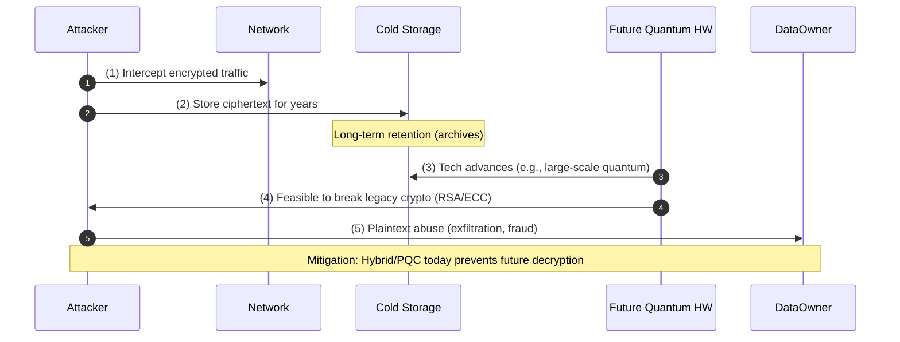
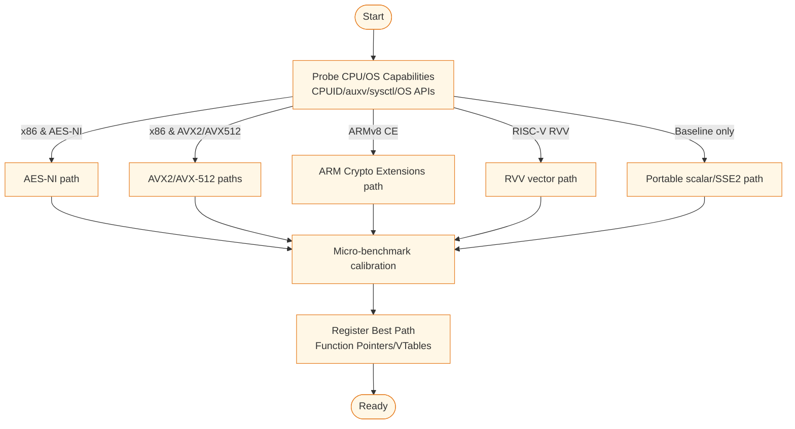
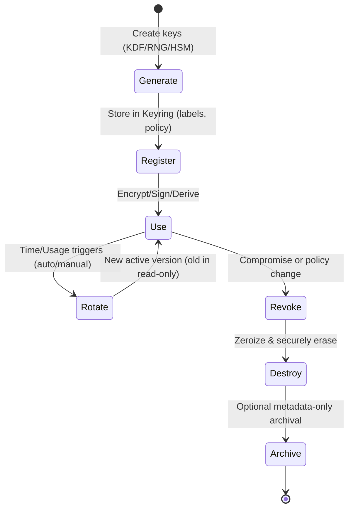
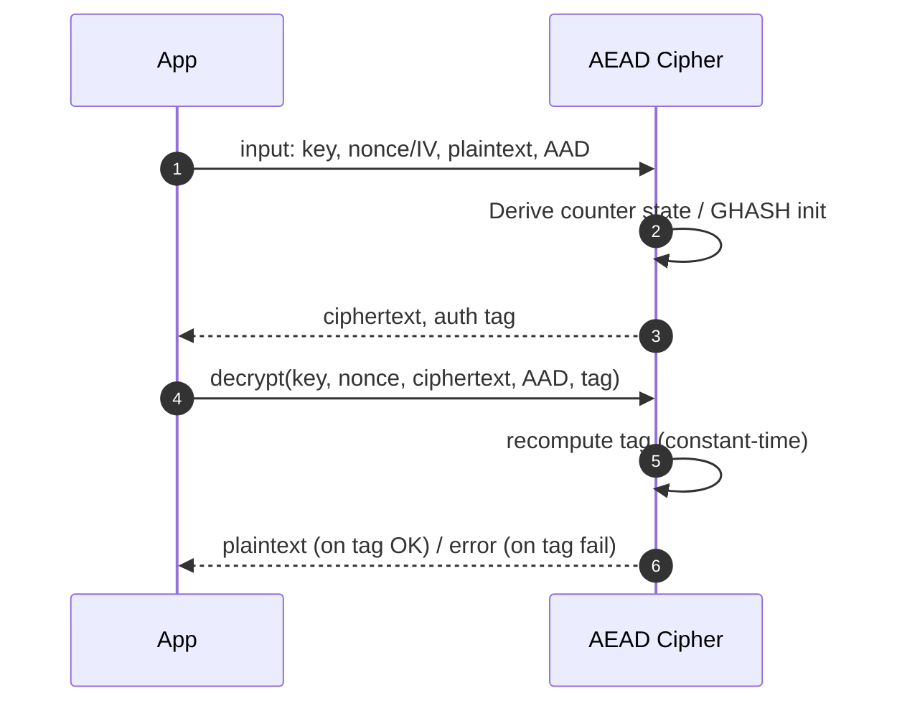

# DIAGRAMS.md
**XPScerpto — Architecture & Flows (English-only, final)**

> This document collects the core diagrams used to understand the XPSI Crypto platform: layered architecture, runtime dispatch, hot‑patch (zero‑downtime) updates, key lifecycle, AEAD dataflow, PQC hybrid paths, CSRNG/entropy flow, build pipeline for C++ Modules, and audit/telemetry streams. All diagrams are Mermaid-compatible.

---

## 1) Layered Architecture Overview
High-level view of how applications interact with XPSI Crypto, and how crypto modules sit above platform/ISA abstraction.

```mermaid
flowchart TB
  A[Client Applications<br/>(Services, Wallets, Gateways)] --> B[High-Level API & Orchestrator<br/>xps.crypto.api, orchestrator.*]
  B --> C[Policy Engine & Capability Negotiation<br/>FIPS mode, Allow/Blocklist, Min key sizes]
  C --> D[Core Cryptographic Modules<br/>AES-GCM • ChaCha20-Poly1305 • HMAC • SHA-2/3 • BLAKE3 • Ed25519 • X25519 • RSA-PSS • PQC (Kyber, Dilithium, Falcon)]
  D --> E[Key Management & Secure Storage<br/>Keyring, Auto-Rotation, Secret Sharding, Zeroize]
  E --> F[Utilities & Common Layers<br/>Hex/Base64X, CSRNG, Serialization, Metrics, Logging]
  F --> G[Platform & ISA Abstraction<br/>SIMD Dispatch, AES-NI, ARM CE, RVV, OS Primitives]
  classDef layer fill:#eef6ff,stroke:#4a90e2,color:#1a2a3a,stroke-width:1.1px;
  class A,B,C,D,E,F,G layer;
```

**Notes**
- The **Orchestrator** applies policy, runs self-tests, and chooses algorithms/paths.
- **Platform Abstraction** hides ISA details while enabling runtime-optimized code paths.

---

## 2) “Harvest‑Now, Decrypt‑Later” (HNDL) Threat Model
Why hybrid/PQC is essential for long-lived confidentiality.



---

## 3) Zero‑Downtime Hot Patch (Live Update) Flow
Roll out a patched crypto module while serving traffic.

```mermaid
flowchart LR
  subgraph ControlPlane[Control Plane]
    P1[Patch Package (.xpsmod)<br/>Signed & Versioned] --> V[Signature Verify]
    V -->|Valid| S[Staging Sandbox<br/>Self-tests & KATs]
    V -->|Invalid| R[Reject Patch & Alert]
    S -->|Pass| A[Activate Patch]
    S -->|Fail| R
  end

  subgraph DataPlane[Data Plane]
    O[Old Module vN] --> SW[Switch Router]
    P[Patched Module vN+1] --> SW
    SW -->|new sessions| P
    SW -->|in-flight sessions| O
    O -->|drain| GC[Graceful Close & Zeroize]
  end

  A -- Deploy --> P
  classDef box fill:#f4fff0,stroke:#2a7b3f,stroke-width:1px;
  class P1,V,S,A,R,O,P,SW,GC box;
```

**Key points:** Signed artifacts, isolated staging, KAT self-tests, graceful draining, automatic zeroize.

---

## 4) Runtime Dispatch Decision Tree (ISA/Feature Probing)
Select the fastest safe path at runtime without recompiles.



---

## 5) Key Lifecycle & Rotation
From generation to archival, with policy‑driven rotation and revocation.



**Safeguards:** secure buffers, zeroization, access control, audit trails.

---

## 6) AEAD (e.g., AES‑GCM) Data Flow
Nonce handling, AAD, tag verification, and error semantics.



**Rules:** unique nonce per key; constant‑time tag checks; no plaintext on failed auth.

---

## 7) PQC‑Hybrid HPKE Envelope
Combine classical + PQC KEMs to future‑proof session keys.

```mermaid
flowchart LR
  subgraph Sender
    S1[Generate ephemeral key] --> S2[Encapsulate with Classical KEM (e.g., X25519)]
    S1 --> S3[Encapsulate with PQC KEM (e.g., Kyber)]
    S2 --> S4[Concat or KDF-Combine secrets]
    S3 --> S4
    S4 --> S5[Derive AEAD key via HKDF]
  end
  S5 --> C[Encrypt payload (AEAD)]
  subgraph Receiver
    R1[Decaps Classical] --> R3[Combine]
    R2[Decaps PQC] --> R3[Combine]
    R3[HKDF derive] --> D[Decrypt (AEAD)]
  end
  classDef node fill:#eefafc,stroke:#0090a0,stroke-width:1px;
  class S1,S2,S3,S4,S5,C,R1,R2,R3,D node;
```

---

## 8) CSRNG (CTR‑DRBG) Entropy & Reseed
How entropy flows into deterministic DRBG per NIST SP 800‑90A.

```mermaid
flowchart TB
  E0[Entropy Sources<br/>OS RNG, HWRNG, RDSEED] --> C0[Collect & Mix]
  C0 --> P0[Instantiate DRBG<br/>(Key, V)]
  P0 --> G0[Generate Blocks<br/>(CTR mode AES)]
  G0 --> AppOut[Random Bytes to Callers]
  G0 --> RS[Reseed Counter]
  RS -->|threshold| R0[Reseed: gather fresh entropy]
  R0 --> C0
  classDef box fill:#f2efff,stroke:#6c4ef5,stroke-width:1px;
  class E0,C0,P0,G0,AppOut,RS,R0 box;
```

---

## 9) C++ Modules Build & Packaging Pipeline
From interface units to PCM/OBJ to linkable library and exports.

```mermaid
flowchart LR
  SRC[.ixx / .cppm (export interface/impl)] --> PCM[Compile → .pcm]
  PCM --> OBJ[Translate Unit → .o]
  OBJ --> LIB[Archive/Link → libxps_crypto.a / .so]
  LIB --> TEST[Unit/Integration Tests]
  LIB --> INSTALL[Install + CMake Export Sets]
  INSTALL --> CONSUMERS[Downstream Apps<br/>import xps.crypto.api;]
  classDef pipe fill:#fff0f0,stroke:#e63946,stroke-width:1px;
  class SRC,PCM,OBJ,LIB,TEST,INSTALL,CONSUMERS pipe;
```

---

## 10) Telemetry, Logging, and Audit
What gets recorded, where, and how it’s protected.

```mermaid
flowchart TB
  Ev[Crypto Events<br/>(key gen, rotate, verify-fail)] --> Log[Structured Logger]
  Err[Errors/Alerts] --> Log
  Log --> F[File/Syslog]
  Log --> M[Metrics (Prometheus/OTel)]
  Log --> SIEM[Security Backend (SIEM/SOC)]
  SIEM --> Alert[Incident Response]
  classDef l fill:#eef7f0,stroke:#2f7d32,stroke-width:1px;
  class Ev,Err,Log,F,M,SIEM,Alert l;
```

**Privacy:** no raw secret material in logs; IDs/tags only; optional hashing/anonymization for correlation.

---

## 11) Side‑Channel & Constant‑Time Boundaries
Where constant‑time and fixed‑access patterns are enforced.

```mermaid
flowchart TB
  CT0[Constant-Time Primitives] --> CT1[MAC compare • Key schedule]
  CT0 --> CT2[Scalar ladders (X25519) • Ed25519 core ops]
  CT0 --> CT3[Tag verify • KDF extract/expand]
  CT1 --> CT4[No early exits • mask-based op]
  CT2 --> CT4
  CT3 --> CT4[Code review gates & tests]
  classDef ct fill:#eaf9ff,stroke:#1da1f2,stroke-width:1px;
  class CT0,CT1,CT2,CT3,CT4 ct;
```

---

## 12) Failure Modes & Safe Defaults
How the system fails closed and surfaces actionable errors.

```mermaid
flowchart LR
  Call[API Call] --> Validate[Parameter & Policy Validation]
  Validate -->|invalid| Err[Fail Fast (exceptions / error codes)]
  Validate --> Exec[Execute Operation]
  Exec -->|auth fail| Err
  Exec -->|success| Ok[Return Result]
  Err --> Audit[Audit + Metrics + Optional Lockout]
  classDef fm fill:#f7f7f7,stroke:#666,stroke-width:1px;
  class Call,Validate,Err,Exec,Ok,Audit fm;
```

---

### Legend & Conventions
- **Solid boxes** are active modules or flows; **notes** explain design intent.
- Mermaid diagrams render in GitHub, GitLab, and most doc portals with Mermaid enabled.
- Keep secrets out of logs and diagrams; use IDs or hashed references only.

---

*End of DIAGRAMS.md*
