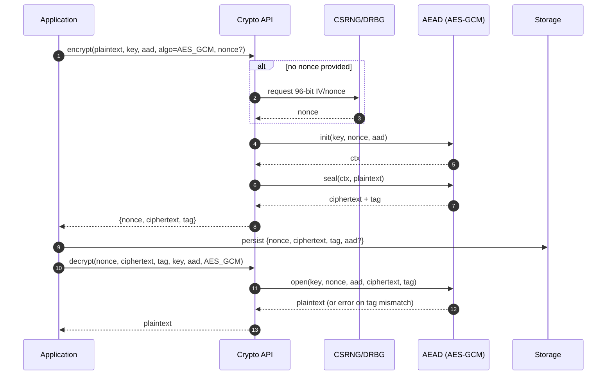
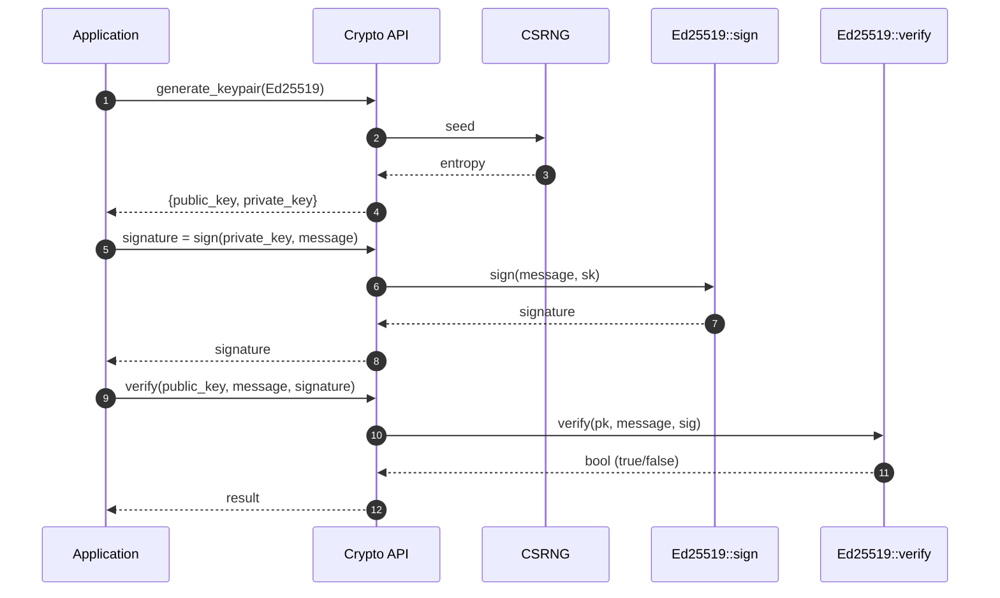
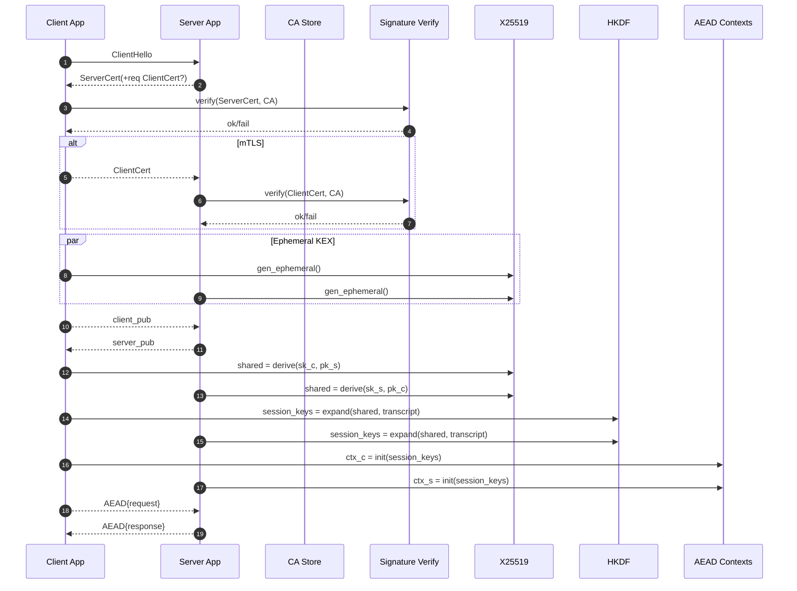
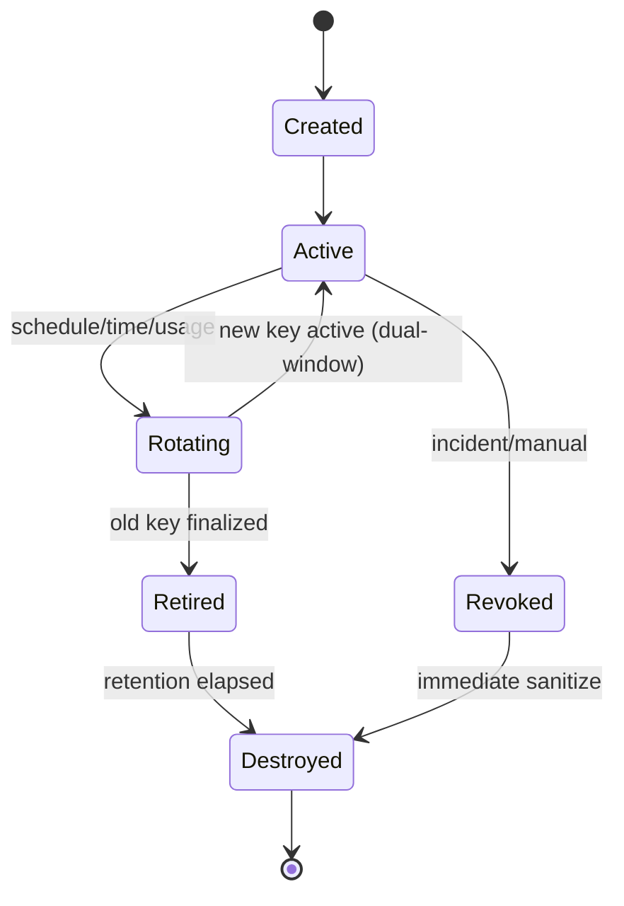

# WORKFLOWS.md
**Operational Workflows for XPScerpto**  


> This document describes how the major components of XPSI Crypto interact to accomplish common tasks. Each workflow includes a goal-oriented overview, a step-by-step sequence, error/resiliency notes, and—where useful—Mermaid diagrams and short, illustrative (pseudo‑)C++ examples using C++ Modules style `import` statements.  
> **Note:** The code snippets are illustrative. Namespaces and function names may differ in your build; adapt to your actual APIs (`xps.crypto.*`).

---

## Table of Contents
1. [Conventions](#conventions)  
2. [Workflow 1 — Data Encryption & Decryption (AEAD/AES‑GCM exemplar)](#workflow-1--data-encryption--decryption-aeadaesgcm-exemplar)  
3. [Workflow 2 — Digital Signature & Verification (Ed25519 exemplar)](#workflow-2--digital-signature--verification-ed25519-exemplar)  
4. [Workflow 3 — Key Lifecycle Management (Create → Use → Rotate → Revoke/Destroy)](#workflow-3--key-lifecycle-management-create--use--rotate--revokedestroy)  
5. [Workflow 4 — Crypto‑Agility Hot‑Patch (Zero‑Downtime Swap)](#workflow-4--cryptoagility-hotpatch-zero-downtime-swap)  
6. [Workflow 5 — Mutual Authentication (mTLS‑like, X25519 + HKDF + AEAD)](#workflow-5--mutual-authentication-mtlslike-x25519--hkdf--aead)  
7. [Appendix A — Key State Machine](#appendix-a--key-state-machine)  
8. [Appendix B — Error & Audit Taxonomy](#appendix-b--error--audit-taxonomy)  
9. [Appendix C — Configuration Hooks](#appendix-c--configuration-hooks)

---

## Conventions

**Actors**
- **App**: Your application or service.
- **API**: XPScerpto top‑level facade (e.g., `xps.crypto.api`) that routes to specific modules.
- **CSRNG**: Cryptographically secure RNG/DRBG.
- **AEAD**: Authenticated encryption engine (e.g., AES‑GCM, ChaCha20‑Poly1305).
- **Keyring**: Secure key store/manager (create, rotate, revoke).
- **Router**: Runtime dispatch/algorithm router.
- **Verifier/Signer**: Signature modules (e.g., `ed25519`).
- **KEX**: Key exchange (e.g., `x25519`).
- **HKDF**: Key derivation function for session keys.
- **Loader/Updater**: Hot‑patch orchestrator with signature verification & self‑tests.
- **Store**: Your persistence (DB/object store).

**Artifacts**
- `key`, `nonce/IV`, `aad`, `ciphertext`, `tag`, `signature`, `pub/priv keys`, `shared_secret`, `session_keys`.

**Reliability & Security Defaults**
- Constant‑time comparisons for MAC/tags and signatures.
- Unique nonces per AEAD encryption; generated by CSRNG if not provided.
- Secure memory and `secure_wipe` for secrets.
- Audit trail for key and patch events.
- Self‑tests (KATs) at startup or before enabling a hot‑patch.

---

## Workflow 1 — Data Encryption & Decryption (AEAD/AES‑GCM exemplar)

### Goal
Encrypt plaintext with a secret key, then decrypt and authenticate the result. AES‑GCM is used as a concrete example; substitute `ChaCha20‑Poly1305` where appropriate.

### Sequence


### Illustrative C++ (pseudo‑API)
```cpp
import xps.crypto.api;      // facade
import xps.crypto.memory;   // secure buffers

using xps::crypto::Bytes;
using xps::crypto::secure_wipe;

Bytes key = api::random_bytes(32); // AES-256
Bytes aad = {/* optional associated data */};

auto sealed = api::aead::encrypt(api::AEAD::AES_GCM, key, /*plaintext*/ data, /*aad*/ aad);
// sealed = { nonce, ciphertext, tag }

auto plain = api::aead::decrypt(api::AEAD::AES_GCM, key, sealed.nonce, sealed.ciphertext, sealed.tag, aad);
// throws or returns error on MAC failure

secure_wipe(key);
```

### Error/Resiliency Notes
- **Nonce reuse** under the same key **must never** occur with GCM.
- On **tag mismatch**, return an authentication error without revealing partial plaintext.
- Consider **key separation** for different purposes (data vs. metadata).

---

## Workflow 2 — Digital Signature & Verification (Ed25519 exemplar)

### Goal
Signer produces a digital signature; verifier checks it using the public key.



### Illustrative C++ (pseudo‑API)
```cpp
import xps.crypto.ed25519;

auto [pk, sk] = ed25519::generate_keypair();
auto sig = ed25519::sign(sk, message);
bool ok = ed25519::verify(pk, message, sig);
```

### Error/Resiliency Notes
- Reject structurally invalid signatures/keys early (length/format).
- Use constant‑time comparisons for signature and hash checks.
- **Never** log or persist private keys; use secure memory and wipe after use.

---

## Workflow 3 — Key Lifecycle Management (Create → Use → Rotate → Revoke/Destroy)

### Goal
Manage long‑lived keys with clear states and automated rotation, without service interruption.

```mermaid
flowchart TD
    C[Create] --> A[Active]
    A -->|Policy Timer<br/>Usage Counter| R[Rotating]
    R -->|Dual-Key Window| AR[Active (New)]
    R -->|Finish re-encryption| RT[Retired]
    A -->|Compromise/Incident| V[Revoked]
    RT -->|Retention Expired| D[Destroyed]
    V -->|Immediate Sanitization| D
```

### Sequence (high level)
1. **Create**: Generate key with metadata (purpose, created_at, rotation policy); store in **Keyring**.
2. **Use**: App requests key by **Key ID**; Keyring materializes into secure memory.
3. **Rotate** (scheduled):  
   - Create **new key**; mark as **Active**.  
   - Enter **dual‑key window**: new encryptions use new key; old key still allowed for decrypt.  
   - Optionally **re‑encrypt at rest**; on completion mark old as **Retired**.
4. **Revoke** (incident): Immediately mark key as **Revoked**; block all uses; fast‑track re‑encryption.
5. **Destroy**: After retention, securely erase material and metadata (tamper‑evident audit remains).

### Illustrative C++ (pseudo‑API)
```cpp
import xps.crypto.keyring;

auto id = keyring::create("db-at-rest", keyring::Algo::AES256_GCM, /*policy=*/"rotate=365d");
auto key = keyring::get(id);          // secure materialize
// ... use key ...
keyring::rotate(id);                  // schedules dual-key window
keyring::revoke(id);                  // emergency
```

### Error/Resiliency Notes
- All state transitions are **idempotent** and **audited**.
- Decrypt must try **new→old** order during rotation windows.
- Enforce **MFA/approval** gates for revoke/destroy.

---

## Workflow 4 — Crypto‑Agility Hot‑Patch (Zero‑Downtime Swap)

### Goal
Replace a vulnerable/obsolete algorithm implementation with a patched module at runtime, safely.

```mermaid
sequenceDiagram
    autonumber
    participant Admin as Admin/DevOps
    participant Updater as Updater/Loader
    participant Verif as Signature+Policy Verifier
    participant SelfTest as KAT/Self-Test
    participant Router as Algo Router
    participant Old as Old Module
    participant New as New Module

    Admin->>Updater: load_update(pkg=module-X-v2.sig)
    Updater->>Verif: verify signature + manifest + compatibility
    Verif-->>Updater: ok (or fail)
    Updater->>SelfTest: run KATs off-path
    SelfTest-->>Updater: ok
    Updater->>Router: stage(New) ; keep(Old) for in-flight
    Router-->>Old: drain in-flight ops
    Router-->>New: route new ops
    Note over Router: Health checks / metrics
    Updater-->>Admin: success (or rollback on any failure)
```

### Safety Gates
- **Provenance**: Detached signature + publisher keypin.
- **Compatibility**: API/ABI match and policy whitelist.
- **Self‑tests**: KATs and micro‑benchmarks before enabling.
- **Phased cutover**: Drain old; route new; **rollback** on health signal.
- **Audit**: Immutable record of module hash, time, operator.

---

## Workflow 5 — Mutual Authentication (mTLS‑like, X25519 + HKDF + AEAD)

### Goal
Client and server authenticate each other, derive a shared session secret, and protect traffic with AEAD.



### Illustrative C++ (pseudo‑API)
```cpp
import xps.crypto.x25519;
import xps.crypto.hkdf;
import xps.crypto.aead;

auto [c_pk, c_sk] = x25519::generate_keypair();
auto [s_pk, s_sk] = x25519::generate_keypair(); // on server

// exchange c_pk <-> s_pk
auto client_shared = x25519::derive_shared(c_sk, s_pk);
auto server_shared = x25519::derive_shared(s_sk, c_pk);

auto keys_c = hkdf::expand(client_shared, /*info*/ transcript, /*len*/ 64);
auto keys_s = hkdf::expand(server_shared,  transcript, 64);

auto ctx_c = aead::make(aead::AES_GCM, keys_c.enc, keys_c.iv);
auto ctx_s = aead::make(aead::AES_GCM, keys_s.enc, keys_s.iv);
```

### Error/Resiliency Notes
- Verify **certificate chains** and check **revocation** (CRL/OCSP) where applicable.
- Bind session keys to the **transcript hash** to prevent downgrade/MI TM.
- Enforce **unique nonces** and **rekey** periodically for long sessions.

---

## Appendix A — Key State Machine



**Rules**
- Only **Active** keys may encrypt.
- Decrypt tries **Active**, then **Retired** during rotation window.
- **Revoked** keys are unusable for any operation.
- Destruction is an audited, one‑way action.

---

## Appendix B — Error & Audit Taxonomy

**Common error classes**
- `XPS_ERR_AUTH`: MAC/tag mismatch, signature invalid.
- `XPS_ERR_KEY`: Missing, revoked, wrong size/curve, or expired.
- `XPS_ERR_NONCE`: Reuse/size violation.
- `XPS_ERR_POLICY`: Disallowed algorithm/parameter.
- `XPS_ERR_UPDATE`: Patch verification, KAT, or compatibility failed.
- `XPS_ERR_INTERNAL`: Memory/entropy/overflow/ASSERT.

**Audit events (examples)**
- `KEY_CREATE/ROTATE/REVOKE/DESTROY` (with actor & policy ref).
- `PATCH_LOAD/ENABLE/ROLLBACK` (module hash, publisher).
- `CRYPTO_FAIL_AUTH` (rate‑limited, redacted context).

---

## Appendix C — Configuration Hooks

```yaml
crypto:
  aead:
    default: AES_GCM
    nonce: auto         # auto | app
  keyring:
    rotation_days: 365
    dual_window_days: 30
    destroy_after_days: 180
  policy:
    forbid:
      - sha1
      - des
  hotpatch:
    require_signature: true
    run_selftests: true
    rollback_on_error: true
  tls:
    rekey_messages: 2_000_000
    rekey_minutes: 60
```

**Tip**: Keep configuration **immutable at runtime** except for explicit, audited changes (e.g., policy toggles or emergency revocations).

---

**End of WORKFLOWS.md**
