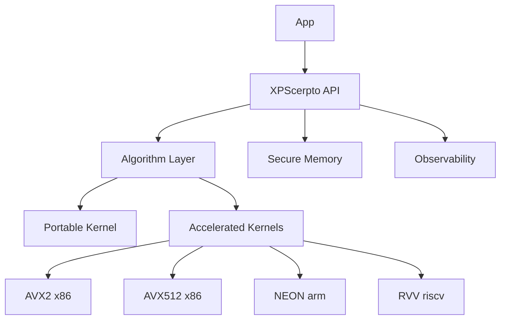
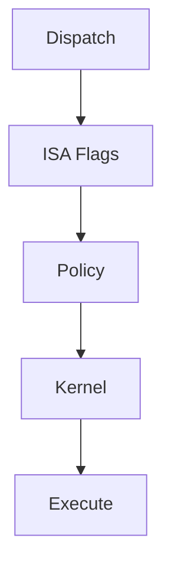
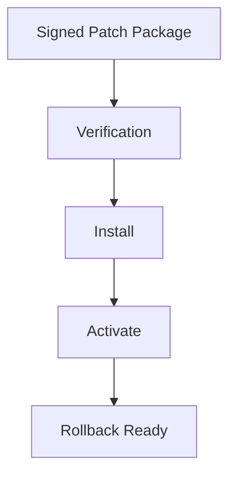

# Architecture

<!-- TOC-BEGIN -->
## Table of Contents

- [Table of Contents](#table-of-contents)
- [Table of Contents](#table-of-contents)
- [Table of Contents](#table-of-contents)
- [Table of Contents](#table-of-contents)
- [1. High‑Level View](#1-highlevel-view)
- [2. Modules & Namespaces](#2-modules--namespaces)
- [3. SIMD Runtime Dispatch](#3-simd-runtime-dispatch)
- [4. Secure Memory Subsystem](#4-secure-memory-subsystem)
- [5. Error Model](#5-error-model)
- [6. Build & Packaging](#6-build--packaging)
- [7. PQC Engines](#7-pqc-engines)
- [8. Hot‑Patch & Key Rotation (Overview)](#8-hotpatch--key-rotation-overview)
- [9. Compliance Hooks](#9-compliance-hooks)
- [Deep Reference — Full v5](#deep-reference--full-v5)
- [XPScerpto — Architecture Overview](#xpscerpto--architecture-overview)
- [Table of Contents](#table-of-contents)
- [1. Architectural Principles](#1-architectural-principles)
- [2. Layered Architecture (Overview)](#2-layered-architecture-overview)
  - [Responsibilities by Layer](#responsibilities-by-layer)
- [3. Module Taxonomy & Naming](#3-module-taxonomy--naming)
- [4. Runtime Dispatch & Performance](#4-runtime-dispatch--performance)
- [5. Security Model & Non‑Goals](#5-security-model--nongoals)
- [6. Dataflows (Representative)](#6-dataflows-representative)
  - [6.1 Unified AEAD Encryption](#61-unified-aead-encryption)
  - [6.2 Hybrid (Classical + PQC) Key Establishment](#62-hybrid-classical--pqc-key-establishment)
- [7. Hot‑Patch Workflow (Zero‑Downtime)](#7-hotpatch-workflow-zerodowntime)
- [8. Key Rotation Workflow (Zero‑Downtime)](#8-key-rotation-workflow-zerodowntime)
- [9. API & Error Model](#9-api--error-model)
- [10. Compliance & Self‑Tests](#10-compliance--selftests)
- [11. Extensibility](#11-extensibility)
- [12. Deployment Profiles](#12-deployment-profiles)
- [13. Glossary](#13-glossary)
- [14. Appendix — Example Module Map](#14-appendix--example-module-map)
- [Merged from `simd/ARCHITECTURE.md`](#merged-from-simdarchitecturemd)
- [1. Design Tenets](#1-design-tenets)
- [2. Module Topology](#2-module-topology)
- [3. ISA & Capability Detection](#3-isa--capability-detection)
- [4. Kernel Registry & Descriptors](#4-kernel-registry--descriptors)
- [5. Adaptive Selection (Per Size Bucket)](#5-adaptive-selection-per-size-bucket)
- [6. Threading & Memory Model](#6-threading--memory-model)
- [7. Error Handling & Invariants](#7-error-handling--invariants)
- [8. Extension Points](#8-extension-points)
- [9. Portability & Build](#9-portability--build)
- [10. Minimal Pseudocode](#10-minimal-pseudocode)
- [Merged from `auto_rotation/ARCHITECTURE.md`](#merged-from-autorotationarchitecturemd)
- [1) High-Level Goals](#1-high-level-goals)
- [2) Module Map](#2-module-map)
- [3) Core Concepts](#3-core-concepts)
- [4) Concurrency & Data](#4-concurrency--data)
- [5) Failure Model](#5-failure-model)
- [6) Extensibility](#6-extensibility)
- [7) External Contracts](#7-external-contracts)
- [8) Architecture Diagram (Mermaid)](#8-architecture-diagram-mermaid)
- [9) Key Data Types (Illustrative)](#9-key-data-types-illustrative)
- [Merged from `super/ARCHITECTURE.md`](#merged-from-superarchitecturemd)
- [1) Vision](#1-vision)
- [2) Module Map](#2-module-map)
- [3) Core Concepts](#3-core-concepts)
- [4) Data & Concurrency](#4-data--concurrency)
- [5) Failure Model](#5-failure-model)
- [6) High-Level Diagram (Mermaid)](#6-high-level-diagram-mermaid)
<!-- TOC-END -->


<!-- TOC-BEGIN -->
## Table of Contents

- [Table of Contents](#table-of-contents)
- [Table of Contents](#table-of-contents)
- [Table of Contents](#table-of-contents)
- [1. High‑Level View](#1-highlevel-view)
- [2. Modules & Namespaces](#2-modules--namespaces)
- [3. SIMD Runtime Dispatch](#3-simd-runtime-dispatch)
- [4. Secure Memory Subsystem](#4-secure-memory-subsystem)
- [5. Error Model](#5-error-model)
- [6. Build & Packaging](#6-build--packaging)
- [7. PQC Engines](#7-pqc-engines)
- [8. Hot‑Patch & Key Rotation (Overview)](#8-hotpatch--key-rotation-overview)
- [9. Compliance Hooks](#9-compliance-hooks)
- [Deep Reference — Full v5](#deep-reference--full-v5)
- [XPScerpto — Architecture Overview](#xpscerpto--architecture-overview)
- [Table of Contents](#table-of-contents)
- [1. Architectural Principles](#1-architectural-principles)
- [2. Layered Architecture (Overview)](#2-layered-architecture-overview)
  - [Responsibilities by Layer](#responsibilities-by-layer)
- [3. Module Taxonomy & Naming](#3-module-taxonomy--naming)
- [4. Runtime Dispatch & Performance](#4-runtime-dispatch--performance)
- [5. Security Model & Non‑Goals](#5-security-model--nongoals)
- [6. Dataflows (Representative)](#6-dataflows-representative)
  - [6.1 Unified AEAD Encryption](#61-unified-aead-encryption)
  - [6.2 Hybrid (Classical + PQC) Key Establishment](#62-hybrid-classical--pqc-key-establishment)
- [7. Hot‑Patch Workflow (Zero‑Downtime)](#7-hotpatch-workflow-zerodowntime)
- [8. Key Rotation Workflow (Zero‑Downtime)](#8-key-rotation-workflow-zerodowntime)
- [9. API & Error Model](#9-api--error-model)
- [10. Compliance & Self‑Tests](#10-compliance--selftests)
- [11. Extensibility](#11-extensibility)
- [12. Deployment Profiles](#12-deployment-profiles)
- [13. Glossary](#13-glossary)
- [14. Appendix — Example Module Map](#14-appendix--example-module-map)
- [Merged from `simd/ARCHITECTURE.md`](#merged-from-simdarchitecturemd)
- [1. Design Tenets](#1-design-tenets)
- [2. Module Topology](#2-module-topology)
- [3. ISA & Capability Detection](#3-isa--capability-detection)
- [4. Kernel Registry & Descriptors](#4-kernel-registry--descriptors)
- [5. Adaptive Selection (Per Size Bucket)](#5-adaptive-selection-per-size-bucket)
- [6. Threading & Memory Model](#6-threading--memory-model)
- [7. Error Handling & Invariants](#7-error-handling--invariants)
- [8. Extension Points](#8-extension-points)
- [9. Portability & Build](#9-portability--build)
- [10. Minimal Pseudocode](#10-minimal-pseudocode)
- [Merged from `auto_rotation/ARCHITECTURE.md`](#merged-from-autorotationarchitecturemd)
- [1) High-Level Goals](#1-high-level-goals)
- [2) Module Map](#2-module-map)
- [3) Core Concepts](#3-core-concepts)
- [4) Concurrency & Data](#4-concurrency--data)
- [5) Failure Model](#5-failure-model)
- [6) Extensibility](#6-extensibility)
- [7) External Contracts](#7-external-contracts)
- [8) Architecture Diagram (Mermaid)](#8-architecture-diagram-mermaid)
- [9) Key Data Types (Illustrative)](#9-key-data-types-illustrative)
- [Merged from `super/ARCHITECTURE.md`](#merged-from-superarchitecturemd)
- [1) Vision](#1-vision)
- [2) Module Map](#2-module-map)
- [3) Core Concepts](#3-core-concepts)
- [4) Data & Concurrency](#4-data--concurrency)
- [5) Failure Model](#5-failure-model)
- [6) High-Level Diagram (Mermaid)](#6-high-level-diagram-mermaid)
<!-- TOC-END -->


<!-- TOC-BEGIN -->
## Table of Contents

- [Table of Contents](#table-of-contents)
- [Table of Contents](#table-of-contents)
- [1. High‑Level View](#1-highlevel-view)
- [2. Modules & Namespaces](#2-modules--namespaces)
- [3. SIMD Runtime Dispatch](#3-simd-runtime-dispatch)
- [4. Secure Memory Subsystem](#4-secure-memory-subsystem)
- [5. Error Model](#5-error-model)
- [6. Build & Packaging](#6-build--packaging)
- [7. PQC Engines](#7-pqc-engines)
- [8. Hot‑Patch & Key Rotation (Overview)](#8-hotpatch--key-rotation-overview)
- [9. Compliance Hooks](#9-compliance-hooks)
- [Deep Reference — Full v5](#deep-reference--full-v5)
- [XPScerpto — Architecture Overview](#xpscerpto--architecture-overview)
- [Table of Contents](#table-of-contents)
- [1. Architectural Principles](#1-architectural-principles)
- [2. Layered Architecture (Overview)](#2-layered-architecture-overview)
  - [Responsibilities by Layer](#responsibilities-by-layer)
- [3. Module Taxonomy & Naming](#3-module-taxonomy--naming)
- [4. Runtime Dispatch & Performance](#4-runtime-dispatch--performance)
- [5. Security Model & Non‑Goals](#5-security-model--nongoals)
- [6. Dataflows (Representative)](#6-dataflows-representative)
  - [6.1 Unified AEAD Encryption](#61-unified-aead-encryption)
  - [6.2 Hybrid (Classical + PQC) Key Establishment](#62-hybrid-classical--pqc-key-establishment)
- [7. Hot‑Patch Workflow (Zero‑Downtime)](#7-hotpatch-workflow-zerodowntime)
- [8. Key Rotation Workflow (Zero‑Downtime)](#8-key-rotation-workflow-zerodowntime)
- [9. API & Error Model](#9-api--error-model)
- [10. Compliance & Self‑Tests](#10-compliance--selftests)
- [11. Extensibility](#11-extensibility)
- [12. Deployment Profiles](#12-deployment-profiles)
- [13. Glossary](#13-glossary)
- [14. Appendix — Example Module Map](#14-appendix--example-module-map)
- [Merged from `simd/ARCHITECTURE.md`](#merged-from-simdarchitecturemd)
- [1. Design Tenets](#1-design-tenets)
- [2. Module Topology](#2-module-topology)
- [3. ISA & Capability Detection](#3-isa--capability-detection)
- [4. Kernel Registry & Descriptors](#4-kernel-registry--descriptors)
- [5. Adaptive Selection (Per Size Bucket)](#5-adaptive-selection-per-size-bucket)
- [6. Threading & Memory Model](#6-threading--memory-model)
- [7. Error Handling & Invariants](#7-error-handling--invariants)
- [8. Extension Points](#8-extension-points)
- [9. Portability & Build](#9-portability--build)
- [10. Minimal Pseudocode](#10-minimal-pseudocode)
- [Merged from `auto_rotation/ARCHITECTURE.md`](#merged-from-autorotationarchitecturemd)
- [1) High-Level Goals](#1-high-level-goals)
- [2) Module Map](#2-module-map)
- [3) Core Concepts](#3-core-concepts)
- [4) Concurrency & Data](#4-concurrency--data)
- [5) Failure Model](#5-failure-model)
- [6) Extensibility](#6-extensibility)
- [7) External Contracts](#7-external-contracts)
- [8) Architecture Diagram (Mermaid)](#8-architecture-diagram-mermaid)
- [9) Key Data Types (Illustrative)](#9-key-data-types-illustrative)
- [Merged from `super/ARCHITECTURE.md`](#merged-from-superarchitecturemd)
- [1) Vision](#1-vision)
- [2) Module Map](#2-module-map)
- [3) Core Concepts](#3-core-concepts)
- [4) Data & Concurrency](#4-data--concurrency)
- [5) Failure Model](#5-failure-model)
- [6) High-Level Diagram (Mermaid)](#6-high-level-diagram-mermaid)
<!-- TOC-END -->


<!-- TOC-BEGIN -->
## Table of Contents

- [Table of Contents](#table-of-contents)
- [1. High‑Level View](#1-highlevel-view)
- [2. Modules & Namespaces](#2-modules--namespaces)
- [3. SIMD Runtime Dispatch](#3-simd-runtime-dispatch)
- [4. Secure Memory Subsystem](#4-secure-memory-subsystem)
- [5. Error Model](#5-error-model)
- [6. Build & Packaging](#6-build--packaging)
- [7. PQC Engines](#7-pqc-engines)
- [8. Hot‑Patch & Key Rotation (Overview)](#8-hotpatch--key-rotation-overview)
- [9. Compliance Hooks](#9-compliance-hooks)
- [Deep Reference — Full v5](#deep-reference--full-v5)
- [XPScerpto — Architecture Overview](#xpscerpto--architecture-overview)
- [Table of Contents](#table-of-contents)
- [1. Architectural Principles](#1-architectural-principles)
- [2. Layered Architecture (Overview)](#2-layered-architecture-overview)
  - [Responsibilities by Layer](#responsibilities-by-layer)
- [3. Module Taxonomy & Naming](#3-module-taxonomy--naming)
- [4. Runtime Dispatch & Performance](#4-runtime-dispatch--performance)
- [5. Security Model & Non‑Goals](#5-security-model--nongoals)
- [6. Dataflows (Representative)](#6-dataflows-representative)
  - [6.1 Unified AEAD Encryption](#61-unified-aead-encryption)
  - [6.2 Hybrid (Classical + PQC) Key Establishment](#62-hybrid-classical--pqc-key-establishment)
- [7. Hot‑Patch Workflow (Zero‑Downtime)](#7-hotpatch-workflow-zerodowntime)
- [8. Key Rotation Workflow (Zero‑Downtime)](#8-key-rotation-workflow-zerodowntime)
- [9. API & Error Model](#9-api--error-model)
- [10. Compliance & Self‑Tests](#10-compliance--selftests)
- [11. Extensibility](#11-extensibility)
- [12. Deployment Profiles](#12-deployment-profiles)
- [13. Glossary](#13-glossary)
- [14. Appendix — Example Module Map](#14-appendix--example-module-map)
- [Merged from `simd/ARCHITECTURE.md`](#merged-from-simdarchitecturemd)
- [1. Design Tenets](#1-design-tenets)
- [2. Module Topology](#2-module-topology)
- [3. ISA & Capability Detection](#3-isa--capability-detection)
- [4. Kernel Registry & Descriptors](#4-kernel-registry--descriptors)
- [5. Adaptive Selection (Per Size Bucket)](#5-adaptive-selection-per-size-bucket)
- [6. Threading & Memory Model](#6-threading--memory-model)
- [7. Error Handling & Invariants](#7-error-handling--invariants)
- [8. Extension Points](#8-extension-points)
- [9. Portability & Build](#9-portability--build)
- [10. Minimal Pseudocode](#10-minimal-pseudocode)
- [Merged from `auto_rotation/ARCHITECTURE.md`](#merged-from-autorotationarchitecturemd)
- [1) High-Level Goals](#1-high-level-goals)
- [2) Module Map](#2-module-map)
- [3) Core Concepts](#3-core-concepts)
- [4) Concurrency & Data](#4-concurrency--data)
- [5) Failure Model](#5-failure-model)
- [6) Extensibility](#6-extensibility)
- [7) External Contracts](#7-external-contracts)
- [8) Architecture Diagram (Mermaid)](#8-architecture-diagram-mermaid)
- [9) Key Data Types (Illustrative)](#9-key-data-types-illustrative)
- [Merged from `super/ARCHITECTURE.md`](#merged-from-superarchitecturemd)
- [1) Vision](#1-vision)
- [2) Module Map](#2-module-map)
- [3) Core Concepts](#3-core-concepts)
- [4) Data & Concurrency](#4-data--concurrency)
- [5) Failure Model](#5-failure-model)
- [6) High-Level Diagram (Mermaid)](#6-high-level-diagram-mermaid)
<!-- TOC-END -->


<!-- TOC-BEGIN -->
## Table of Contents

- [1. High‑Level View](#1-highlevel-view)
- [2. Modules & Namespaces](#2-modules--namespaces)
- [3. SIMD Runtime Dispatch](#3-simd-runtime-dispatch)
- [4. Secure Memory Subsystem](#4-secure-memory-subsystem)
- [5. Error Model](#5-error-model)
- [6. Build & Packaging](#6-build--packaging)
- [7. PQC Engines](#7-pqc-engines)
- [8. Hot‑Patch & Key Rotation (Overview)](#8-hotpatch--key-rotation-overview)
- [9. Compliance Hooks](#9-compliance-hooks)
- [Deep Reference — Full v5](#deep-reference--full-v5)
- [XPScerpto — Architecture Overview](#xpscerpto--architecture-overview)
- [Table of Contents](#table-of-contents)
- [1. Architectural Principles](#1-architectural-principles)
- [2. Layered Architecture (Overview)](#2-layered-architecture-overview)
  - [Responsibilities by Layer](#responsibilities-by-layer)
- [3. Module Taxonomy & Naming](#3-module-taxonomy--naming)
- [4. Runtime Dispatch & Performance](#4-runtime-dispatch--performance)
- [5. Security Model & Non‑Goals](#5-security-model--nongoals)
- [6. Dataflows (Representative)](#6-dataflows-representative)
  - [6.1 Unified AEAD Encryption](#61-unified-aead-encryption)
  - [6.2 Hybrid (Classical + PQC) Key Establishment](#62-hybrid-classical--pqc-key-establishment)
- [7. Hot‑Patch Workflow (Zero‑Downtime)](#7-hotpatch-workflow-zerodowntime)
- [8. Key Rotation Workflow (Zero‑Downtime)](#8-key-rotation-workflow-zerodowntime)
- [9. API & Error Model](#9-api--error-model)
- [10. Compliance & Self‑Tests](#10-compliance--selftests)
- [11. Extensibility](#11-extensibility)
- [12. Deployment Profiles](#12-deployment-profiles)
- [13. Glossary](#13-glossary)
- [14. Appendix — Example Module Map](#14-appendix--example-module-map)
- [Merged from `simd/ARCHITECTURE.md`](#merged-from-simdarchitecturemd)
- [1. Design Tenets](#1-design-tenets)
- [2. Module Topology](#2-module-topology)
- [3. ISA & Capability Detection](#3-isa--capability-detection)
- [4. Kernel Registry & Descriptors](#4-kernel-registry--descriptors)
- [5. Adaptive Selection (Per Size Bucket)](#5-adaptive-selection-per-size-bucket)
- [6. Threading & Memory Model](#6-threading--memory-model)
- [7. Error Handling & Invariants](#7-error-handling--invariants)
- [8. Extension Points](#8-extension-points)
- [9. Portability & Build](#9-portability--build)
- [10. Minimal Pseudocode](#10-minimal-pseudocode)
- [Merged from `auto_rotation/ARCHITECTURE.md`](#merged-from-autorotationarchitecturemd)
- [1) High-Level Goals](#1-high-level-goals)
- [2) Module Map](#2-module-map)
- [3) Core Concepts](#3-core-concepts)
- [4) Concurrency & Data](#4-concurrency--data)
- [5) Failure Model](#5-failure-model)
- [6) Extensibility](#6-extensibility)
- [7) External Contracts](#7-external-contracts)
- [8) Architecture Diagram (Mermaid)](#8-architecture-diagram-mermaid)
- [9) Key Data Types (Illustrative)](#9-key-data-types-illustrative)
- [Merged from `super/ARCHITECTURE.md`](#merged-from-superarchitecturemd)
- [1) Vision](#1-vision)
- [2) Module Map](#2-module-map)
- [3) Core Concepts](#3-core-concepts)
- [4) Data & Concurrency](#4-data--concurrency)
- [5) Failure Model](#5-failure-model)
- [6) High-Level Diagram (Mermaid)](#6-high-level-diagram-mermaid)
<!-- TOC-END -->


This document presents XPScerpto's architecture across **API layers**, **kernel dispatch**, **secure memory**, and **observability**. 
The design emphasizes **crypto‑agility**, **deterministic behavior**, and **strict separation** of portable vs accelerated implementations.

## 1. High‑Level View



- **API**: clean, module‑based, exception‑light APIs with `std::expected` integration when needed.
- **Algorithm Layer**: classic primitives (SHA‑2/3, BLAKE3, Poly1305, AES‑GCM, ChaCha20‑Poly1305), signatures (Ed25519), KDF (HKDF), and PQC (Falcon, Dilithium).
- **Kernels**: portable baseline plus runtime‑selected accelerated paths.
- **Secure Memory**: `LockedBuffer`, `SecureBuffer`, `secure_erase`, constant‑time helpers.
- **Observability**: counters, gauges, minimal spans; Prometheus‑style pull metrics optional.

## 2. Modules & Namespaces

- `xps.crypto.hash.sha256`, `xps.crypto.hash.sha384`, `xps.crypto.hash.blake3`
- `xps.crypto.kdf.hkdf`
- `xps.crypto.mac.poly1305`
- `xps.crypto.aead.aes_gcm`, `xps.crypto.aead.chacha20_poly1305`
- `xps.crypto.sign.ed25519`
- `xps.crypto.falcon1024.native` (PQC, internal heavy module)
- Utilities: `xps.crypto.utils.memory`, `xps.memory`, `xps.expected`

> PQC modules may expose a **stable façade** and keep internal engine layout private.

## 3. SIMD Runtime Dispatch



- **Probe**: CPUID or platform‑specific ISA detection.
- **Policy**: enable/disable AVX2/AVX‑512/NEON/RVV, constant‑time mode, thresholds.
- **Select**: choose best kernel for message size and policy.
- **Execute**: run kernel, wipe temps, record metrics.

## 4. Secure Memory Subsystem

- `LockedBuffer<T>`: page‑locked, non‑swappable buffers with RAII wipe.
- `SecureBuffer<byte>`: zeroize on destruct, optional guard pages.
- `secure_erase`, `ct_equal`, `ct_is_zero`, `secure_copy`.
- Integration points in AEAD/KDF/signature code paths hide secrets early.

## 5. Error Model

- Prefer return types: `std::expected<T, Error>` or `xps::expected<T, ErrorCode>`.
- Mapping to a central **Error Taxonomy**; no exceptions for routine control flow.

## 6. Build & Packaging

- Pure C++ Modules layout; CMake builds PCM → OBJ → static/shared library.
- Dual pipelines: **native modules** if compiler supports, otherwise **fallback** scanning.
- Optional LTO, sanitizers, per‑target arch flags via helper `XpsArch.cmake`.

## 7. PQC Engines

- **Falcon‑1024**: FFT + NTT hybrid sampler; constant‑time corrections; compressed signatures.
- **Dilithium‑5**: standard reference‑aligned façade; stable API; hardened memory paths.
- **Key points**: deterministic APIs for KAT testability; wipe intermediates; side‑channel notes in Security.

## 8. Hot‑Patch & Key Rotation (Overview)



- Signed patch verification, policy gate, activation under guard, immediate rollback path.

## 9. Compliance Hooks

- Documented build provenance, version manifest, reproducible build toggles.
- Optional audit logs for key lifecycle and patching.

---

## Deep Reference — Full v5
## XPScerpto — Architecture Overview

<!-- TOC-BEGIN -->
## Table of Contents

- [1. Architectural Principles](#1-architectural-principles)
- [2. Layered Architecture (Overview)](#2-layered-architecture-overview)
  - [Responsibilities by Layer](#responsibilities-by-layer)
- [3. Module Taxonomy & Naming](#3-module-taxonomy--naming)
- [4. Runtime Dispatch & Performance](#4-runtime-dispatch--performance)
- [5. Security Model & Non‑Goals](#5-security-model--nongoals)
- [6. Dataflows (Representative)](#6-dataflows-representative)
  - [6.1 Unified AEAD Encryption](#61-unified-aead-encryption)
  - [6.2 Hybrid (Classical + PQC) Key Establishment](#62-hybrid-classical--pqc-key-establishment)
- [7. Hot‑Patch Workflow (Zero‑Downtime)](#7-hotpatch-workflow-zerodowntime)
- [8. Key Rotation Workflow (Zero‑Downtime)](#8-key-rotation-workflow-zerodowntime)
- [9. API & Error Model](#9-api--error-model)
- [10. Compliance & Self‑Tests](#10-compliance--selftests)
- [11. Extensibility](#11-extensibility)
- [12. Deployment Profiles](#12-deployment-profiles)
- [13. Glossary](#13-glossary)
- [14. Appendix — Example Module Map](#14-appendix--example-module-map)
- [Merged from `simd/ARCHITECTURE.md`](#merged-from-simdarchitecturemd)
- [1. Design Tenets](#1-design-tenets)
- [2. Module Topology](#2-module-topology)
- [3. ISA & Capability Detection](#3-isa--capability-detection)
- [4. Kernel Registry & Descriptors](#4-kernel-registry--descriptors)
- [5. Adaptive Selection (Per Size Bucket)](#5-adaptive-selection-per-size-bucket)
- [6. Threading & Memory Model](#6-threading--memory-model)
- [7. Error Handling & Invariants](#7-error-handling--invariants)
- [8. Extension Points](#8-extension-points)
- [9. Portability & Build](#9-portability--build)
- [10. Minimal Pseudocode](#10-minimal-pseudocode)
- [Merged from `auto_rotation/ARCHITECTURE.md`](#merged-from-autorotationarchitecturemd)
- [1) High-Level Goals](#1-high-level-goals)
- [2) Module Map](#2-module-map)
- [3) Core Concepts](#3-core-concepts)
- [4) Concurrency & Data](#4-concurrency--data)
- [5) Failure Model](#5-failure-model)
- [6) Extensibility](#6-extensibility)
- [7) External Contracts](#7-external-contracts)
- [8) Architecture Diagram (Mermaid)](#8-architecture-diagram-mermaid)
- [9) Key Data Types (Illustrative)](#9-key-data-types-illustrative)
- [Merged from `super/ARCHITECTURE.md`](#merged-from-superarchitecturemd)
- [1) Vision](#1-vision)
- [2) Module Map](#2-module-map)
- [3) Core Concepts](#3-core-concepts)
- [4) Data & Concurrency](#4-data--concurrency)
- [5) Failure Model](#5-failure-model)
- [6) High-Level Diagram (Mermaid)](#6-high-level-diagram-mermaid)
<!-- TOC-END -->

**XPScerpto — System Architecture (English Edition)**

> **Goal.** XPScerpto is a production‑grade, modular cryptography platform built with modern C++ (C++20/23 Modules). The architecture emphasizes **crypto‑agility**, **zero‑downtime updates**, **defense‑in‑depth**, and **high performance** across multiple CPU architectures.

---

## 1. Architectural Principles

- **Crypto‑Agility by Design**
  - Swap algorithms, key sizes, and even whole implementations **without application downtime**.
  - Policy‑driven enable/disable and preference of algorithms; hybrid (classical + PQC) compositions supported.
- **Strict Modularity & Clear Boundaries**
  - Every primitive lives in its own module (e.g., `xps.crypto.hash.sha256`, `xps.crypto.aead.aes_gcm`).
  - Public importable interfaces are separated from private implementation units.
- **Zero‑Downtime Operations**
  - Hot‑patching of cryptographic modules with signature‑verified payloads and guarded activation.
  - Atomic switchover with rollback and post‑install self‑tests.
- **Defense‑in‑Depth**
  - Constant‑time code paths, clean memory hygiene, integrity checks, policy gates, and attestation hooks.
- **Cross‑Platform Performance**
  - Runtime ISA detection and **SIMD dispatch** (x86: SSE/AVX/AVX2/AVX‑512, ARM: NEON/SHA, RISC‑V: RVV when available).
  - Cache‑friendly data layouts, minimal copies, and concurrency‑safe APIs.
- **Operator‑Friendly**
  - Versioned components, explicit compatibility policy, self‑tests on startup, rich logging/metrics.

---

## 2. Layered Architecture (Overview)

```
Applications / Services
        │
        ▼
[ L5 ] Super Crypto & Unified API
        │  (routing, providers, bridges)
        ▼
[ L4 ] Orchestration & Hot Patch
        │  (zero-downtime updates, key rotation control, policy gates)
        ▼
[ L3 ] Key Management & Security Services
        │  (keyring, storage, policy, attestation, audit)
        ▼
[ L2 ] Core Crypto Modules
        │  (hash, AEAD, MAC, KDF, signatures, KEM/PQC)
        ▼
[ L1 ] Utilities & Platform Abstraction
           (arch detect, SIMD dispatch, memory, random, logging, compat)
```

### Responsibilities by Layer

- **L5 — Super Crypto & Unified API**
  - Single import (e.g., `import xps.crypto.api;`) that re‑exports stable, curated higher‑level interfaces.
  - Intelligent routing: pick best algorithm or path per policy, platform capabilities, and risk profile.
  - Enterprise bridges/providers for external KMS/HSM/cloud or legacy systems.

- **L4 — Orchestration & Hot Patch**
  - Hot‑patch framework (repository, verifier, security gate, installer, rollback).
  - Zero‑downtime coordination for upgrades to algorithms and to key material distribution.
  - Scheduling and coordination services (e.g., distributed key rotation).

- **L3 — Key Management & Security Services**
  - **Keyring**: lifecycle (generate, import/export, wrap/unwrap, rotate, revoke, audit).
  - Policies: allowed algorithms, min key sizes, lifetimes, usages, jurisdictional constraints.
  - Storage backends: secure memory buffers, encrypted persistence; optional external providers (KMS/HSM).
  - Multi‑party cryptography (threshold signing/sharing) and blockchain‑style key use cases.
  - Attestation hooks and audit logging for sensitive operations.

- **L2 — Core Crypto Modules**
  - **Hashes:** SHA‑2 (256/384/512), SHA‑3, SHAKE128/256, BLAKE2b/s, BLAKE3.
  - **AEAD:** AES‑GCM (128/256), ChaCha20‑Poly1305, XChaCha20‑Poly1305.
  - **MAC:** HMAC (SHA‑2/3/BLAKE3), Poly1305.
  - **KDF:** HKDF, PBKDF2, Argon2id.
  - **Signatures & KEM:** RSA (PSS), Ed25519 / X25519, **PQC** (Dilithium, Falcon‑1024, Kyber‑1024).
  - Constant‑time operations where applicable; pluggable implementations per algorithm.

- **L1 — Utilities & Platform Abstraction**
  - Arch/ISA detect, SIMD dispatch registry, secure random, hex/base64, JSON helpers.
  - Memory primitives: `LockedBuffer`, secure wipe, constant‑time compare.
  - Logging/metrics, error model (`expected<T,E>`), compat shims for OS/compiler quirks.

---

## 3. Module Taxonomy & Naming

- `xps.crypto.hash.<name>` — Hash functions and XOFs.
- `xps.crypto.aead.<name>` — Authenticated encryption.
- `xps.crypto.mac.<name>` — Message authentication codes.
- `xps.crypto.kdf.<name>` — Key derivation functions.
- `xps.crypto.ed25519`, `xps.crypto.rsa`, `xps.crypto.pqc.<algo>` — Signatures/KEM.
- `xps.crypto.keyring.*` — Key lifecycle, storage, rotation, providers.
- `xps.crypto.orchestrator.*` / `xps.crypto.hot_patch.*` — Update and rollout control.
- `xps.crypto.api` — Unified, high‑level re‑export.
- `xps.utils.*` / `xps.internal.*` — Utilities and private helpers.

**Rule of thumb:** Interfaces (importable) do not expose implementation details; impls can be swapped or hot‑patched without API breakage.

---

## 4. Runtime Dispatch & Performance

- **ISA Sensing & Dispatch**
  - On startup, detect CPU features; register fast paths (e.g., AVX2 for BLAKE3, AES‑NI for AES‑GCM, ARM SHA for SHA‑2).
  - Fallback to portable scalar code if features are unavailable.
- **Data & Memory**
  - Aligned contexts, contiguous blocks, `std::span`‑based APIs to avoid copies.
  - Secure wiping of ephemeral secrets; constant‑time compares for tags/keys.
- **Concurrency**
  - Stateless APIs or confined state make parallelism straightforward.
  - BLAKE3 and some KDF/AEAD paths can scale across threads when driven by the application.

---

## 5. Security Model & Non‑Goals

**Assumptions**  
- Trusted build pipeline and signed patch payloads.  
- No secret leaves `LockedBuffer` in clear unless explicitly exported under policy.  

**Mitigations**  
- Constant‑time critical code paths (MAC/AEAD/verify/compare).  
- Strict input validation; domain separation where applicable.  
- Memory hygiene (wipe on scope exit, avoid accidental copies), no UB in hot paths.  
- Policy gates + attestation check before dangerous operations (e.g., hot‑patch activation).

**Non‑Goals**  
- Implementing network protocols (TLS/QUIC) end‑to‑end. XPS Crypto provides the *primitives* to build them.  
- Providing a general‑purpose secrets manager UI — integrate with providers instead.

---

## 6. Dataflows (Representative)

### 6.1 Unified AEAD Encryption
1. App calls `api.encrypt(…)` with key, IV/nonce, plaintext, AAD.
2. Unified API selects algorithm per policy (e.g., prefer AES‑GCM if AES‑NI is present; else ChaCha20‑Poly1305).
3. Selected module:
   - Expands key (AES) or seeds state (ChaCha20).
   - Processes blocks; updates GHASH (GCM) or Poly1305 (ChaCha) in constant time.
4. Returns `{ciphertext, tag, iv}`; metrics/logs recorded (if enabled).

### 6.2 Hybrid (Classical + PQC) Key Establishment
1. Generate random session key (symmetric).
2. Encapsulate under RSA/ECDH **and** Kyber (dual encapsulation).
3. Transmit both artifacts; receiver decapsulates both. 
4. Policy mandates: require both successes or KDF‑combine to resist “harvest‑now, decrypt‑later”.

---

## 7. Hot‑Patch Workflow (Zero‑Downtime)

1. **Prepare Patch**: `manifest.json` (+ signer info, targets, hash) and `payload` (e.g., shared object / module impl).
2. **Fetch** (Repository): filesystem / remote provider.
3. **Verify** (Verifier): signature & digest; version/compat checks.
4. **Gate** (Security Gate): policy/time window/allow‑list validation.
5. **Install** (Installer): load payload; swap function table / impl pointer atomically.
6. **Self‑Test**: run KAT/smoke for the target module.
7. **Activate**: new calls use the new impl; in‑flight ops finish on the old impl.
8. **Rollback (if needed)**: revert atomically on failure; keep audit trail.

**Properties**: bounded pause, no process restart, idempotent, auditable.

---

## 8. Key Rotation Workflow (Zero‑Downtime)

1. **Policy**: min key sizes, lifetime (e.g., 90d), overlap window (e.g., 7d), usages.
2. **Monitor**: orchestrator schedules rotation based on age/usage thresholds.
3. **Generate**: create new key material inside Keyring (secure RNG, correct domain params).
4. **Switch‑Over**: new encryptions use new key; old key remains **decrypt‑only** during overlap.
5. **Distribute**: notify/propagate to distributed nodes; ensure version sync.
6. **Retire**: after overlap, wipe/archive old key; update audit logs.

**Guarantees**: no service interruption; decryptability preserved; atomic pointer swap inside Keyring; strong auditing.

---

## 9. API & Error Model

- **Import‑First**: prefer `import xps.crypto.<…>;` interfaces; linkless integration for modern toolchains.
- **Types**: strong types for keys/tags/IVs; sized byte containers; spans over copies.
- **Errors**: `expected<T, Error>` for hot paths; classified `ErrorCode` with actionable context.
- **Logging & Metrics**: structured logs; optional high‑resolution timers; production‑safe redaction of secrets.

---

## 10. Compliance & Self‑Tests

- **Modes**: standard, “FIPS‑like” constrained mode (policy gates enforce approved algorithms/key sizes).
- **Self‑Tests**: power‑on KATs for critical primitives; optional continuous health checks.
- **Provenance**: patch payloads and config are signed; audit trails for key events, rotations, and patches.

---

## 11. Extensibility

- **Providers/Bridges**: adapters for HSM/KMS/cloud, legacy APIs, or blockchain wallets.
- **New Algorithms**: add a new module, register in API catalog, implement self‑tests + metrics hooks.
- **Alternate Implementations**: side‑by‑side impls under same interface (e.g., portable vs AVX2 vs ARM SHA).

---

## 12. Deployment Profiles

- **Server**: maximum throughput, SIMD on, background rotations/patch scans, rich metrics.
- **Client/Desktop**: balanced footprint, reduced telemetry, OS‑integrated storage provider.
- **Embedded/Edge**: minimal build, scalar fallbacks, NEON/RVV when available, static key policies.

---

## 13. Glossary

- **AEAD**: Authenticated Encryption with Associated Data.  
- **KAT**: Known‑Answer Test.  
- **KDF**: Key Derivation Function.  
- **PQC**: Post‑Quantum Cryptography.  
- **Hot‑Patch**: Replace code at runtime with verifiable, signed payloads.  
- **LockedBuffer**: Secure memory that resists swapping/copying and is wiped on release.

---

## 14. Appendix — Example Module Map

```
xps.crypto.api
 ├─ xps.crypto.hash.{sha256,sha384,sha512,sha3,shake128,shake256,blake2b,blake2s,blake3}
 ├─ xps.crypto.aead.{aes_gcm,chacha20_poly1305,xchacha20_poly1305}
 ├─ xps.crypto.mac.{hmac,poly1305}
 ├─ xps.crypto.kdf.{hkdf,pbkdf2,argonn2id}
 ├─ xps.crypto.{rsa,ed25519,x25519}
 ├─ xps.crypto.pqc.{kyber1024,dilithium5,falcon1024}
 ├─ xps.crypto.keyring.{core,policy,storage,auto_rotation,multiparty,distributed}
 └─ xps.crypto.orchestrator.{core,hot_patch,verifier,repo,gate,attest,installer}
```

> This architecture turns XPScerpto into a **future‑proof security substrate**: modular, measurable, updatable in place, and ready for hybrid classical/PQC operations without disrupting applications or users.


---

## Merged from `simd/ARCHITECTURE.md`

# XPScerpto — SIMD Dispatch Architecture
**Version:** v4 • **Generated:** 2025-11-02 11:52 UTC

This document describes the production-grade, ISA‑aware runtime dispatch for XPS Crypto. It enables
dynamic, per‑platform selection of the fastest **constant‑correct** kernel (portable, SSE/SSE4, AVX/AVX2,
AVX‑512, NEON, ARM Crypto Extensions), while honoring **policy** (constant‑time posture, allowed ISA mask,
AVX‑512 demotion) and providing **atomic, lock‑light** fast paths.

## 1. Design Tenets
- **Correctness first:** all kernels must be bit‑exact and API‑compatible.
- **Security‑aware:** optional global constant‑time (CT) posture excludes non‑CT kernels.
- **ISA‑aware:** only kernels whose requirements are supported **and** allowed by policy can be chosen.
- **Adaptive performance:** a one‑time autotune picks the fastest candidate per size‑bucket; results are cached.
- **Thread‑friendly:** first call may do small calibration; subsequent calls are single indirect jumps to hot code.
- **Modular growth:** new algorithms register themselves; dispatch code never changes for new kernels.

## 2. Module Topology
```
xps.crypto.policy            # Global security/perf posture (CT, ISA mask, AVX512 demotion, autotune)
xps.crypto.simd.dispatch     # Public dispatch API (resolve/select/invoke), kernel registry, hot cache
xps.crypto.simd.calibrate    # Micro-bench and choose best kernel (per size bucket)
xps.crypto.simd.adaptive     # Hybrid decision strategy (small/medium/large/huge)
xps.crypto.simd.fastpath     # Atomic cache of chosen function pointers
xps.crypto.simd.trace        # Optional diagnostics/events (off by default)
xps.crypto.simd.hybrid       # Cross-size blends, safe fallbacks
xps.crypto.alg.*             # Algorithm modules (AES, GCM, X25519, Poly1305, …) registering kernels
```

## 3. ISA & Capability Detection
- **x86_64:** CPUID feature bits (SSE2..AVX512F), AES‑NI, PCLMULQDQ, BMI2, VAES, VPCLMULQDQ.
- **ARM64:** `getauxval(AT_HWCAP/HWCAP2)`: NEON, AES, PMULL, SHA1, SHA2.
- **Policy filter:** an **allowed‑ISA mask** intersects detected features; AVX‑512 demotion can be enabled by default.

```cpp
enum class ISA : uint64_t { SSE2=1ull<<0, SSE41=1ull<<3, AVX2=1ull<<6, AVX512=1ull<<9,
                             NEON=1ull<<16, ARM_AES=1ull<<17, ARM_PMULL=1ull<<18 };
struct CryptoCaps { uint64_t features; bool has(ISA f) const; };
```

## 4. Kernel Registry & Descriptors
Each algorithm registers candidates into a central registry.

```cpp
struct KernelDesc {
  const char* op;              // e.g. "AES128-CTR", "AES-GCM", "X25519", "Poly1305"
  void*       fn;              // function pointer (erased; typed at call-site)
  uint64_t    isa_mask;        // required features (bitset of ISA)
  bool        constant_time;   // claims CT properties
  uint8_t     weight;          // static priority hint (higher ISA gets higher weight)
};
```

The registry stores per‑operation vectors of candidates and a **size‑bucket map**:
- **Small ≤ 256 B**, **Medium ≤ 2 KiB**, **Large ≤ 64 KiB**, **Huge > 64 KiB**.

## 5. Adaptive Selection (Per Size Bucket)
On first call (and if `autotune=true`), the dispatcher:
1. Filters candidates by **policy** (CT, allowed ISA, AVX‑512 demotion) ∧ **detected caps**.
2. Benchmarks survivors at representative sizes (48, 1536, 65536 bytes).
3. Records the winner per bucket and an overall fast path pointer.
4. Publishes pointers via `std::atomic<void*>` for **lock‑free** steady‑state.

Subsequent calls read the atomic pointer and jump directly.

## 6. Threading & Memory Model
- Registration and tuning use `std::shared_mutex` (write during register/tune, read otherwise).
- Hot path is **read‑only** (atomic pointer load). No per‑call locks.
- All function pointers are published with release‑semantics; readers use acquire‑loads.

## 7. Error Handling & Invariants
- If no candidate survives, dispatcher returns the **portable** function explicitly provided by the caller, or
  raises an error code.
- Invariants checked in debug:
  - All kernel function signatures match the declared op.
  - CT policy excludes all non‑CT kernels when enabled.
  - ISA masks are non‑empty and subset of known bits.

## 8. Extension Points
- **New algorithms:** add a module `xps.crypto.alg.<name>`; call `register_kernel()` for portable and SIMD paths.
- **New ISAs:** extend `ISA` enum, detection, and policy mask; existing code paths auto‑benefit.
- **Hot‑patch:** kernels may be replaced by re‑registering and flipping atomic pointers after validation.

## 9. Portability & Build
- Works with Clang/GCC MSVC (C++23 Modules). Avoid PCH config drift across units.
- Keep module partitions (`:detail`) private; public interfaces remain stable.

## 10. Minimal Pseudocode
```cpp
Fn resolve(std::string_view op, Fn portable) {
  if (auto cached = fastpath_load(op)) return cached;
  std::unique_lock lk(registry.mu);  // once per-op
  auto cand = filter_by_policy_and_caps(registry[op]);
  if (policy.autotune) tune(cand); else sort_by_weight(cand);
  auto best = pick_overall(cand);
  fastpath_store(op, best.fn);
  return (Fn)best.fn;
}
```


---

## Merged from `auto_rotation/ARCHITECTURE.md`

# ARCHITECTURE — Auto-Rotation Subsystem
**Version:** 2025-11-01  
**Scope:** `auto_rotation/*` modules — enterprise-grade, zero-downtime key rotation for XPS Crypto.

---

## 1) High-Level Goals
- Zero-downtime rotations with *grace windows* and dual-publish semantics.
- Crypto-agility: algorithm/parameter migrations without service interruption.
- Policy-driven orchestration with compliance guardrails (FIPS, retention, audit).
- Pluggable key providers (HSM/local/KMS) via a clean `IKeyProvider` interface.
- Optional distributed coordination for clustered deployments.

## 2) Module Map
The subsystem is split into focused C++23 Modules:

- **core** — `xps.crypto.keyring.auto_rotation.core`: domain types (`KeyId`, `KeyVersion`, `RotationPlan`, `RotationEvent`), `IKeyProvider`, provider registry, listener hooks.
- **policies** — `xps.crypto.keyring.auto_rotation.policies`: reusable policy atoms (schedules, grace windows, usage-based triggers), composition helpers.
- **crypto_agile** — `xps.crypto.keyring.auto_rotation.crypto_agile`: algorithm/suite descriptors, migration helpers, safety checks.
- **compliance** — `xps.crypto.keyring.auto_rotation.compliance`: FIPS mode enforcement, audit annotations, retention caps, approval gates.
- **orchestrator** — `xps.crypto.keyring.auto_rotation.orchestrator`: `AutoRotationOrchestrator`: plan tracking, worker loop (`std::jthread`), tick cadence, ZDT cutover.
- **provider.deflt** — `xps.crypto.keyring.auto_rotation.provider.deflt`: `DefaultKeyProvider` with hooks (`on_generate/on_activate/on_retire`), thread-safe in-memory store.
- **distributed** — `xps.auto_rotation.distributed`: optional quorum/lease signals for multi-node orchestration (stub-friendly).
- **zero_downtime** — `xps.zero_downtime`: grace windows & dual availability helpers, cancel-safe steps, rollback advice.

> Module names are taken directly from the provided source files.

## 3) Core Concepts
- **KeyId / KeyVersion**: logical key name and monotonically increasing version.
- **RotationPlan**: desired end-state with schedule, policy id, target crypto suite, and provider identifier.
- **RotationEvent**: lifecycle events (`Planned`, `Generating`, `Activating`, `Cutover`, `Retiring`, `Completed`, `Failed`, `Canceled`).
- **IKeyProvider**: abstraction for real key backends. Supports *generate*, *activate*, *retire*, *bump usage/epochs*, and *next_due()* for scheduling.
- **ZDT Grace**: a bounded period where *N* and *N+1* are valid to avoid downtime during cutover.

## 4) Concurrency & Data
- **Threading**: `AutoRotationOrchestrator` owns a `std::jthread` worker that wakes every *tick* (default 30s) and evaluates all tracked plans.
- **State**: thread-safe maps guarded by `std::shared_mutex` to store `{ KeyId -> TrackedPlan }` and provider registry `{ name -> IKeyProvider }`.
- **Cancellation**: `std::stop_token` is plumbed through long-running operations to support safe shutdown and rollback.
- **Events**: subscribers can register `RotationListener` to get structured events for metrics/auditing.

## 5) Failure Model
- **Soft errors** (transient provider/HSM/KMS failures): retried with backoff by policy.
- **Hard errors** (compliance veto, invalid policy): stop the plan and emit `Failed` with reason.
- **Rollback**: ZDT ensures old version remains valid until *commit*; orchestrator calls `retire` only after commit signals succeed.

## 6) Extensibility
- Add a new provider: implement `IKeyProvider` & register with `core::register_provider("name", ptr)`.
- Add a new policy: compose from atoms in `policies` and reference its `policy_id` in `RotationPlan`.
- Add a new crypto suite: extend `crypto_agile` descriptor; orchestrator will pass it to provider during `generate`.

## 7) External Contracts
- Providers should be **idempotent** and **reentrant** for `generate/activate/retire`.
- All operations must be **constant-time where applicable** for key material paths.
- Audit logs must capture: *who/what/when/why*, old/new versions, and compliance decision.

---

## 8) Architecture Diagram (Mermaid)
```mermaid
flowchart LR
  subgraph Client/Services
    App[Apps / Services] -- uses --> Keyring
%% par/and/end removed
  subgraph Auto-Rotation
    ORCH[Orchestrator] --- POL[Policies]
    ORCH -- events --> AUDIT[Audit/Metrics]
    ORCH -- ZDT --> ZDT[Zero Downtime]
    ORCH -- plans --> CORE[Core Types]
    ORCH --> DIST[Distributed optional]
    ORCH --> PROV[Provider API]
    PROV --> DEF[Default Provider]
%% par/and/end removed
  Keyring -. imports .-> CORE
  Keyring -. resolve .-> PROV
  App -- decrypt/sign --> Keyring
```

## 9) Key Data Types (Illustrative)
```cpp
import xps.crypto.keyring.auto_rotation.core;

using XPScerpto::crypto::keyring::auto_rotation::KeyId;
struct RotationPlan {/* … schedule, policy_id, target_suite, provider … */};
class IKeyProvider {/* … generate/activate/retire/next_due … */};
```

---

**Status:** Architecture aligned with the provided modules; ready for production hardening.


---

## Merged from `super/ARCHITECTURE.md`

# ARCHITECTURE — XPS Super Crypto
**Version:** 2025-11-01  
**Scope:** The “super_crypto” module family — unified, enterprise orchestration across providers, algorithms, and platforms.

---

## 1) Vision
- A **unified crypto surface** over heterogeneous backends (local, HSM, KMS, remote services).
- **Intelligent routing** of operations to the best engine/path (latency, ISA, compliance).
- **Hot-patch adapters** for zero-downtime cryptographic engine upgrades.
- **Future-proof** posture: post-quantum bridges and versioned capability descriptors.
- **Developer experience** first: ergonomic API, observability, and strong safety defaults.

## 2) Module Map
- **Core** — `xps.crypto.super_crypto.core`: shared types, capability descriptors, error taxonomy, versioning.
- **Unified API** — `xps.crypto.super_crypto.unified_api`: single facade over sign/verify, seal/open, KDF/MAC/hash.
- **Intelligent Routing** — `xps.crypto.super_crypto.intelligent_routing`: policy engine to pick an engine path per operation.
- **Cross-Platform** — `xps.crypto.super_crypto.cross_platform`: ISA detection, ABI compat, portable fallbacks.
- **Future-Proof** — `xps.crypto.super_crypto.future_proof`: capability envelopes, deprecation lanes, migration guides.
- **Quantum Bridge** — `xps.crypto.super_crypto.quantum_bridge`: PQC interop (e.g., Kyber/Dilithium/Falcon) and hybrids.
- **Enterprise Orchestration** — `xps.crypto.super_crypto.enterprise_orchestration`: org policies, tenant isolation, rate/quotas.
- **Developer Experience** — `xps.crypto.super_crypto.developer_experience`: tracing, metrics, error ergonomics, docs hooks.
- **Provider Hooks** — `xps.crypto.super_crypto.provider.hooks`: pluggable lifecycle & telemetry hooks.
- **XPScerpto Bridge** — `xps.crypto.super_crypto.provider.xpsi_bridge`: provider to integrate the existing XPScerpto crypto stack.
- **Adapters** — `xps.crypto.super_crypto.adapter.rotation`, `xps.crypto.super_crypto.adapter.hot_patch`: rotation & hot-patch integration layers.

## 3) Core Concepts
- **Capability Descriptor**: what an engine supports (algorithms, modes, sizes, CT guarantees).
- **Route Policy**: selection logic (e.g., prefer FIPS-approved AES-GCM; fallback to ChaCha20-Poly1305).
- **Operation Ticket**: immutable request with security context (tenant, purpose, SLAs, CT).
- **Engine Adapter**: driver for a backend (local module, HSM, remote microservice).
- **Patch Capsule**: signed payload enabling a new engine or version (hot-patch path).

## 4) Data & Concurrency
- Registries are read-mostly; protect with `shared_mutex` and atomic snapshots.
- Routing evaluates policy → capability → health → cost model (ns/byte).
- Hot-patch loads are staged, signature-verified, and switched using dual-run ZDT semantics.

## 5) Failure Model
- Engine failure → reroute if allowed; mark unhealthy with backoff.
- Policy veto → fail fast with structured error.
- Patch verification failure → abort and roll back to previous snapshot.

---

## 6) High-Level Diagram (Mermaid)
```mermaid
flowchart LR
  Client --> UnifiedAPI
  UnifiedAPI --> Routing[Routing Policy]
  Routing --> Core[Capabilities]
  Routing --> Engines
  Engines --> Local[Local Impl]
  Engines --> HSM[KMS/HSM]
  Engines --> Remote[Remote Service]
  subgraph Adapters
    HotPatch
    Rotation
%% par/and/end removed
  HotPatch --> Engines
  Rotation --> Engines
  UnifiedAPI --> DevX[Tracing/Metrics]
```