# XPScerpto — Diagrams 

<!-- TOC-BEGIN -->
## Table of Contents

- [Table of Contents](#table-of-contents)
- [Table of Contents](#table-of-contents)
- [Legend & Conventions](#legend--conventions)
- [1) Layered Architecture Overview](#1-layered-architecture-overview)
- [2) “Harvest-Now, Decrypt-Later” (HNDL) Threat Model](#2-harvest-now-decrypt-later-hndl-threat-model)
- [3) Zero-Downtime Hot Patch (Live Update) Flow](#3-zero-downtime-hot-patch-live-update-flow)
- [4) Runtime Dispatch Decision Tree (ISA/Feature Probing)](#4-runtime-dispatch-decision-tree-isafeature-probing)
- [5) Key Lifecycle & Rotation](#5-key-lifecycle--rotation)
- [6) AEAD (e.g., AES-GCM/ChaCha20-Poly1305) Data Flow](#6-aead-eg-aes-gcmchacha20-poly1305-data-flow)
- [7) PQC Hybrid HPKE Envelope](#7-pqc-hybrid-hpke-envelope)
- [8) CSRNG CTR‑DRBG Reseed](#8-csrng-ctrdrbg-reseed)
- [9) C++ Modules Build & Packaging Pipeline](#9-c-modules-build--packaging-pipeline)
- [10) Telemetry, Logging, and Audit](#10-telemetry-logging-and-audit)
- [11) Side-Channel & Constant-Time Boundaries](#11-side-channel--constant-time-boundaries)
- [12) Failure Modes & Safe Defaults](#12-failure-modes--safe-defaults)
- [Merged from `simd/DIAGRAMS.md`](#merged-from-simddiagramsmd)
  - [1. SIMD Component Architecture](#1-simd-component-architecture)
  - [2. SIMD Selection Sequence (First Call)](#2-simd-selection-sequence-first-call)
  - [3. SIMD Policy State](#3-simd-policy-state)
  - [4. SIMD CI/CD Flow](#4-simd-cicd-flow)
- [Merged from `auto_rotation/DIAGRAMS.md`](#merged-from-autorotationdiagramsmd)
  - [A) Auto‑Rotation Component Diagram](#a-autorotation-component-diagram)
  - [B) Rotation Sequence (ZDT)](#b-rotation-sequence-zdt)
  - [C) Rollback & Guardrails](#c-rollback--guardrails)
- [Super/Hybrid Overview](#superhybrid-overview)
<!-- TOC-END -->


<!-- TOC-BEGIN -->
## Table of Contents

- [Table of Contents](#table-of-contents)
- [Legend & Conventions](#legend--conventions)
- [1) Layered Architecture Overview](#1-layered-architecture-overview)
- [2) “Harvest-Now, Decrypt-Later” (HNDL) Threat Model](#2-harvest-now-decrypt-later-hndl-threat-model)
- [3) Zero-Downtime Hot Patch (Live Update) Flow](#3-zero-downtime-hot-patch-live-update-flow)
- [4) Runtime Dispatch Decision Tree (ISA/Feature Probing)](#4-runtime-dispatch-decision-tree-isafeature-probing)
- [5) Key Lifecycle & Rotation](#5-key-lifecycle--rotation)
- [6) AEAD (e.g., AES-GCM/ChaCha20-Poly1305) Data Flow](#6-aead-eg-aes-gcmchacha20-poly1305-data-flow)
- [7) PQC Hybrid HPKE Envelope](#7-pqc-hybrid-hpke-envelope)
- [8) CSRNG CTR‑DRBG Reseed](#8-csrng-ctrdrbg-reseed)
- [9) C++ Modules Build & Packaging Pipeline](#9-c-modules-build--packaging-pipeline)
- [10) Telemetry, Logging, and Audit](#10-telemetry-logging-and-audit)
- [11) Side-Channel & Constant-Time Boundaries](#11-side-channel--constant-time-boundaries)
- [12) Failure Modes & Safe Defaults](#12-failure-modes--safe-defaults)
- [Merged from `simd/DIAGRAMS.md`](#merged-from-simddiagramsmd)
  - [1. SIMD Component Architecture](#1-simd-component-architecture)
  - [2. SIMD Selection Sequence (First Call)](#2-simd-selection-sequence-first-call)
  - [3. SIMD Policy State](#3-simd-policy-state)
  - [4. SIMD CI/CD Flow](#4-simd-cicd-flow)
- [Merged from `auto_rotation/DIAGRAMS.md`](#merged-from-autorotationdiagramsmd)
  - [A) Auto‑Rotation Component Diagram](#a-autorotation-component-diagram)
  - [B) Rotation Sequence (ZDT)](#b-rotation-sequence-zdt)
  - [C) Rollback & Guardrails](#c-rollback--guardrails)
- [Super/Hybrid Overview](#superhybrid-overview)
<!-- TOC-END -->


> **Single-file, production-grade diagrams bundle for GitHub.**
> Covers layered architecture, HNDL threat model, zero-downtime hot patch, runtime dispatch,
> key lifecycle, AEAD flow, PQC-hybrid HPKE, CSRNG/DRBG, build & packaging, telemetry/audit,
> side-channel boundaries, failure modes, **plus merged SIMD and Auto‑Rotation diagrams and Super/Hybrid overview**.

<!-- TOC-BEGIN -->
## Table of Contents
- [Legend & Conventions](#legend--conventions)
- [1) Layered Architecture Overview](#1-layered-architecture-overview)
- [2) “Harvest-Now, Decrypt-Later” (HNDL) Threat Model](#2-harvestnow-decryptlater-hndl-threat-model)
- [3) Zero-Downtime Hot Patch (Live Update) Flow](#3-zero-downtime-hot-patch-live-update-flow)
- [4) Runtime Dispatch Decision Tree (ISA/Feature Probing)](#4-runtime-dispatch-decision-tree-isafeature-probing)
- [5) Key Lifecycle & Rotation](#5-key-lifecycle--rotation)
- [6) AEAD (e.g., AES-GCM/ChaCha20-Poly1305) Data Flow](#6-aead-eg-aes-gcmchacha20-poly1305-data-flow)
- [7) PQC-Hybrid HPKE Envelope](#7-pqc-hybrid-hpke-envelope)
- [8) CSRNG (CTR-DRBG) Entropy & Reseed](#8-csrng-ctr-drbg-entropy--reseed)
- [9) C++ Modules Build & Packaging Pipeline](#9-c-modules-build--packaging-pipeline)
- [10) Telemetry, Logging, and Audit](#10-telemetry-logging-and-audit)
- [11) Side-Channel & Constant-Time Boundaries](#11-side-channel--constant-time-boundaries)
- [12) Failure Modes & Safe Defaults](#12-failure-modes--safe-defaults)
- [Merged from simd/DIAGRAMS.md](#merged-from-simdiagramsmd)
  - [1. SIMD Component Architecture](#1-simd-component-architecture)
  - [2. SIMD Selection Sequence (First Call)](#2-simd-selection-sequence-first-call)
  - [3. SIMD Policy State](#3-simd-policy-state)
  - [4. SIMD CI/CD Flow](#4-simd-cicd-flow)
- [Merged from auto_rotation/DIAGRAMS.md](#merged-from-auto_rotationdiagramsmd)
  - [A) Auto‑Rotation Component Diagram](#a-auto-rotation-component-diagram)
  - [B) Rotation Sequence (ZDT)](#b-rotation-sequence-zdt)
  - [C) Rollback & Guardrails](#c-rollback--guardrails)
- [Merged from super/DIAGRAMS.md](#merged-from-superdiagramsmd)
- [Appendix A — Auto‑discovered files](#appendix-a--auto-discovered-files)
<!-- TOC-END -->

---

## Legend & Conventions

- **Rectangles** = components/services. **Rhombus** = decision. **Cylinders** = stores. **Round** = external systems.
- **CT** = constant-time required. **Wipe** = guaranteed memory wipe.
- **Governance key** = offline/secured approval for high-risk actions.
- **GitHub-safe Mermaid** (ASCII only).


---

## 1) Layered Architecture Overview

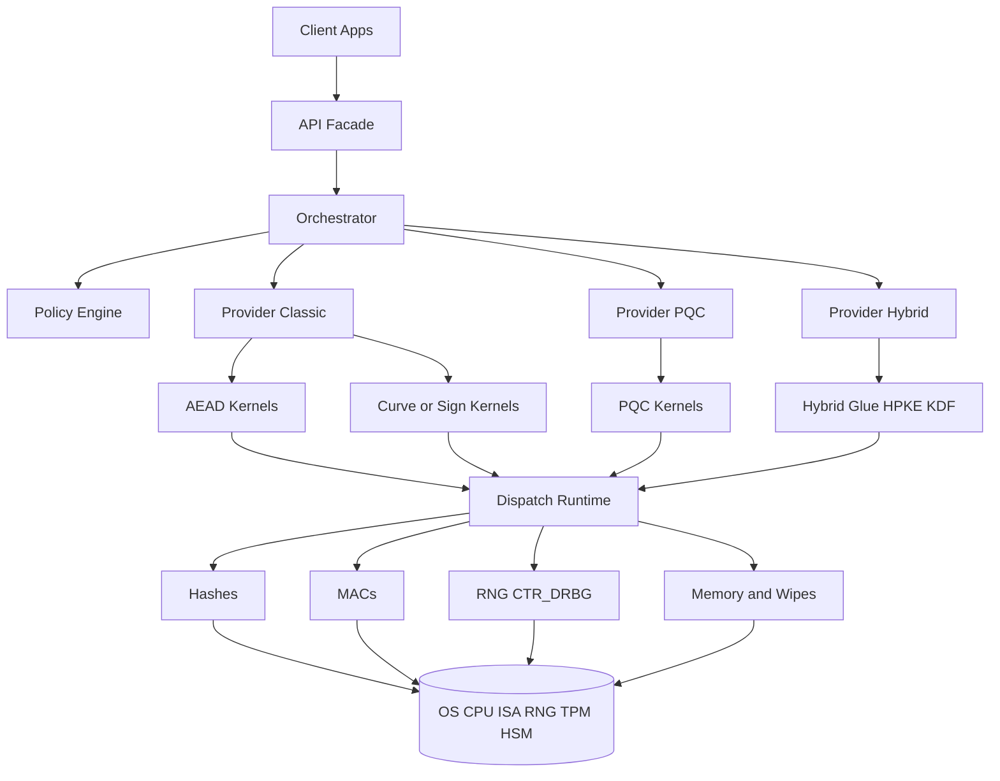


---

## 2) “Harvest-Now, Decrypt-Later” (HNDL) Threat Model

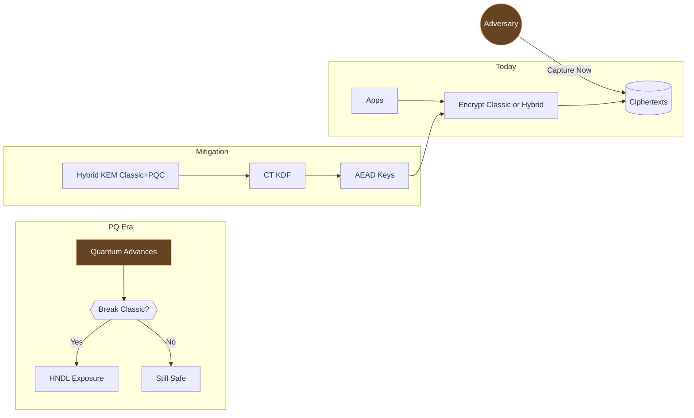

---

## 3) Zero-Downtime Hot Patch (Live Update) Flow

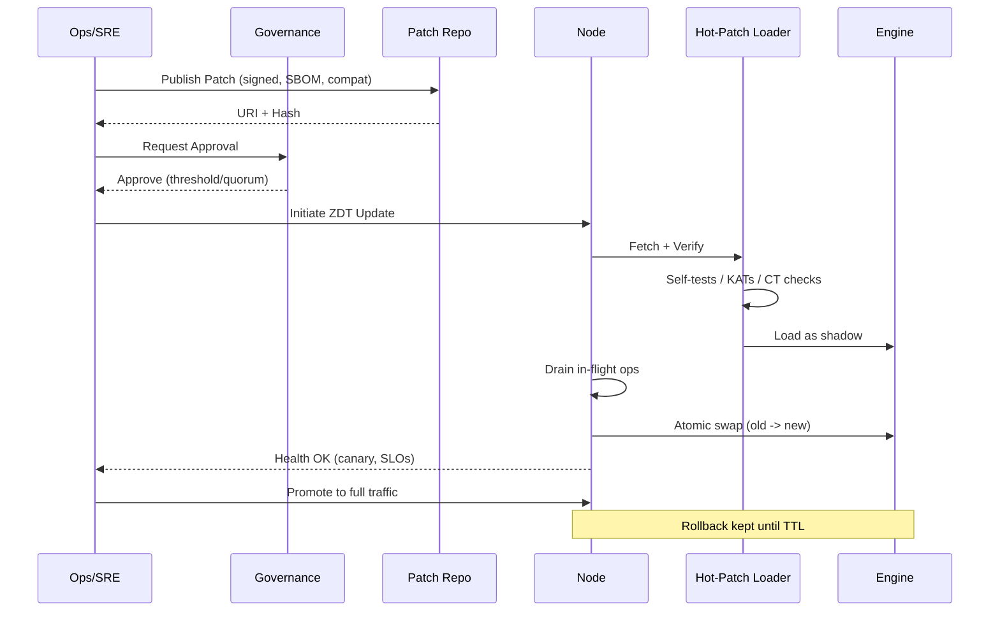

---

## 4) Runtime Dispatch Decision Tree (ISA/Feature Probing)

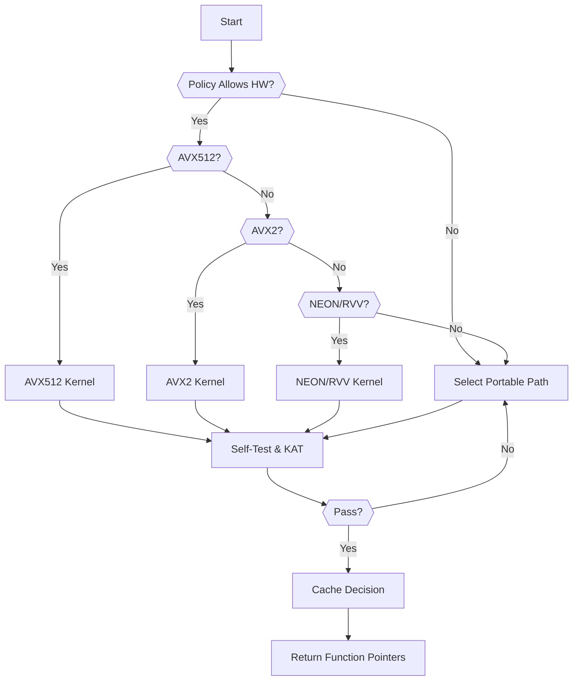

---

## 5) Key Lifecycle & Rotation

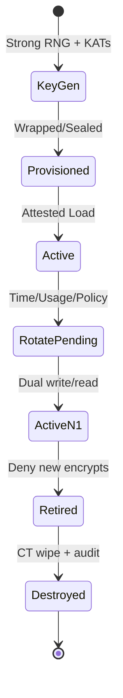

---

## 6) AEAD (e.g., AES-GCM/ChaCha20-Poly1305) Data Flow

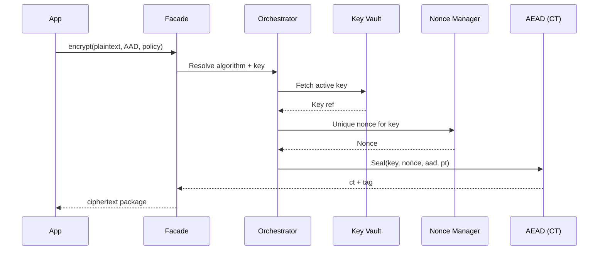

---

## 7) PQC Hybrid HPKE Envelope

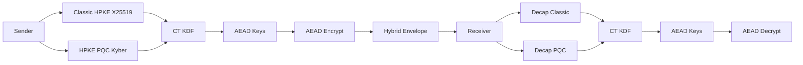


---


## 8) CSRNG CTR‑DRBG Reseed

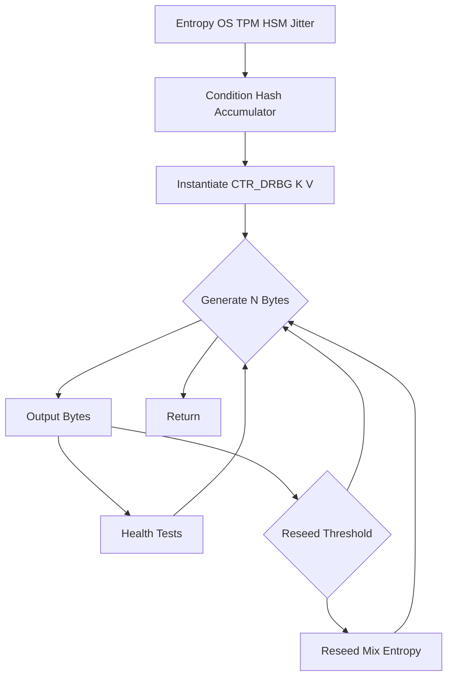


---

## 9) C++ Modules Build & Packaging Pipeline

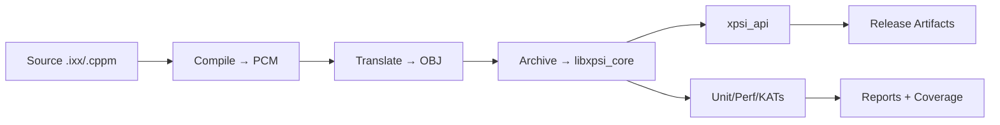

---

## 10) Telemetry, Logging, and Audit

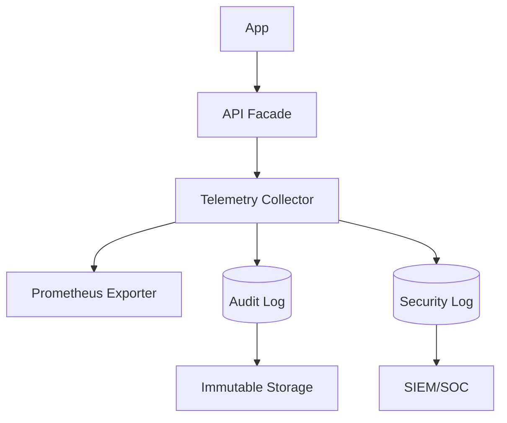

---

## 11) Side-Channel & Constant-Time Boundaries

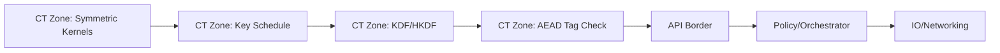

---

## 12) Failure Modes & Safe Defaults

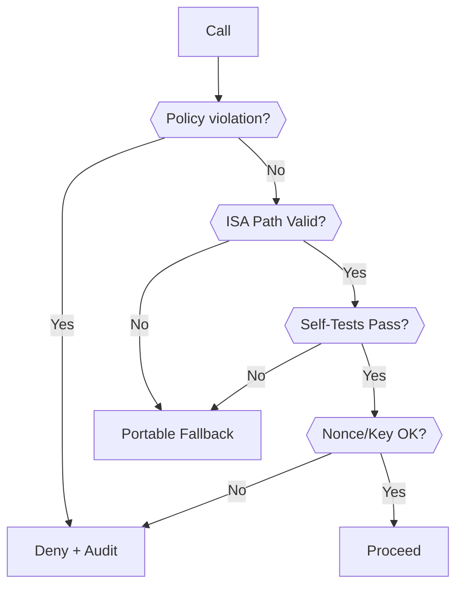

---

## Merged from `simd/DIAGRAMS.md`

### 1. SIMD Component Architecture
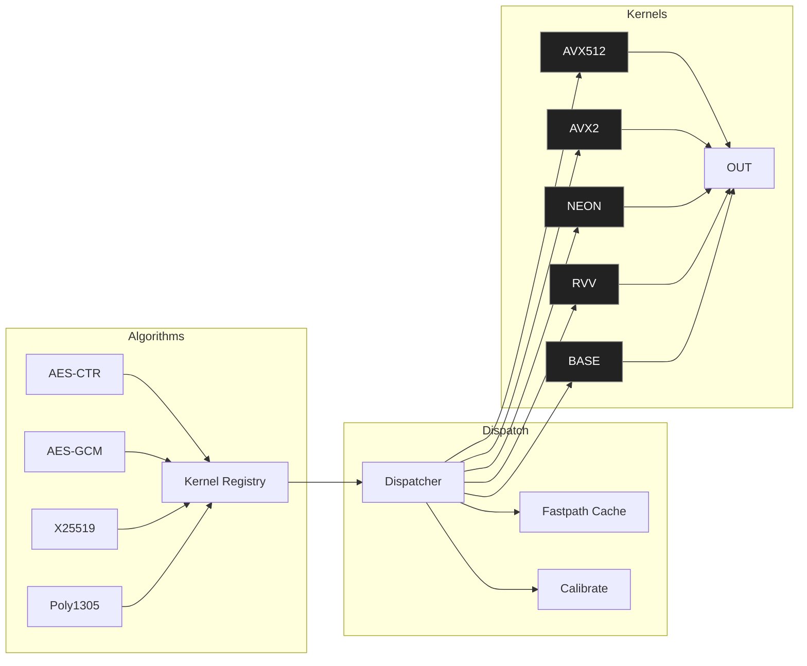

### 2. SIMD Selection Sequence (First Call)
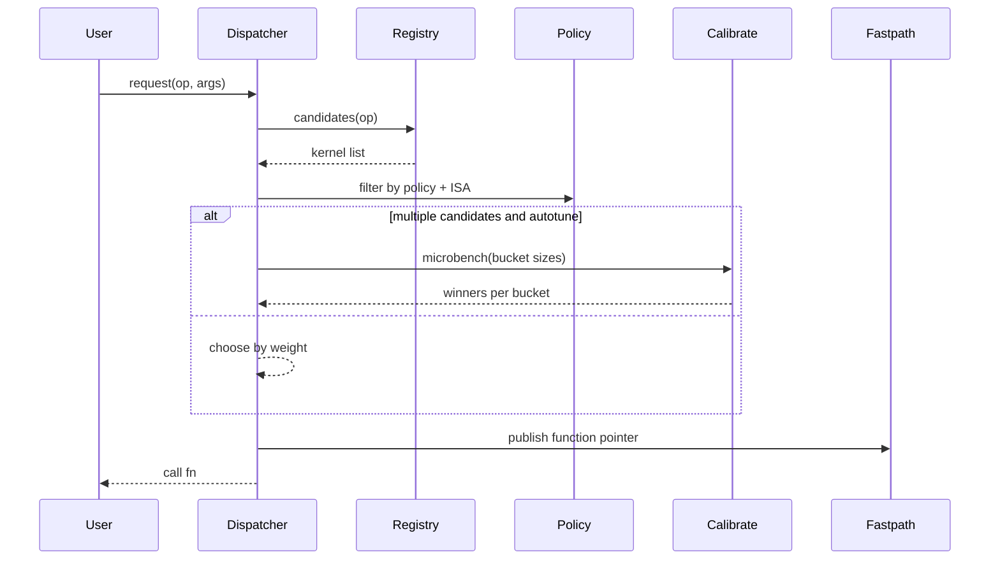

### 3. SIMD Policy State
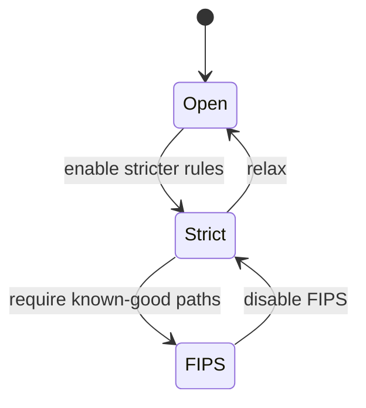

### 4. SIMD CI/CD Flow
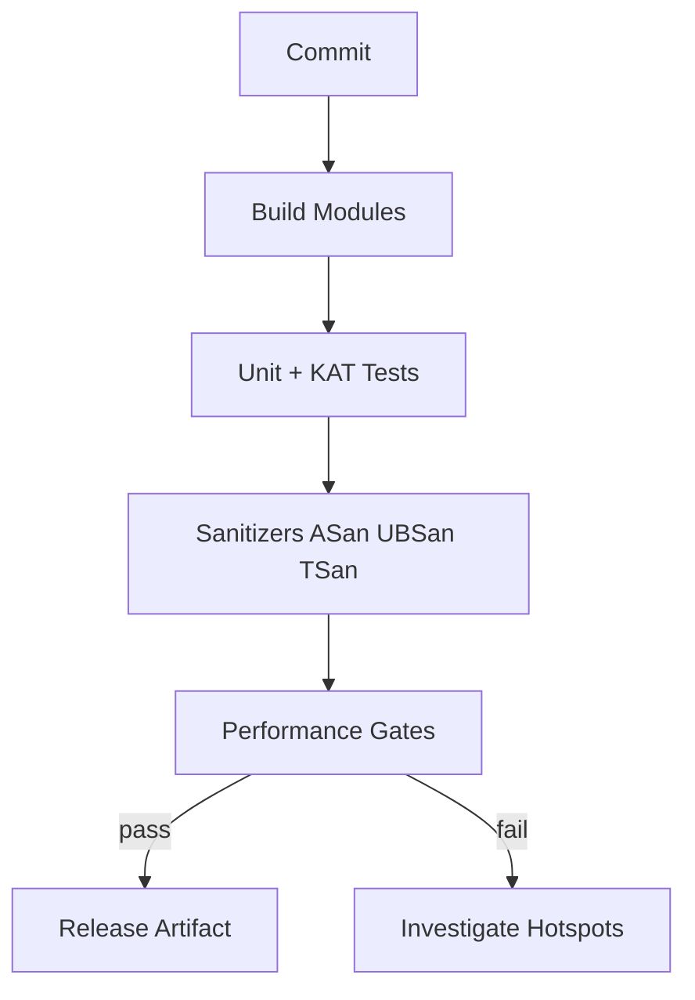

---

## Merged from `auto_rotation/DIAGRAMS.md`

### A) Auto‑Rotation Component Diagram
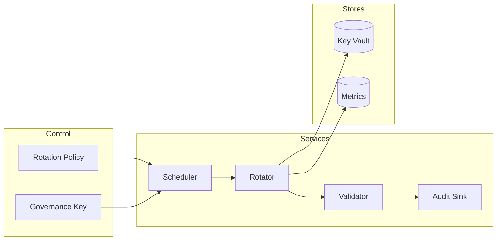

### B) Rotation Sequence (ZDT)
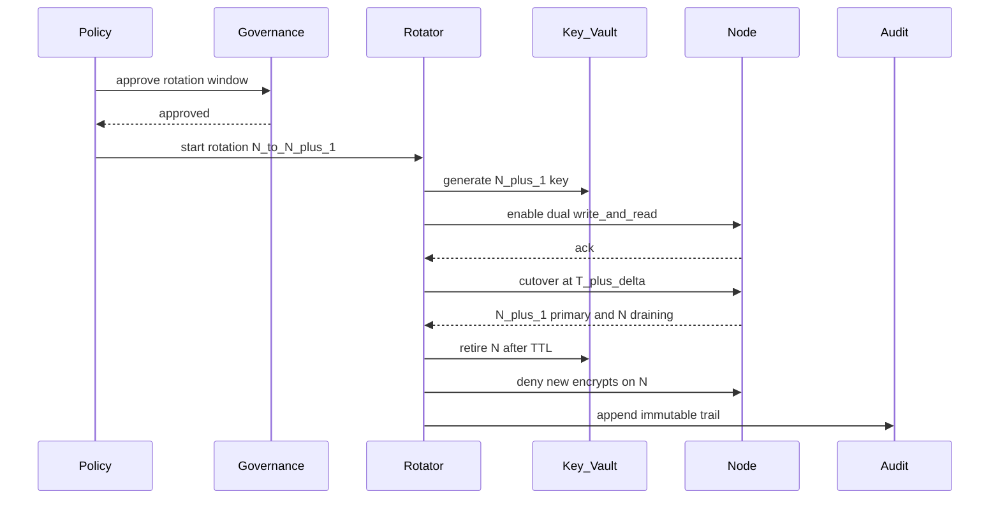

### C) Rollback & Guardrails
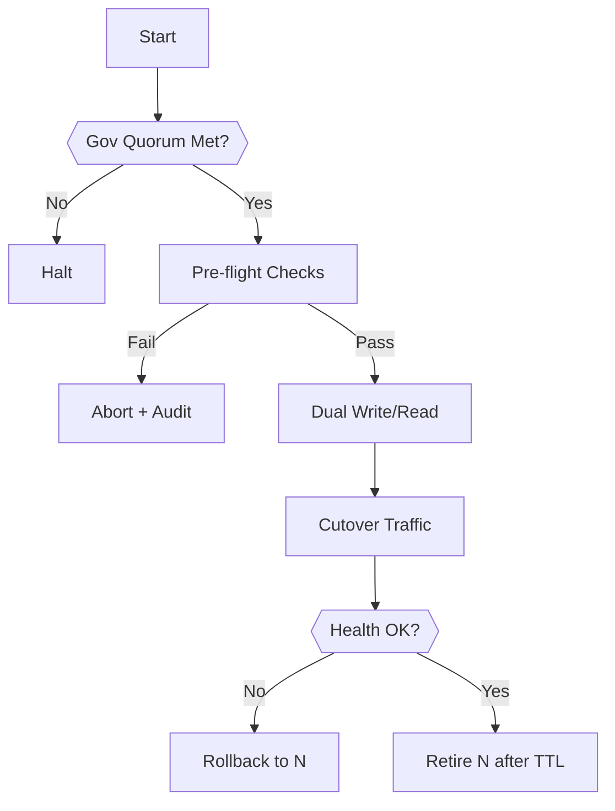

## Super/Hybrid Overview

```mermaid
flowchart LR
%% Nodes
Client[Client]
API[Unified API]
Route[Routing Orchestrator]
Engines[Engines]
Local[Local]
HSM[KMS HSM]
Remote[Remote]
HotPatch[HotPatch Adapter]
Rotation[Rotation Adapter]
```

```mermaid
%% Edges
Client --> API
API --> Route
Route --> Engines
Engines --> Local
Engines --> HSM
Engines --> Remote
HotPatch --- Rotation
HotPatch --> Engines
Rotation --> Engines
```

---

*End of DIAGRAMS.md*
