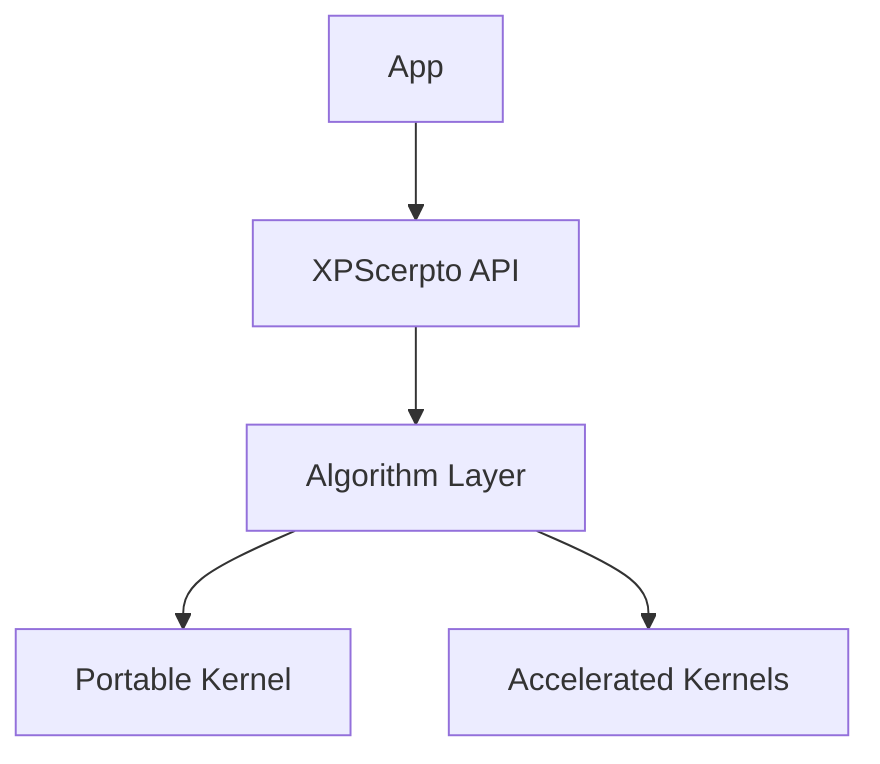
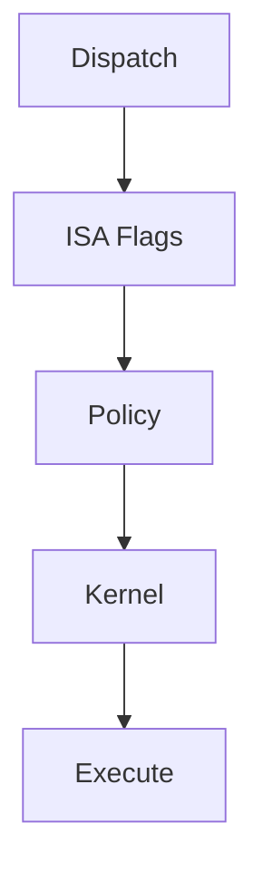

# Diagrams

<!-- TOC-BEGIN -->
## Table of Contents

- [Table of Contents](#table-of-contents)
- [1. High‑Level](#1-highlevel)
- [2. Dispatch](#2-dispatch)
<!-- TOC-END -->

<!-- TOC-BEGIN -->
## Table of Contents

- [1. High‑Level](#1-highlevel)
- [2. Dispatch](#2-dispatch)
<!-- TOC-END -->

All Mermaid snippets follow the project's linter rules:
- No `note over`
- No `|label|` on edges
- No parentheses in node labels

## 1. High‑Level

## 2. Dispatch
