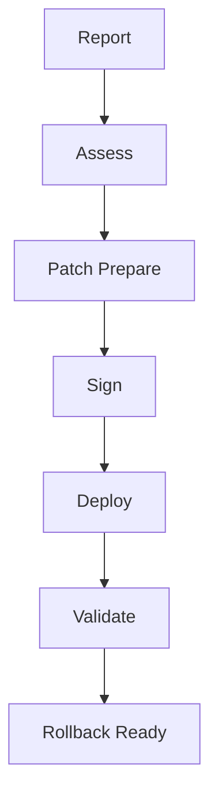

# Security Specification

<!-- TOC-BEGIN -->
## Table of Contents

- [Table of Contents](#table-of-contents)
- [Table of Contents](#table-of-contents)
- [Table of Contents](#table-of-contents)
- [1. Assumptions](#1-assumptions)
- [2. Threat Model](#2-threat-model)
- [3. Hardening Controls](#3-hardening-controls)
- [4. Side‑Channel Policy](#4-sidechannel-policy)
- [5. Secrets Handling](#5-secrets-handling)
- [6. Incident Response](#6-incident-response)
- [7. Compliance Notes](#7-compliance-notes)
- [Deep Reference — Full v5](#deep-reference--full-v5)
- [XPScerpto — Security Specification](#xpscerpto--security-specification)
- [Table of Contents](#table-of-contents)
- [Introduction](#introduction)
- [Supported Algorithms & Standards (Secure Defaults)](#supported-algorithms--standards-secure-defaults)
  - [Symmetric Encryption](#symmetric-encryption)
  - [Asymmetric Cryptography](#asymmetric-cryptography)
  - [Hash Functions](#hash-functions)
  - [MACs & Signatures](#macs--signatures)
  - [Key Derivation](#key-derivation)
  - [Randomness](#randomness)
  - [Post‑Quantum (PQC)](#postquantum-pqc)
- [Security Guarantees & Design Properties](#security-guarantees--design-properties)
  - [1) Side‑channel Resistance](#1-sidechannel-resistance)
  - [2) Sensitive Memory Protection](#2-sensitive-memory-protection)
  - [3) Authenticated Confidentiality & Integrity](#3-authenticated-confidentiality--integrity)
  - [4) Self‑Tests (Power‑up & Conditional)](#4-selftests-powerup--conditional)
  - [5) Crypto‑Agility & Hot Patch](#5-cryptoagility--hot-patch)
  - [6) Standards Alignment](#6-standards-alignment)
  - [7) Post‑Quantum Readiness](#7-postquantum-readiness)
- [Threat Model (Summary)](#threat-model-summary)
- [Operational Guidance & Hardening](#operational-guidance--hardening)
  - [Key Management (Keyring)](#key-management-keyring)
  - [Policies](#policies)
  - [Logging & Audit](#logging--audit)
  - [Build/Runtime Hardening](#buildruntime-hardening)
- [Security Testing](#security-testing)
- [Coordinated Disclosure (Optional)](#coordinated-disclosure-optional)
- [Assumptions & Limitations](#assumptions--limitations)
- [Appendix A — Default Approved Algorithms](#appendix-a--default-approved-algorithms)
- [Appendix B — Secure Defaults (Illustrative)](#appendix-b--secure-defaults-illustrative)
- [Merged from `simd/SECURITY_SPEC.md`](#merged-from-simdsecurityspecmd)
- [1. Goals & Scope](#1-goals--scope)
- [2. Trust Boundaries](#2-trust-boundaries)
- [3. Threats & Mitigations (Traceability Matrix)](#3-threats--mitigations-traceability-matrix)
- [4. Constant‑Time Policy](#4-constanttime-policy)
- [5. Memory Safety & Hygiene](#5-memory-safety--hygiene)
- [6. Keying & Randomness](#6-keying--randomness)
- [7. Secure Defaults](#7-secure-defaults)
- [8. Compliance Notes](#8-compliance-notes)
- [9. Incident Response Playbook](#9-incident-response-playbook)
- [Merged from `auto_rotation/SECURITY_SPEC.md`](#merged-from-autorotationsecurityspecmd)
- [1) Security Objectives](#1-security-objectives)
- [2) Threat Model](#2-threat-model)
- [3) Controls](#3-controls)
- [4) Compliance](#4-compliance)
- [5) Secure Coding Notes](#5-secure-coding-notes)
- [Merged from `super/SECURITY_SPEC.md`](#merged-from-supersecurityspecmd)
- [Objectives](#objectives)
- [Threat Model](#threat-model)
- [Controls](#controls)
- [Compliance](#compliance)
<!-- TOC-END -->

<!-- TOC-BEGIN -->
## Table of Contents

- [Table of Contents](#table-of-contents)
- [Table of Contents](#table-of-contents)
- [1. Assumptions](#1-assumptions)
- [2. Threat Model](#2-threat-model)
- [3. Hardening Controls](#3-hardening-controls)
- [4. Side‑Channel Policy](#4-sidechannel-policy)
- [5. Secrets Handling](#5-secrets-handling)
- [6. Incident Response](#6-incident-response)
- [7. Compliance Notes](#7-compliance-notes)
- [Deep Reference — Full v5](#deep-reference--full-v5)
- [XPScerpto — Security Specification](#xpscerpto--security-specification)
- [Table of Contents](#table-of-contents)
- [Introduction](#introduction)
- [Supported Algorithms & Standards (Secure Defaults)](#supported-algorithms--standards-secure-defaults)
  - [Symmetric Encryption](#symmetric-encryption)
  - [Asymmetric Cryptography](#asymmetric-cryptography)
  - [Hash Functions](#hash-functions)
  - [MACs & Signatures](#macs--signatures)
  - [Key Derivation](#key-derivation)
  - [Randomness](#randomness)
  - [Post‑Quantum (PQC)](#postquantum-pqc)
- [Security Guarantees & Design Properties](#security-guarantees--design-properties)
  - [1) Side‑channel Resistance](#1-sidechannel-resistance)
  - [2) Sensitive Memory Protection](#2-sensitive-memory-protection)
  - [3) Authenticated Confidentiality & Integrity](#3-authenticated-confidentiality--integrity)
  - [4) Self‑Tests (Power‑up & Conditional)](#4-selftests-powerup--conditional)
  - [5) Crypto‑Agility & Hot Patch](#5-cryptoagility--hot-patch)
  - [6) Standards Alignment](#6-standards-alignment)
  - [7) Post‑Quantum Readiness](#7-postquantum-readiness)
- [Threat Model (Summary)](#threat-model-summary)
- [Operational Guidance & Hardening](#operational-guidance--hardening)
  - [Key Management (Keyring)](#key-management-keyring)
  - [Policies](#policies)
  - [Logging & Audit](#logging--audit)
  - [Build/Runtime Hardening](#buildruntime-hardening)
- [Security Testing](#security-testing)
- [Coordinated Disclosure (Optional)](#coordinated-disclosure-optional)
- [Assumptions & Limitations](#assumptions--limitations)
- [Appendix A — Default Approved Algorithms](#appendix-a--default-approved-algorithms)
- [Appendix B — Secure Defaults (Illustrative)](#appendix-b--secure-defaults-illustrative)
- [Merged from `simd/SECURITY_SPEC.md`](#merged-from-simdsecurityspecmd)
- [1. Goals & Scope](#1-goals--scope)
- [2. Trust Boundaries](#2-trust-boundaries)
- [3. Threats & Mitigations (Traceability Matrix)](#3-threats--mitigations-traceability-matrix)
- [4. Constant‑Time Policy](#4-constanttime-policy)
- [5. Memory Safety & Hygiene](#5-memory-safety--hygiene)
- [6. Keying & Randomness](#6-keying--randomness)
- [7. Secure Defaults](#7-secure-defaults)
- [8. Compliance Notes](#8-compliance-notes)
- [9. Incident Response Playbook](#9-incident-response-playbook)
- [Merged from `auto_rotation/SECURITY_SPEC.md`](#merged-from-autorotationsecurityspecmd)
- [1) Security Objectives](#1-security-objectives)
- [2) Threat Model](#2-threat-model)
- [3) Controls](#3-controls)
- [4) Compliance](#4-compliance)
- [5) Secure Coding Notes](#5-secure-coding-notes)
- [Merged from `super/SECURITY_SPEC.md`](#merged-from-supersecurityspecmd)
- [Objectives](#objectives)
- [Threat Model](#threat-model)
- [Controls](#controls)
- [Compliance](#compliance)
<!-- TOC-END -->

<!-- TOC-BEGIN -->
## Table of Contents

- [Table of Contents](#table-of-contents)
- [1. Assumptions](#1-assumptions)
- [2. Threat Model](#2-threat-model)
- [3. Hardening Controls](#3-hardening-controls)
- [4. Side‑Channel Policy](#4-sidechannel-policy)
- [5. Secrets Handling](#5-secrets-handling)
- [6. Incident Response](#6-incident-response)
- [7. Compliance Notes](#7-compliance-notes)
- [Deep Reference — Full v5](#deep-reference--full-v5)
- [XPScerpto — Security Specification](#xpscerpto--security-specification)
- [Table of Contents](#table-of-contents)
- [Introduction](#introduction)
- [Supported Algorithms & Standards (Secure Defaults)](#supported-algorithms--standards-secure-defaults)
  - [Symmetric Encryption](#symmetric-encryption)
  - [Asymmetric Cryptography](#asymmetric-cryptography)
  - [Hash Functions](#hash-functions)
  - [MACs & Signatures](#macs--signatures)
  - [Key Derivation](#key-derivation)
  - [Randomness](#randomness)
  - [Post‑Quantum (PQC)](#postquantum-pqc)
- [Security Guarantees & Design Properties](#security-guarantees--design-properties)
  - [1) Side‑channel Resistance](#1-sidechannel-resistance)
  - [2) Sensitive Memory Protection](#2-sensitive-memory-protection)
  - [3) Authenticated Confidentiality & Integrity](#3-authenticated-confidentiality--integrity)
  - [4) Self‑Tests (Power‑up & Conditional)](#4-selftests-powerup--conditional)
  - [5) Crypto‑Agility & Hot Patch](#5-cryptoagility--hot-patch)
  - [6) Standards Alignment](#6-standards-alignment)
  - [7) Post‑Quantum Readiness](#7-postquantum-readiness)
- [Threat Model (Summary)](#threat-model-summary)
- [Operational Guidance & Hardening](#operational-guidance--hardening)
  - [Key Management (Keyring)](#key-management-keyring)
  - [Policies](#policies)
  - [Logging & Audit](#logging--audit)
  - [Build/Runtime Hardening](#buildruntime-hardening)
- [Security Testing](#security-testing)
- [Coordinated Disclosure (Optional)](#coordinated-disclosure-optional)
- [Assumptions & Limitations](#assumptions--limitations)
- [Appendix A — Default Approved Algorithms](#appendix-a--default-approved-algorithms)
- [Appendix B — Secure Defaults (Illustrative)](#appendix-b--secure-defaults-illustrative)
- [Merged from `simd/SECURITY_SPEC.md`](#merged-from-simdsecurityspecmd)
- [1. Goals & Scope](#1-goals--scope)
- [2. Trust Boundaries](#2-trust-boundaries)
- [3. Threats & Mitigations (Traceability Matrix)](#3-threats--mitigations-traceability-matrix)
- [4. Constant‑Time Policy](#4-constanttime-policy)
- [5. Memory Safety & Hygiene](#5-memory-safety--hygiene)
- [6. Keying & Randomness](#6-keying--randomness)
- [7. Secure Defaults](#7-secure-defaults)
- [8. Compliance Notes](#8-compliance-notes)
- [9. Incident Response Playbook](#9-incident-response-playbook)
- [Merged from `auto_rotation/SECURITY_SPEC.md`](#merged-from-autorotationsecurityspecmd)
- [1) Security Objectives](#1-security-objectives)
- [2) Threat Model](#2-threat-model)
- [3) Controls](#3-controls)
- [4) Compliance](#4-compliance)
- [5) Secure Coding Notes](#5-secure-coding-notes)
- [Merged from `super/SECURITY_SPEC.md`](#merged-from-supersecurityspecmd)
- [Objectives](#objectives)
- [Threat Model](#threat-model)
- [Controls](#controls)
- [Compliance](#compliance)
<!-- TOC-END -->

<!-- TOC-BEGIN -->
## Table of Contents

- [1. Assumptions](#1-assumptions)
- [2. Threat Model](#2-threat-model)
- [3. Hardening Controls](#3-hardening-controls)
- [4. Side‑Channel Policy](#4-sidechannel-policy)
- [5. Secrets Handling](#5-secrets-handling)
- [6. Incident Response](#6-incident-response)
- [7. Compliance Notes](#7-compliance-notes)
- [Deep Reference — Full v5](#deep-reference--full-v5)
- [XPScerpto — Security Specification](#xpscerpto--security-specification)
- [Table of Contents](#table-of-contents)
- [Introduction](#introduction)
- [Supported Algorithms & Standards (Secure Defaults)](#supported-algorithms--standards-secure-defaults)
  - [Symmetric Encryption](#symmetric-encryption)
  - [Asymmetric Cryptography](#asymmetric-cryptography)
  - [Hash Functions](#hash-functions)
  - [MACs & Signatures](#macs--signatures)
  - [Key Derivation](#key-derivation)
  - [Randomness](#randomness)
  - [Post‑Quantum (PQC)](#postquantum-pqc)
- [Security Guarantees & Design Properties](#security-guarantees--design-properties)
  - [1) Side‑channel Resistance](#1-sidechannel-resistance)
  - [2) Sensitive Memory Protection](#2-sensitive-memory-protection)
  - [3) Authenticated Confidentiality & Integrity](#3-authenticated-confidentiality--integrity)
  - [4) Self‑Tests (Power‑up & Conditional)](#4-selftests-powerup--conditional)
  - [5) Crypto‑Agility & Hot Patch](#5-cryptoagility--hot-patch)
  - [6) Standards Alignment](#6-standards-alignment)
  - [7) Post‑Quantum Readiness](#7-postquantum-readiness)
- [Threat Model (Summary)](#threat-model-summary)
- [Operational Guidance & Hardening](#operational-guidance--hardening)
  - [Key Management (Keyring)](#key-management-keyring)
  - [Policies](#policies)
  - [Logging & Audit](#logging--audit)
  - [Build/Runtime Hardening](#buildruntime-hardening)
- [Security Testing](#security-testing)
- [Coordinated Disclosure (Optional)](#coordinated-disclosure-optional)
- [Assumptions & Limitations](#assumptions--limitations)
- [Appendix A — Default Approved Algorithms](#appendix-a--default-approved-algorithms)
- [Appendix B — Secure Defaults (Illustrative)](#appendix-b--secure-defaults-illustrative)
- [Merged from `simd/SECURITY_SPEC.md`](#merged-from-simdsecurityspecmd)
- [1. Goals & Scope](#1-goals--scope)
- [2. Trust Boundaries](#2-trust-boundaries)
- [3. Threats & Mitigations (Traceability Matrix)](#3-threats--mitigations-traceability-matrix)
- [4. Constant‑Time Policy](#4-constanttime-policy)
- [5. Memory Safety & Hygiene](#5-memory-safety--hygiene)
- [6. Keying & Randomness](#6-keying--randomness)
- [7. Secure Defaults](#7-secure-defaults)
- [8. Compliance Notes](#8-compliance-notes)
- [9. Incident Response Playbook](#9-incident-response-playbook)
- [Merged from `auto_rotation/SECURITY_SPEC.md`](#merged-from-autorotationsecurityspecmd)
- [1) Security Objectives](#1-security-objectives)
- [2) Threat Model](#2-threat-model)
- [3) Controls](#3-controls)
- [4) Compliance](#4-compliance)
- [5) Secure Coding Notes](#5-secure-coding-notes)
- [Merged from `super/SECURITY_SPEC.md`](#merged-from-supersecurityspecmd)
- [Objectives](#objectives)
- [Threat Model](#threat-model)
- [Controls](#controls)
- [Compliance](#compliance)
<!-- TOC-END -->

This document defines the **threat model**, **assumptions**, **hardening**, and **incident response** for XPScerpto.

## 1. Assumptions

- Clean toolchain and OS, no malicious kernel modules
- NTP‑synchronized clock for consensus or timestamped ops
- Hardware RNG sane; augment with DRBG reseed policy

## 2. Threat Model

- Adversary can read process memory via bugs; protect keys by minimizing exposure, locking, wiping
- Side channels: timing, cache, branch predictors; constant‑time where required
- Supply chain: tampered archives or patches; verify signatures and manifests

## 3. Hardening Controls

- **Secure memory**: `LockedBuffer`, `SecureBuffer`, `secure_erase`
- **Constant‑time** helpers: `ct_equal`, `ct_is_zero`, `secure_copy`
- **Key lifecycle**: generation, rotation, destruction; optional keyring modules
- **Patch security**: verify package signature; rollback available and tested
- **Build flags**: `-fstack-protector-strong`, `-fPIC`, optional `-fno-exceptions` in kernels

## 4. Side‑Channel Policy

- Disallow data‑dependent table indices in sensitive paths
- Keep branches independent of secret bits
- Mask or blind where applicable
- Use portable fallbacks when accelerated path compromises constant time

## 5. Secrets Handling

- Zeroize on error and success paths
- Never log secrets; structured logs redact by default
- Memory locking for long‑lived secrets

## 6. Incident Response

- Contact: `security@yourdomain.tld`
- Versioned advisories with CVE mapping when applicable
- Hot‑patch flow:

- Playbooks in `docs/WORKFLOWS.md`

## 7. Compliance Notes

- Reproducible builds preferred
- SBOM optional; sign releases; keep build logs

---

## Deep Reference — Full v5
## XPScerpto — Security Specification

<!-- TOC-BEGIN -->
## Table of Contents

- [Introduction](#introduction)
- [Supported Algorithms & Standards (Secure Defaults)](#supported-algorithms--standards-secure-defaults)
  - [Symmetric Encryption](#symmetric-encryption)
  - [Asymmetric Cryptography](#asymmetric-cryptography)
  - [Hash Functions](#hash-functions)
  - [MACs & Signatures](#macs--signatures)
  - [Key Derivation](#key-derivation)
  - [Randomness](#randomness)
  - [Post‑Quantum (PQC)](#postquantum-pqc)
- [Security Guarantees & Design Properties](#security-guarantees--design-properties)
  - [1) Side‑channel Resistance](#1-sidechannel-resistance)
  - [2) Sensitive Memory Protection](#2-sensitive-memory-protection)
  - [3) Authenticated Confidentiality & Integrity](#3-authenticated-confidentiality--integrity)
  - [4) Self‑Tests (Power‑up & Conditional)](#4-selftests-powerup--conditional)
  - [5) Crypto‑Agility & Hot Patch](#5-cryptoagility--hot-patch)
  - [6) Standards Alignment](#6-standards-alignment)
  - [7) Post‑Quantum Readiness](#7-postquantum-readiness)
- [Threat Model (Summary)](#threat-model-summary)
- [Operational Guidance & Hardening](#operational-guidance--hardening)
  - [Key Management (Keyring)](#key-management-keyring)
  - [Policies](#policies)
  - [Logging & Audit](#logging--audit)
  - [Build/Runtime Hardening](#buildruntime-hardening)
- [Security Testing](#security-testing)
- [Coordinated Disclosure (Optional)](#coordinated-disclosure-optional)
- [Assumptions & Limitations](#assumptions--limitations)
- [Appendix A — Default Approved Algorithms](#appendix-a--default-approved-algorithms)
- [Appendix B — Secure Defaults (Illustrative)](#appendix-b--secure-defaults-illustrative)
- [Merged from `simd/SECURITY_SPEC.md`](#merged-from-simdsecurityspecmd)
- [1. Goals & Scope](#1-goals--scope)
- [2. Trust Boundaries](#2-trust-boundaries)
- [3. Threats & Mitigations (Traceability Matrix)](#3-threats--mitigations-traceability-matrix)
- [4. Constant‑Time Policy](#4-constanttime-policy)
- [5. Memory Safety & Hygiene](#5-memory-safety--hygiene)
- [6. Keying & Randomness](#6-keying--randomness)
- [7. Secure Defaults](#7-secure-defaults)
- [8. Compliance Notes](#8-compliance-notes)
- [9. Incident Response Playbook](#9-incident-response-playbook)
- [Merged from `auto_rotation/SECURITY_SPEC.md`](#merged-from-autorotationsecurityspecmd)
- [1) Security Objectives](#1-security-objectives)
- [2) Threat Model](#2-threat-model)
- [3) Controls](#3-controls)
- [4) Compliance](#4-compliance)
- [5) Secure Coding Notes](#5-secure-coding-notes)
- [Merged from `super/SECURITY_SPEC.md`](#merged-from-supersecurityspecmd)
- [Objectives](#objectives)
- [Threat Model](#threat-model)
- [Controls](#controls)
- [Compliance](#compliance)
<!-- TOC-END -->

## Introduction
XPScerpto is engineered to meet stringent security requirements for protecting data-at-rest and data-in-motion. This document describes the library’s cryptographic algorithms, key and memory protection, side‑channel safeguards, self‑tests, standards alignment, and operational guidance. It is written for security engineers and assessors who need to understand how XPScerpto Crypto achieves both present‑day and forward‑looking (post‑quantum) security.

---

## Supported Algorithms & Standards (Secure Defaults)
XPScerpto exposes modern primitives through high‑level, safe APIs and policy‑driven defaults.

### Symmetric Encryption
- **AES‑GCM** (128/192/**256**). Authenticated encryption per **NIST SP 800‑38D** (default AEAD).
- **ChaCha20‑Poly1305** per **RFC 8439**, lightweight AEAD alternative.

### Asymmetric Cryptography
- **RSA** (≥ 3072‑bit recommended for 2030+ horizon), **RSA‑PSS** for signatures.
- **ECC**: X25519 (ECDH), Ed25519 (EdDSA), ECDH/ECDSA on common NIST curves (policy‑controlled).

### Hash Functions
- **SHA‑2** (SHA‑256/384/512), **SHA‑3**.
- **BLAKE2** / **BLAKE3** for high performance hashing.
- **SHAKE128/256** (extendable‑output functions).

### MACs & Signatures
- **HMAC** (SHA‑256/384/512; also BLAKE2/3 variants if enabled).
- **Poly1305** (paired with ChaCha20).  
- **Signatures**: RSA‑PSS, ECDSA, **Ed25519** (default), and PQC signatures where enabled.

### Key Derivation
- **HKDF** (RFC 5869) for session keys from shared secrets.
- **PBKDF2** and **Argon2id** for password‑backed keys (high‑cost defaults; randomized salt).

### Randomness
- **CSPRNG**: CTR‑DRBG (NIST SP 800‑90A). Optional HWRNG seeding (e.g., RDSEED/RDRAND) when available.

### Post‑Quantum (PQC)
- **Kyber** (KEM) and **Dilithium**/**Falcon** (signatures), selectable via policy and available for hybrid schemes.

> **Policy‑driven defaults**: weak/legacy algorithms are disabled by default. Minimum key sizes and allowed modes are enforced centrally.

---

## Security Guarantees & Design Properties

### 1) Side‑channel Resistance
- Constant‑time implementations for critical paths (comparisons, MAC checks, ECDH/EdDSA internals).
- Memory access and control‑flow independent of secret data (to the extent feasible on target ISA).
- SIMD/ISA paths gated by policies to avoid variable‑latency instructions on secret material.
- Pairwise consistency checks for asymmetric keys to avoid oracle leakage.

### 2) Sensitive Memory Protection
- **SecureBuffer**/**LockedBuffer** abstractions for key material, with:
  - Explicit `secure_wipe()` using volatility barriers to prevent compiler elision.
  - Optional **RAM locking** (mlock/VirtualLock) to prevent swapping.
  - Zeroization on scope end (RAII) and on error paths.
- Prohibit accidental logging/serialization of secrets via type separation and policy guards.

### 3) Authenticated Confidentiality & Integrity
- AEAD by default (AES‑GCM / ChaCha20‑Poly1305): decryption fails closed on tag mismatch.
- Constant‑time MAC verification; no partial plaintext on authentication failure.
- Strict separation of “encrypt” vs “sign” keys via Keyring policy attributes.

### 4) Self‑Tests (Power‑up & Conditional)
- **Known Answer Tests (KATs)** at initialization for core primitives (AES, SHA‑2/3, HMAC, DRBG, Ed25519, etc.).
- **Conditional tests**:
  - Pairwise key tests on asymmetric key generation.
  - DRBG continuous health tests.
- Fail‑safe mode on self‑test failure (module enters disabled/error state).

### 5) Crypto‑Agility & Hot Patch
- Signed module updates (signature verification before load).
- **Zero‑downtime** switchover: in‑flight operations complete on the old version, new calls routed to updated module.
- Policy engine can centrally disable algorithms and set minimum strengths at runtime.

### 6) Standards Alignment
- Designed with **FIPS 140‑3** validation path in mind (see mapping file).
- Uses NIST‑approved algorithms and constructions by default; non‑approved are opt‑in with warnings.
- Supports compliance goals for **GDPR/HIPAA/PCI‑DSS** via strong encryption and key lifecycle controls.

### 7) Post‑Quantum Readiness
- Optional hybrid KEM/signature flows (e.g., X25519+Kyber; Ed25519+Dilithium) to mitigate “harvest‑now‑decrypt‑later”.

---

## Threat Model (Summary)
- **In scope**: network adversaries, compromised storage, passive side‑channel observers, software‑only attackers.
- **Partially in scope**: micro‑architectural leakages (mitigated by constant‑time discipline and policy), kernel compromise detection.
- **Out of scope**: physical tampering against non‑HSM deployments (unless combined with platform protections).

---

## Operational Guidance & Hardening

### Key Management (Keyring)
- Key generation with high entropy; tagged usage (Encrypt‑Only, Sign‑Only, Derive‑Only).
- **Rotation** (time/use‑count policies); **revocation** lists; signed key manifests.
- Encrypted at rest with password‑based wrapping (Argon2id/PBKDF2 → AEAD).

### Policies
- Centrally enforced: min key sizes, approved curves/modes, forbidden algorithms.
- Runtime switches to disable legacy algorithms without rebuilds.

### Logging & Audit
- Structured security events: key‑gen, rotation, self‑test results, auth failures, policy denials.
- Redaction by default; no secret bytes in logs.

### Build/Runtime Hardening
- Hardened compiler flags, stack canaries, ASLR, RELRO/PIE where applicable.
- Sanitizers in CI (ASan/UBSan/TSan) and reproducible builds.
- Deterministic tests with KAT vectors; fuzzing and differential tests for crypto code paths.

---

## Security Testing
- **KAT suites** for AES/SHA/HMAC/DRBG/Ed25519/etc.
- **Interoperability** tests vs. reference vectors.
- **Fuzzing** (inputs, state machines) and **property‑based** tests (e.g., AEAD misuse resistance invariants).
- **Performance** tests gated to ensure constant‑time critical paths do not regress into secret‑dependent branches.

---

## Coordinated Disclosure (Optional)
- Security contact, PGP key, and SLA for triage and fixes. Signed advisories and hot‑patches when needed.

---

## Assumptions & Limitations
- XPScerpto Crypto is a **software module** (no physical tamper‑evidence). Combine with OS/container hardening.
- Side‑channel resistance depends on deployment discipline (pinning cores, constant‑time build flags, disabling frequency scaling on sensitive paths when required).
- PQC algorithms are included for hybrid readiness; formal certification timelines may vary by scheme.

---

## Appendix A — Default Approved Algorithms
- AEAD: AES‑GCM(256), ChaCha20‑Poly1305
- Signatures: RSA‑PSS(≥3072), Ed25519, (PQC: Dilithium/Falcon)
- KEM/ECDH: X25519, (PQC: Kyber)
- Hashing/XOF: SHA‑256/384/512, SHA‑3, SHAKE128/256, BLAKE3
- KDF: HKDF, Argon2id, PBKDF2
- DRBG: CTR‑DRBG (with continuous tests)

---

## Appendix B — Secure Defaults (Illustrative)
- Min RSA size: 3072; ECC: X25519/Ed25519 by default.
- AEAD default: AES‑GCM‑256 with random 96‑bit nonce (unique per message).
- HKDF with SHA‑256 and explicit salt; Argon2id with memory ≥ 128 MiB, time ≥ 3 and parallelism ≥ 2 (tunable by policy).
- Keys in memory: LockedBuffer + mandatory zeroization on scope end.

---

## Merged from `simd/SECURITY_SPEC.md`

# XPScerpto — Security Specification
**Version:** v4 • **Generated:** 2025-11-02 11:52 UTC

## 1. Goals & Scope
- **Confidentiality/Integrity:** kernels are correct and constant‑correct; dispatch never changes semantics.
- **Side‑channel mindfulness:** optional constant‑time posture excludes non‑CT kernels globally.
- **Least capability:** only ISAs both **detected** and **allowed** are used; AVX‑512 is conservatively demoted by default.
- **Composability:** no network or file I/O; no secret persistence; small, auditable state.

## 2. Trust Boundaries
- **Inside:** process memory, registry state, function pointers (atomics).
- **Outside:** environment variables, user data buffers, RNG/key provisioning (caller’s responsibility).

## 3. Threats & Mitigations (Traceability Matrix)
| Threat                                   | Vector/Condition                          | Mitigation                                                                 |
|------------------------------------------|-------------------------------------------|----------------------------------------------------------------------------|
| Timing side-channel (data‑dependent)     | Non‑CT kernels                            | `XPS_SIMD_CT=1`, CT tagging per kernel, AES‑NI/VAES preferred, bitslicing |
| Micro‑arch regressions (AVX‑512 freq)     | Turbo drop on wide vectors                | AVX‑512 demotion default; user override required                           |
| Illegal instruction (SIGILL)             | Executing ISA not supported               | Feature detection + policy mask gate; filtered before selection            |
| Cache‑based leakage                      | Table lookups keyed by secrets            | CT posture excludes such kernels; AES‑NI/PMULL alternatives                |
| RCE via registry tampering               | Untrusted writes to registry              | No external write APIs; internal registration only; module‑internal guards |
| Races/UB                                 | Cross‑thread hot path                     | Atomic publication; shared_mutex around writes; sanitizer CI               |
| Misconfiguration                         | Wrong env flags                           | Safe defaults; doc’d toggles; sanity asserts in debug                      |

## 4. Constant‑Time Policy
- `constant_time=false` candidates are excluded when CT posture is enabled.
- AES‑NI / VAES / PMULL kernels are considered CT for data‑flow (no secret‑indexed tables).

## 5. Memory Safety & Hygiene
- No heap allocations on hot path; transient calibration buffers bounded and zeroized when applicable.
- Prefer fixed‑size arrays & span; avoid UB; CI with **ASan/UBSan/TSan** profiles.

## 6. Keying & Randomness
- The dispatcher does **not** generate keys or IVs. Callers must supply cryptographically strong randomness.
- Provide IV/nonce uniqueness guarantees at a higher layer (GCM/CTR nonce discipline).

## 7. Secure Defaults
- Autotune **on**; CT **off** (performance default); AVX‑512 **demoted**; ISA mask **all detected**.
- Production hardening guidance: enable CT where secrets are long‑term; pin ISA if you must reproduce results.

## 8. Compliance Notes
- The system is **not** a certification boundary by itself (no FIPS modules). It is structured to ease later validation:
  tiny hot path; clear CT toggles; reproducible selection. Documentation and tests support audits.

## 9. Incident Response Playbook
- Rapidly disable a problematic ISA: `XPS_SIMD_ISA_MASK` to exclude bits, or re‑register portable kernel only.
- Roll forward with fixed kernel: register new candidate, atomically swap fast path after self‑test, keep old as fallback.

---

## Merged from `auto_rotation/SECURITY_SPEC.md`

# SECURITY SPEC — Auto-Rotation
**Version:** 2025-11-01

---

## 1) Security Objectives
- Preserve confidentiality & integrity of keys across *generate → activate → cutover → retire*.
- Prevent stale/compromised versions from lingering beyond grace.
- Provide cryptographic agility with safe defaults and explicit approvals.
- Maintain robust auditability and tamper-evident logs.

## 2) Threat Model
**In-scope**: provider compromise, API misuse, race conditions, replay of rotation commands, clock skew, partial rollouts, malicious peer in distributed mode.  
**Out-of-scope**: micro-architectural side-channels not mitigated by platform, physical HSM extraction, OS root compromise.

## 3) Controls
- **Least privilege** for provider backends; activation requires pre-checks from `compliance`.
- **Dual control** (optional): require two approvals before `activate`.
- **Constant-time** operations on key material and version selectors within providers.
- **Audit trails**: append-only, signed or hashed log chains; include `{KeyId, from→to, reason, ts, approver}`.
- **Grace caps**: bounded ZDT windows; automatic retirement upon health signals.
- **Rollback safety**: old key valid only within grace; after commit, call `retire` with proof of health.
- **Distributed guard**: single active leader via lease; rotations are idempotent and replay-safe.
- **Time hygiene**: monotonic clocks, drift warnings; orchestrator validates non-regressive timestamps.

## 4) Compliance
- FIPS mode toggles restrict algorithm sets via `crypto_agile` and `compliance` gating.
- Retention: keep only the last *M* retired versions for forensics within legal policy.
- Keys at rest: rely on HSM/KMS or sealed storage; no raw keys in logs or exceptions.

## 5) Secure Coding Notes
- Avoid throwing with secret-bearing messages; prefer structured error codes.
- Wipe temporary buffers; prefer `xps.memory::SecureBuffer` if available.
- Ensure `IKeyProvider` hooks are **idempotent** and **thread-safe**.

---

## Merged from `super/SECURITY_SPEC.md`

# SECURITY SPEC — XPS Super Crypto
**Version:** 2025-11-01

---

## Objectives
- Constant-time guarantees for sensitive paths with documented exceptions.
- Defense-in-depth across routing, providers, and patching.
- Strong provenance for patches and engines (signature chains, transparency log).

## Threat Model
**In-scope**: malicious provider, compromised engine, downgrade attempts, route manipulation, patch forgery, side-effects on cross-platform ABIs.  
**Out-of-scope**: physical extraction from HSM, full OS compromise.

## Controls
- **Policy Guardrails**: explicit allow-lists per tenant/purpose; FIPS mode restricts algorithms.
- **CT Discipline**: constant-time comparisons, masked tables, CT toggles documented and gated.
- **Patch Security**: signed capsules, mandatory verification, roll-back journal.
- **Transparency**: append-only logs of engine changes and route decisions.
- **Tenant Isolation**: per-tenant quotas/limits and independent health scoring.
- **Key Handling**: use handles; avoid raw keys in process memory where possible.
- **Randomness**: platform entropy with health checks; HKDF for key derivation.

## Compliance
- FIPS/CC posture configurable; engines carry compliance metadata.
- Retention windows and audit hooks exposed via `provider.hooks`.