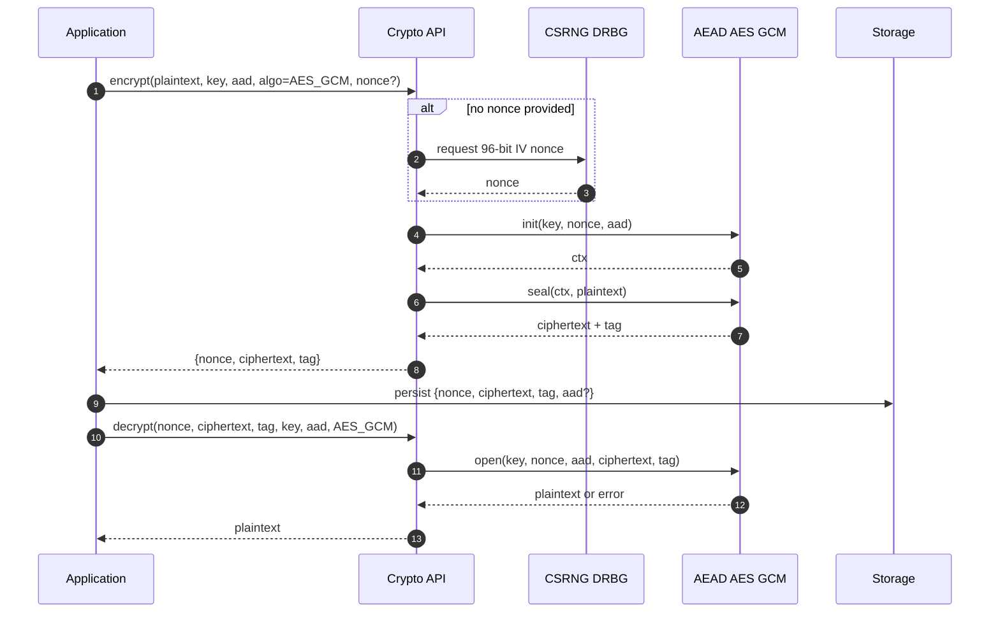
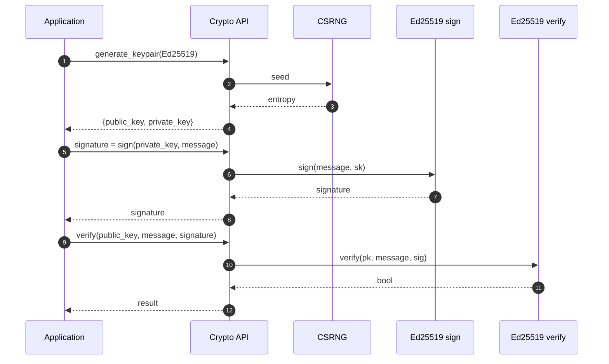
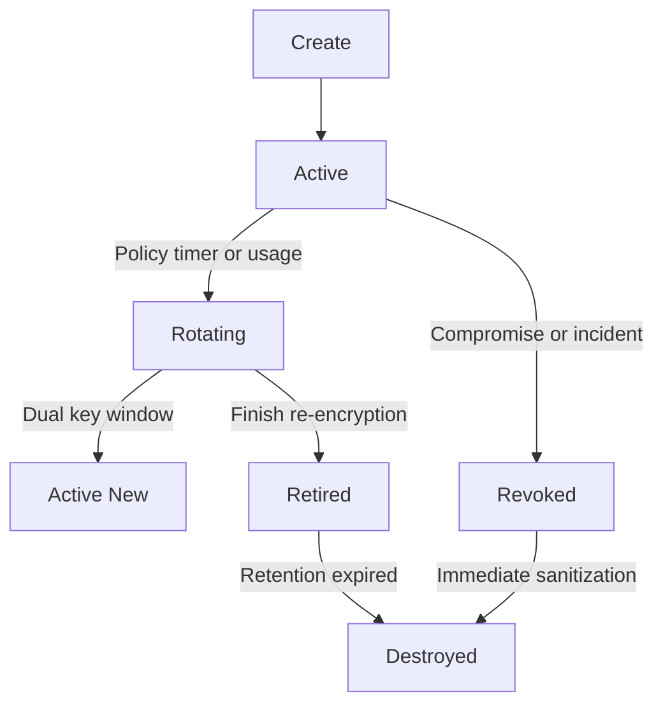
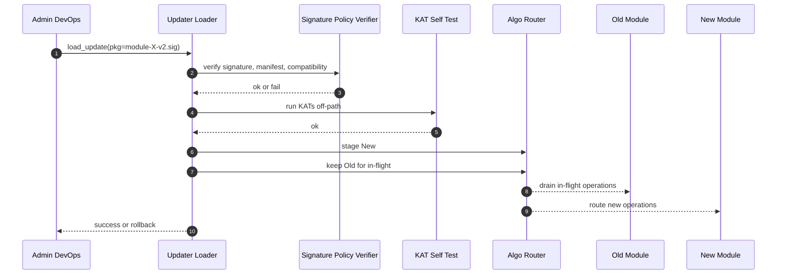
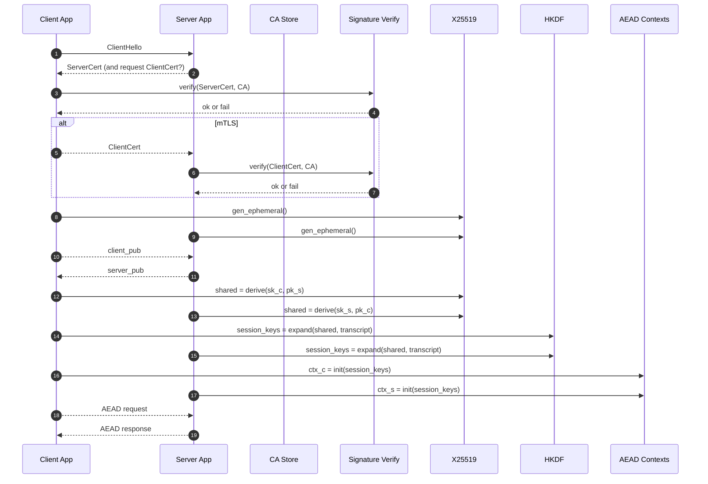

<!--
  XPScerpto — Workflows (Public v4)
  Notes:
  - GitHub-safe Mermaid (no parentheses in node labels, no "par"/"note over").
  - Version header + date + disclaimers.
  - Brand unified: XPScerpto.
-->

<div align="center">

<a id="top"></a>

# 🚀 XPScerpto — Workflows  

<!-- TOC-BEGIN -->
## Table of Contents

- [🔗 Quick Navigation](#-quick-navigation)
- [Conventions](#conventions)
- [Workflow 1 — Data Encryption & Decryption (AEAD/AES-GCM exemplar)](#workflow-1--data-encryption--decryption-aeadaes-gcm-exemplar)
  - [Goal](#goal)
  - [Illustrative C++ (pseudo-API)](#illustrative-c-pseudo-api)
  - [Error/Resiliency Notes](#errorresiliency-notes)
- [Workflow 2 — Digital Signature & Verification (Ed25519 exemplar)](#workflow-2--digital-signature--verification-ed25519-exemplar)
  - [Goal](#goal)
  - [Illustrative C++](#illustrative-c)
  - [Error/Resiliency Notes](#errorresiliency-notes)
- [Workflow 3 — Key Lifecycle Management (Create → Use → Rotate → Revoke/Destroy)](#workflow-3--key-lifecycle-management-create--use--rotate--revokedestroy)
  - [Goal](#goal)
  - [Sequence (high level)](#sequence-high-level)
  - [Illustrative C++](#illustrative-c)
- [Workflow 4 — Crypto-Agility Hot-Patch (Zero-Downtime Swap)](#workflow-4--crypto-agility-hot-patch-zero-downtime-swap)
  - [Goal](#goal)
- [Workflow 5 — Mutual Authentication (mTLS-like, X25519 + HKDF + AEAD)](#workflow-5--mutual-authentication-mtls-like-x25519--hkdf--aead)
  - [Goal](#goal)
  - [Illustrative C++](#illustrative-c)
- [Appendices](#appendices)
  - [Appendix A — Key State Rules](#appendix-a--key-state-rules)
  - [Appendix B — Error & Audit Taxonomy](#appendix-b--error--audit-taxonomy)
  - [Appendix C — Configuration Hooks](#appendix-c--configuration-hooks)
- [Advanced Playbooks](#advanced-playbooks)
- [Contributing & Security](#contributing--security)
<!-- TOC-END -->

Operational Playbooks for a Modern C++ Crypto Engine

<!-- Badges (replace links with your real ones if available) -->


**Version:** v1.0 • **Date:** 2025‑11‑03 • **Status:** Public

</div>

> [!IMPORTANT]
> **Brand consistency**: The library name is **XPScerpto**.  
> Code examples may reference `xps.crypto.*` modules if that’s your actual namespace. Replace with your real APIs as needed.

> [!CAUTION]
> This document is **not cryptographic advice**. Verify configuration against your threat model, compliance needs (e.g., FIPS), and jurisdictional constraints.

---

## 🔗 Quick Navigation
**Conventions** · [AEAD Encrypt/Decrypt](#workflow-1--data-encryption--decryption-aeadaes-gcm-exemplar) · [Ed25519 Sign/Verify](#workflow-2--digital-signature--verification-ed25519-exemplar) · [Key Lifecycle](#workflow-3--key-lifecycle-management-create--use--rotate--revokedestroy) · [Hot-Patch](#workflow-4--crypto-agility-hot-patch-zero-downtime-swap) · [Mutual Auth](#workflow-5--mutual-authentication-mtls-like-x25519--hkdf--aead) · [Appendices](#appendices) · [Advanced Playbooks](#advanced-playbooks) · [Contributing & Security](#contributing--security)

---

## Conventions

**Actors**
- **App**: Your service/application
- **API**: XPScerpto top-level facade (e.g., `xps.crypto.api`)
- **CSRNG**: Cryptographically secure RNG/DRBG
- **AEAD**: Authenticated encryption (AES-GCM, XChaCha20-Poly1305)
- **Keyring**: Secure key store/manager (create/rotate/revoke)
- **Router**: Runtime algorithm/router (SIMD dispatch)
- **Signer/Verifier**: Signature modules (e.g., `ed25519`)
- **KEX**: Key exchange (e.g., `x25519`)
- **HKDF**: Session key derivation
- **Loader/Updater**: Hot-patch orchestrator
- **Store**: Persistence layer (DB/object store)

**Artifacts**: `key`, `nonce/IV`, `aad`, `ciphertext`, `tag`, `signature`, `pub/priv keys`, `shared_secret`, `session_keys`.

> [!SECURITY]
> Defaults: constant-time compares, unique AEAD nonces, secure memory + wipes, audited key/patch events, KAT self-tests on startup and before hot-patch enablement.

---

## Workflow 1 — Data Encryption & Decryption (AEAD/AES-GCM exemplar)

<details>
<summary><b>What you get</b>: nonce generation, AEAD seal/open, storage pattern, and resiliency tips.</summary>

### Goal
Encrypt plaintext with a secret key, then decrypt & authenticate. (Swap AES-GCM with XChaCha20-Poly1305 if required.)



### Illustrative C++ (pseudo-API)
```cpp
import xps.crypto.api;      // facade
import xps.crypto.memory;   // secure buffers

using xps::crypto::Bytes;
using xps::crypto::secure_wipe;

Bytes key = api::random_bytes(32); // AES-256
Bytes aad;                         // optional AAD

auto sealed = api::aead::encrypt(api::AEAD::AES_GCM, key, data, aad);
// sealed = { nonce, ciphertext, tag }

auto plain  = api::aead::decrypt(api::AEAD::AES_GCM, key,
                                 sealed.nonce, sealed.ciphertext, sealed.tag, aad);

secure_wipe(key);
```

### Error/Resiliency Notes
- **Never** reuse a nonce with the same key (GCM catastrophic).
- On **tag mismatch**, return an auth error (no partial plaintext).
- Prefer **key separation** (data vs metadata).

</details>

---

## Workflow 2 — Digital Signature & Verification (Ed25519 exemplar)

<details>
<summary><b>What you get</b>: keygen → sign → verify, constant-time rules, early validation.</summary>

### Goal
Signer produces a digital signature; verifier checks it using the public key.



### Illustrative C++
```cpp
import xps.crypto.ed25519;

auto [pk, sk] = ed25519::generate_keypair();
auto sig = ed25519::sign(sk, message);
bool ok  = ed25519::verify(pk, message, sig);
```

### Error/Resiliency Notes
- Reject structurally invalid keys/signatures early (length/format).
- Constant-time comparisons only; never log private material.
- Use secure memory; wipe secrets.

</details>

---

## Workflow 3 — Key Lifecycle Management (Create → Use → Rotate → Revoke/Destroy)

<details open>
<summary><b>What you get</b>: state machine, dual-key windows, emergency revoke, audited transitions.</summary>

### Goal
Manage long-lived keys with clear states and automated rotation, without service interruption.



### Sequence (high level)
1. **Create**: Generate key + metadata (purpose, policy) → **Keyring**.
2. **Use**: App fetches by **Key ID**; materialize in secure memory.
3. **Rotate** (scheduled): new key **Active**; **dual-key** decrypt window; optional re-encrypt at rest; old → **Retired**.
4. **Revoke** (incident): mark **Revoked** → block usage; fast-track re-encrypt.
5. **Destroy**: after retention → secure erase; audit remains.

### Illustrative C++
```cpp
import xps.crypto.keyring;

auto id  = keyring::create("db-at-rest", keyring::Algo::AES256_GCM, "rotate=365d");
auto key = keyring::get(id);      // secure materialize
// ... use key ...
keyring::rotate(id);              // schedules dual-window
keyring::revoke(id);              // emergency
```

> [!NOTE]
> Decrypt should try **Active → Retired** during rotation windows.  
> Transitions must be **idempotent** and **audited**. Gate revoke/destroy with MFA/approvals.

</details>

---

## Workflow 4 — Crypto-Agility Hot-Patch (Zero-Downtime Swap)

<details>
<summary><b>What you get</b>: signed capsule verify → self-tests → phased cutover → rollback.</summary>

### Goal
Replace a vulnerable/obsolete algorithm implementation at runtime, safely.



**Safety Gates**
- Provenance: detached signature + publisher key-pin
- Compatibility: API/ABI checks + policy allow-list
- Self-tests: KATs & micro-benchmarks before enable
- Phased cutover: drain old, route new, **rollback** on signal
- Audit: immutable hash, time, operator, policy refs

</details>

---

## Workflow 5 — Mutual Authentication (mTLS-like, X25519 + HKDF + AEAD)

<details>
<summary><b>What you get</b>: bilateral auth, transcript-bound keys, AEAD channels.</summary>

### Goal
Mutual auth, shared secret derivation, AEAD-protected traffic.



### Illustrative C++
```cpp
import xps.crypto.x25519;
import xps.crypto.hkdf;
import xps.crypto.aead;

auto [c_pk, c_sk] = x25519::generate_keypair();
auto [s_pk, s_sk] = x25519::generate_keypair(); // server

// exchange c_pk <-> s_pk
auto client_shared = x25519::derive_shared(c_sk, s_pk);
auto server_shared = x25519::derive_shared(s_sk, c_pk);

auto keys_c = hkdf::expand(client_shared, transcript, 64);
auto keys_s = hkdf::expand(server_shared, transcript, 64);

auto ctx_c = aead::make(aead::AES_GCM, keys_c.enc, keys_c.iv);
auto ctx_s = aead::make(aead::AES_GCM, keys_s.enc, keys_s.iv);
```

> [!WARNING]
> Verify certificate chains & revocation; bind session keys to a **transcript hash**; enforce **unique nonces** and periodic re-key.

</details>

---

## Appendices

### Appendix A — Key State Rules
- Only **Active** keys may encrypt.
- Decrypt tries **Active → Retired** during rotation windows.
- **Revoked** keys are unusable; destruction is one-way & audited.

### Appendix B — Error & Audit Taxonomy

| Class             | Examples/Meaning                                                   |
|-------------------|--------------------------------------------------------------------|
| `XPS_ERR_AUTH`    | MAC/tag mismatch, invalid signature                                |
| `XPS_ERR_KEY`     | Missing/revoked/wrong size/expired                                 |
| `XPS_ERR_NONCE`   | Reuse/size violation                                               |
| `XPS_ERR_POLICY`  | Disallowed algorithm/parameter                                     |
| `XPS_ERR_UPDATE`  | Patch verification/KAT/compatibility failed                        |
| `XPS_ERR_INTERNAL`| Memory/entropy/overflow/assert                                     |

**Audit events (samples)**: `KEY_CREATE/ROTATE/REVOKE/DESTROY`, `PATCH_LOAD/ENABLE/ROLLBACK`, `CRYPTO_FAIL_AUTH` (rate-limited; redacted context).

### Appendix C — Configuration Hooks
```yaml
crypto:
  aead:
    default: AES_GCM
    nonce: auto         # auto | app
  keyring:
    rotation_days: 365
    dual_window_days: 30
    destroy_after_days: 180
  policy:
    forbid: [sha1, des]
  hotpatch:
    require_signature: true
    run_selftests: true
    rollback_on_error: true
  tls:
    rekey_messages: 2_000_000
    rekey_minutes: 60
```

> [!TIP]
> Keep configuration **immutable at runtime** except for explicit, audited changes (e.g., emergency revocations).

---

## Advanced Playbooks

> Merged content from `simd/WORKFLOWS.md`, `auto_rotation/WORKFLOWS.md`, and `super/WORKFLOWS.md`.

<details>
<summary><b>SIMD Runtime Dispatch — Ops Lifecycle</b></summary>

**Init & Registration**
1. Load policy (CT, ISA, demotion, autotune).
2. Modules register kernels into the registry.
3. First call triggers selection.

**Autotune (first call)**
- Filter by policy ∧ caps → survivors.
- Measure survivors → winners per bucket.
- Publish atomic fn* for hot path.

**Hot Path**
- Single atomic load → indirect call to chosen kernel.
- No locks/heap/policy lookups per call.

**Add a Kernel**
- Implement new SIMD/portable impl with identical signature.
- `register_kernel(op, desc)` with CT flag + ISA mask.
- Static weight optional; autotune validates.

**CI/CD**
- Clang + GCC; **ASan/UBSan/TSan** jobs.
- KATs: AES-GCM, X25519, Poly1305.
- Perf gates (64 KiB) on AVX2/NEON runners.

**Incidents**
- `XPS_SIMD_ISA_MASK` to restrict ISA.
- Ship fixed kernel, keep old fallback; flip fastpath post self-test.
- Roll back by re-publishing previous pointer.

**Troubleshooting**
- **PCM mismatch**: ensure identical flags (`-pthread`, sanitizers, visibility).
- **SIGILL**: verify detection; restrict ISA temporarily.
- **Perf cliffs**: toggle AVX-512 demotion; compare tuned vs static.

</details>

<details>
<summary><b>Key Auto-Rotation Orchestrator — Operational Steps</b></summary>

**Monthly Rotation**
1. Register provider (e.g., Vault/HSM).
2. Policy: monthly(UTC 00:00) + grace 7d.
3. Create plan: `KeyId`, `policy_id`, `target_suite`, `provider`.
4. `orch.track(plan)` → `orch.start()`.

**Emergency Rotation**
1. Pause ticks or force run.
2. Forced plan (immediate schedule, short grace).
3. Generate/Activate N+1; prefer newest for encrypt.
4. Commit cutover post health checks; retire N.
5. File incident report + full audit.

**Crypto Migration (AES-GCM-256 → XChaCha20-Poly1305)**
1. Ensure `crypto_agile` lists both; note FIPS implications.
2. Draft plan with extended grace & canary subset.
3. Monitor decrypt error rates → commit → retire old; update compliance docs.

**Multi-Node Rollout**
1. Distributed lease (single leader).
2. Followers warm caches and observe.
3. Leader performs rotations; idempotent steps prevent duplication.
4. Lease transfers on failure.

**Post-Rotation Hygiene**
- Verify zero usage of `N` for ≥ grace; archive audit; rotate logs.

</details>

<details>
<summary><b>XPScerpto Super-Crypto — Engines, Patches, PQC Hybrid</b></summary>

**Add New Engine**
1. Implement Adapter (caps + driver).
2. Register in `UnifiedAPI` under a stable name.
3. Update route policy allow-list & weights.
4. Add observability hooks & KATs.

**Emergency Patch**
1. Stage signed patch capsule.
2. Validate KATs; canary routes.
3. Commit with dual-run; monitor errors.
4. Roll back on anomalies; preserve journal.

**PQC Migration (Hybrid)**
1. Enable hybrid (e.g., ECDH + Kyber).
2. Canary subset; gather perf/error metrics.
3. Increase share; retire legacy once thresholds met.

</details>

---

## Contributing & Security

- **Contributing**: See `CONTRIBUTING.md` for style, testing, and CI rules.
- **Security Policy / Disclosure**: See `SECURITY.md` for how to report vulnerabilities.
- **License**: Apache-2.0 (see `LICENSE`).

<p align="right"><a href="#top">⬆️ Back to top</a></p>
