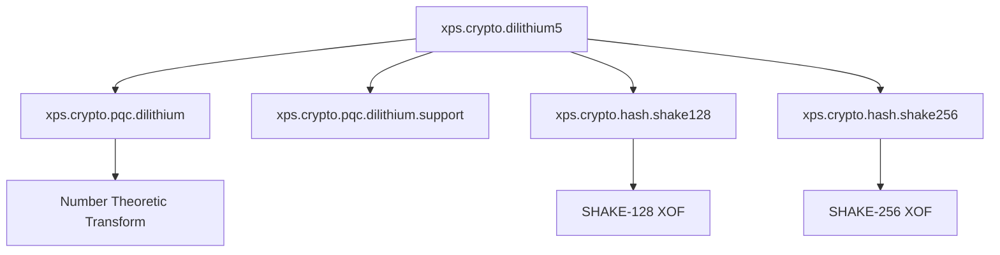

<!-- TOC-BEGIN -->
**Document Version:** 2.0 | **Last Updated:** 2025-10-26  
**Module:** `xps.crypto.dilithium5`  
**Status:** **Production-Ready (Engineering Preview)**

> **Security Advisory**  
> This implementation is an engineering preview and has not undergone formal cryptographic certification.  
> Use for **development and testing** purposes only.

---

## Executive Summary
The `xps.crypto.dilithium5` module provides a C++23/26 implementation of the **Dilithium Level-5** digital signature scheme, a post-quantum cryptographic algorithm selected for standardization by NIST. It offers a type-safe, high-performance interface for quantum-resistant digital signatures with clean C++ Modules integration.

### Key Features
- **Quantum-resistant security:** Based on the MLWE problem in lattice cryptography.  
- **Modern C++ design:** Leverages C++23/26 modules for clear dependencies and fast builds.  
- **Production-lean architecture:** Optimized for performance while remaining readable and maintainable.  
- **Type-safe API:** Strong typing and bounds checking to reduce misuse.


## Quick Start Guide

### Minimal Working Example
```cpp
#include <array>
#include <span>
#include <random>
#include <iostream>
#include <cstring>

import xps.crypto.dilithium5;

int main() {
    using namespace XPScerpto::crypto::dilithium5;

    // 1) Cryptographic-grade entropy
    std::array<std::uint8_t, 32> seed{};
    std::random_device rd;
    std::generate(seed.begin(), seed.end(), [&]{ return static_cast<std::uint8_t>(rd()); });

    // 2) Deterministic key pair generation
    auto [public_key, secret_key] = Dilithium5::keygen(seed);

    // 3) Message signing
    constexpr std::string_view message = "Quantum-resistant message payload";
    auto signature = Dilithium5::sign(secret_key, std::as_bytes(std::span{message}));

    // 4) Signature verification
    bool ok = Dilithium5::verify(public_key, std::as_bytes(std::span{message}), signature);
    std::cout << "Signature verification: " << (ok ? "SUCCESS" : "FAILURE") << '\n';
    return ok ? 0 : 1;
}
```

### Build Configuration (Standalone)
```cmake
cmake_minimum_required(VERSION 3.26)
project(quantum_crypto_example LANGUAGES CXX)

set(CMAKE_CXX_STANDARD 23)
set(CMAKE_CXX_STANDARD_REQUIRED ON)

find_package(xps_crypto REQUIRED COMPONENTS dilithium5)

add_executable(example main.cpp)
target_link_libraries(example PRIVATE XPScerpto::crypto::dilithium5)
```

---

## Architecture Overview

### Module Dependencies


### Core Components

| Component       | Purpose                       | Implementation                      |
|----------------|-------------------------------|-------------------------------------|
| Number Theoretic Transform (NTT) Engine     | Polynomial multiplication     | `xps.crypto.pqc.dilithium`          |
| Hash Functions | SHAKE128/256 for XOF          | `xps.crypto.hash.shake*`            |
| Sampling       | CBD for secret generation     | `xps.crypto.pqc.dilithium.support`  |
| Arithmetic     | Modular polynomial operations | Optimized C++ with `constexpr`      |

---

## Integration Guide

### Prerequisites
- **Compiler:** Clang ≥ 17.0 or GCC ≥ 14.0 with C++23 modules support.  
- **Build System:** CMake ≥ 3.26 with module dependency resolution.  
- **OS:** Linux, Windows, or macOS with a modern toolchain.

### CMake Integration
```cmake
# Hash modules

<!-- TOC-BEGIN -->
## Table of Contents

- [Executive Summary](#executive-summary)
  - [Key Features](#key-features)
- [Quick Start Guide](#quick-start-guide)
  - [Minimal Working Example](#minimal-working-example)
  - [Build Configuration (Standalone)](#build-configuration-standalone)
- [Architecture Overview](#architecture-overview)
  - [Module Dependencies](#module-dependencies)
  - [Core Components](#core-components)
- [Integration Guide](#integration-guide)
  - [Prerequisites](#prerequisites)
  - [CMake Integration](#cmake-integration)
  - [Recommended Build Order](#recommended-build-order)
- [API Reference](#api-reference)
  - [Core Types](#core-types)
  - [Primary Interface](#primary-interface)
- [Security Implementation](#security-implementation)
  - [Cryptographic Parameters](#cryptographic-parameters)
  - [Memory Footprint (Indicative)](#memory-footprint-indicative)
  - [Security Considerations](#security-considerations)
- [Performance Characteristics](#performance-characteristics)
  - [Benchmark Results (Illustrative)](#benchmark-results-illustrative)
- [Operational Guidelines](#operational-guidelines)
  - [Key Management (Sketch)](#key-management-sketch)
  - [Error Handling (Safe Wrappers)](#error-handling-safe-wrappers)
- [Troubleshooting & Support](#troubleshooting--support)
  - [Common Issues](#common-issues)
  - [Performance Tuning](#performance-tuning)
- [Compliance Notes](#compliance-notes)
- [Appendix](#appendix)
  - [Parameter Specifications](#parameter-specifications)
  - [References](#references)
- [Change Log](#change-log)
- [Document Classification](#document-classification)
<!-- TOC-END -->

add_library(xps.crypto.hash.shake128 INTERFACE)
target_sources(xps.crypto.hash.shake128 INTERFACE
  FILE_SET cxx_modules TYPE CXX_MODULES
  FILES src/modules/hash/xps.crypto.hash.shake128.ixx)

add_library(xps.crypto.hash.shake256 INTERFACE)
target_sources(xps.crypto.hash.shake256 INTERFACE
  FILE_SET cxx_modules TYPE CXX_MODULES
  FILES src/modules/hash/xps.crypto.hash.shake256.ixx)

# PQC core
add_library(xps.crypto.pqc.dilithium INTERFACE)
target_sources(xps.crypto.pqc.dilithium INTERFACE
  FILE_SET cxx_modules TYPE CXX_MODULES
  FILES src/modules/pqc/xps.crypto.pqc.dilithium.ixx)

add_library(xps.crypto.pqc.dilithium.support INTERFACE)
target_sources(xps.crypto.pqc.dilithium.support INTERFACE
  FILE_SET cxx_modules TYPE CXX_MODULES
  FILES src/modules/pqc/xps.crypto.pqc.dilithium.support.ixx)

# Main module
add_library(xps.crypto.dilithium5 INTERFACE)
target_sources(xps.crypto.dilithium5 INTERFACE
  FILE_SET cxx_modules TYPE CXX_MODULES
  FILES src/modules/pqc/xps.crypto.dilithium5.ixx)

# Dependencies
target_link_libraries(xps.crypto.dilithium5 INTERFACE
  xps.crypto.pqc.dilithium
  xps.crypto.pqc.dilithium.support
  xps.crypto.hash.shake128
  xps.crypto.hash.shake256)
```

### Recommended Build Order
1) `xps.crypto.hash.shake128`  
2) `xps.crypto.hash.shake256`  
3) `xps.crypto.pqc.dilithium`  
4) `xps.crypto.pqc.dilithium.support`  
5) `xps.crypto.dilithium5`

---

## API Reference

### Core Types
```cpp
namespace XPScerpto::crypto::dilithium5 {

  struct PublicKey {
    std::array<std::uint8_t, 32> rho;  // Seed for matrix A
    std::array<Poly, K> t1;            // Compressed public vector
  };

  struct SecretKey {
    std::array<std::uint8_t, 32> rho;  // Seed for matrix A
    std::array<std::uint8_t, 32> tr;   // Hash of public key
    std::array<std::uint8_t, 32> key;  // Key for nonce derivation
    std::array<Poly, L> s1;            // Secret vector 1
    std::array<Poly, K> s2;            // Secret vector 2
    std::array<Poly, K> t0;            // Secret component of t
  };

  struct Signature {
    std::array<Poly, L> z;                // Signature vector
    std::array<Poly, K> h;                // Hint vector
    std::array<std::uint8_t, 32> c_tilde; // Challenge seed
  };

  struct Keypair {
    PublicKey pk;
    SecretKey sk;
  };
}
```

### Primary Interface
```cpp
class Dilithium5 {
public:
  // seed: 32-byte cryptographically secure random seed
  static Keypair keygen(std::span<const std::uint8_t, 32> seed) noexcept;

  // Message signing
  static Signature sign(const SecretKey& sk,
                        std::span<const std::uint8_t> message);

  // Signature verification
  static bool verify(const PublicKey& pk,
                     std::span<const std::uint8_t> message,
                     const Signature& sig) noexcept;

  // Public Key Serialization
  static std::vector<std::uint8_t>
  serialize_public_key(const PublicKey& pk) noexcept;
};
```

---

## Security Implementation

### Cryptographic Parameters
| Parameter       | Value  | Description                        |
|----------------|-------:|------------------------------------|
| Security Level | 5      | NIST Level 5 (highest)             |
| Dimension (n)  | 256    | Ring dimension                     |
| Modulus (q)    | 8,380,417 | Prime modulus                   |
| Vector Dim (K) | 8      | Elements in `t`                    |
| Vector Dim (L) | 7      | Elements in `s`                    |
| Bound (γ₁)     | 2¹⁷    | Norm bound for `y` and `z`         |
| Bound (γ₂)     | (q−1)/32 | Decomposition parameter          |
| Samples (τ)    | 60     | Non-zero coefficients in challenge |
| OMEGA          | 75     | Max hint weight                    |

### Memory Footprint (Indicative)
| Component   | In-Memory Size | Serialized Size |
|-------------|-----------------|-----------------|
| Public Key  | ~8.2 KB         | 8,224 bytes     |
| Secret Key  | ~15.1 KB        | —               |
| Signature   | ~9.8 KB         | Variable        |

### Security Considerations
**Implemented protections**
- Constant-time discipline for critical paths.  
- Bounds checking on polynomial operations.  
- Deterministic signing seeded from secure entropy.  
- Clearing sensitive buffers where applicable.

**Implementation notes**
- Not NIST-certified; intended for evaluation and development.  
- Side-channel analysis is not yet complete.  
- Secret-key serialization and storage are **out of scope** (use Authenticated Encryption with Associated Data (AEAD)).  
- Entropy quality depends on the platform RNG.

**Best-practice wrapper (sketch)**
```cpp
class SecureSigner {
  XPScerpto::crypto::dilithium5::Keypair keys_;
public:
  SecureSigner() {
    std::array<std::uint8_t, 32> seed{};
    std::random_device rd;
    std::generate(seed.begin(), seed.end(),
                  [&]{ return static_cast<std::uint8_t>(rd()); });
    keys_ = XPScerpto::crypto::dilithium5::Dilithium5::keygen(seed);
    std::fill(seed.begin(), seed.end(), 0);
  }
  // ... sign/verify wrappers
};
```

---

## Performance Characteristics

### Benchmark Results (Illustrative)
| Operation        | CPU Cycles (avg) | Wall Time (x86-64) |
|------------------|------------------|--------------------|
| Key Generation   | ~850k            | ~0.30 ms           |
| Message Signing  | ~1.2M            | ~0.45 ms           |
| Signature Verify | ~350k            | ~0.12 ms           |

**Optimization status**
- **NTT acceleration:** Optimized modular arithmetic.  
- **Memory access:** Cache-friendly polynomial layout.  
- **Hashing:** Streaming SHAKE implementation.  
- **Parallelization:** Single-threaded; batch at higher layers.

**Batch verification (sketch)**
```cpp
class BatchVerifier {
  std::vector<std::tuple<PublicKey, std::vector<std::uint8_t>, Signature>> queue_;
public:
  void add(PublicKey pk, std::vector<std::uint8_t> msg, Signature sig) {
    queue_.emplace_back(std::move(pk), std::move(msg), std::move(sig));
  }
  std::vector<bool> verify_batch() {
    std::vector<bool> out; out.reserve(queue_.size());
    std::transform(queue_.begin(), queue_.end(), std::back_inserter(out),
      [](const auto& t){
        const auto& [pk, m, s] = t;
        return Dilithium5::verify(pk, m, s);
      });
    return out;
  }
};
```

---

## Operational Guidelines

### Key Management (Sketch)
```cpp
class KeyManager {
public:
  static constexpr std::size_t PUBLIC_KEY_SIZE = 8224;
  static constexpr std::size_t SEED_SIZE = 32;

  static bool generate_and_store_keys(const std::filesystem::path& key_dir) {
    auto seed = secure_random_bytes(SEED_SIZE);
    auto keypair = Dilithium5::keygen(std::span<const std::uint8_t, SEED_SIZE>(seed.data(), SEED_SIZE));
    auto pub = Dilithium5::serialize_public_key(keypair.pk);
    return store_protected_key(keypair.sk, key_dir / "secret.key") &&
           store_public_key(pub, key_dir / "public.key");
  }

private:
  static std::vector<std::uint8_t> secure_random_bytes(std::size_t bytes);
  static bool store_protected_key(const SecretKey& sk, const std::filesystem::path& p);
  static bool store_public_key(const std::vector<std::uint8_t>& pk, const std::filesystem::path& p);
};
```

### Error Handling (Safe Wrappers)
```cpp
class SafeDilithium {
public:
  struct KeyGenResult { std::optional<Keypair> keypair; std::string error_message; };
  struct SignResult   { std::optional<Signature> signature; std::string error_message; };

  static KeyGenResult safe_keygen(std::span<const std::uint8_t, 32> seed) noexcept {
    try { return { Dilithium5::keygen(seed), "" }; }
    catch (const std::exception& e) {
      return { std::nullopt, std::string("Key generation failed: ") + e.what() };
    }
  }

  static SignResult safe_sign(const SecretKey& sk, std::span<const std::uint8_t> m) noexcept {
    try { return { Dilithium5::sign(sk, m), "" }; }
    catch (const std::runtime_error&) { return { std::nullopt, "Signing rejected — retry recommended" }; }
    catch (const std::exception& e) { return { std::nullopt, std::string("Signing failed: ") + e.what() }; }
  }
};
```

---

## Troubleshooting & Support

### Common Issues

**Build configuration**  
**Problem:** Module import failures  
```
error: module 'xps.crypto.hash.shake128' not found
```
**Solution:** Verify the CMake dependency graph. Ensure every imported **public** module has an INTERFACE provider and is linked via `target_link_libraries(... INTERFACE ...)`.

**Runtime**  
**Problem:** Rejection during signing  
```
std::runtime_error: Signature rejected — bounds check failed
```
**Solution:** Implement bounded retry logic:
```cpp
Signature sign_with_retry(const SecretKey& sk, std::span<const std::uint8_t> msg, int max_retries = 10) {
  for (int i = 0; i < max_retries; ++i) {
    try { return Dilithium5::sign(sk, msg); }
    catch (const std::runtime_error&) { continue; }
  }
  throw std::runtime_error("Max signing retries exceeded");
}
```

### Performance Tuning
- **Compiler flags:** `-O3 -DNDEBUG` (consider `-march=native` on trusted hosts).  
- **Memory:** Pre-allocate buffers for batches.  
- **Concurrency:** Parallelize at the batch level where appropriate.

---

## Compliance Notes
| Specification | Status           | Notes                         |
|---------------|------------------|-------------------------------|
| NIST FIPS 204 | Draft compliance | Core algorithm aligned        |
| RFC (Draft)   | Monitoring       | Potential future standardization |
| FIPS 140-3    | Not certified    | Requires formal validation    |

> **Known Deviations (Interop Impact):**  
> The module may use simplified packing for `w1` and signatures to aid readability. Byte-exact KAT vectors require canonical (de)serialization as per the specification.

---

## Appendix

### Parameter Specifications
```cpp
namespace XPScerpto::crypto::dilithium5::params {
  constexpr std::size_t  N      = 256;
  constexpr std::int32_t Q      = 8380417;
  constexpr std::size_t  K      = 8;
  constexpr std::size_t  L      = 7;
  constexpr std::size_t  D      = 13;
  constexpr std::int32_t GAMMA1 = 1 << 17;
  constexpr std::int32_t GAMMA2 = (Q - 1) / 32;
  constexpr std::int32_t ALPHA  = 2 * GAMMA2;
  constexpr std::int32_t BETA   = 120;
  constexpr std::size_t  TAU    = 60;
  constexpr std::size_t  OMEGA  = 75;
}
```

### References
- NIST FIPS 204 — Digital Signature Standard (Draft)  
- CRYSTALS-Dilithium Algorithm Specification v3.1  
- NIST Post-Quantum Cryptography Standardization Project

---

## Change Log
- **2.0 (2025-10-26):** Initial production-lean user guide covering API, build, security, performance, troubleshooting, and compliance.

---

## Document Classification
**xpsio Internal — Cryptographic Module**  
**Review Cycle:** Quarterly security review required  
**Contact:** xpsio Team <crypto-team@xpsio.com>
