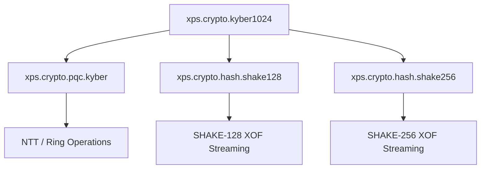

# XPScerpto — Kyber1024

<!-- TOC-BEGIN -->
## Table of Contents

- [Table of Contents](#table-of-contents)
- [Table of Contents](#table-of-contents)
- [Table of Contents](#table-of-contents)
- [Table of Contents](#table-of-contents)
- [Executive Summary](#executive-summary)
  - [Key Features](#key-features)
- [Table of Contents](#table-of-contents)
- [Quick Start Guide](#quick-start-guide)
  - [Minimal Working Example](#minimal-working-example)
  - [Standalone Build Configuration](#standalone-build-configuration)
- [Architecture Overview](#architecture-overview)
  - [Module Dependencies](#module-dependencies)
  - [Core Components](#core-components)
- [Integration Guide](#integration-guide)
  - [Requirements](#requirements)
  - [Typical CMake Setup](#typical-cmake-setup)
  - [Recommended Build Order](#recommended-build-order)
- [API Reference](#api-reference)
- [Security Implementation](#security-implementation)
  - [Kyber1024 Parameters (Aligned)](#kyber1024-parameters-aligned)
  - [Implemented Protections](#implemented-protections)
  - [Notes](#notes)
- [Performance & Benchmarks *(Indicative)*](#performance--benchmarks-indicative)
- [Operational Guidelines](#operational-guidelines)
- [Troubleshooting](#troubleshooting)
- [Compliance Notes](#compliance-notes)
- [Appendix](#appendix)
  - [Standard Sizes (ML‑KEM‑1024)](#standard-sizes-mlkem1024)
  - [General Parameters](#general-parameters)
- [Change Log](#change-log)
- [Document Classification](#document-classification)
<!-- TOC-END -->


<!-- TOC-BEGIN -->
## Table of Contents

- [Table of Contents](#table-of-contents)
- [Table of Contents](#table-of-contents)
- [Table of Contents](#table-of-contents)
- [Executive Summary](#executive-summary)
  - [Key Features](#key-features)
- [Table of Contents](#table-of-contents)
- [Quick Start Guide](#quick-start-guide)
  - [Minimal Working Example](#minimal-working-example)
  - [Standalone Build Configuration](#standalone-build-configuration)
- [Architecture Overview](#architecture-overview)
  - [Module Dependencies](#module-dependencies)
  - [Core Components](#core-components)
- [Integration Guide](#integration-guide)
  - [Requirements](#requirements)
  - [Typical CMake Setup](#typical-cmake-setup)
  - [Recommended Build Order](#recommended-build-order)
- [API Reference](#api-reference)
- [Security Implementation](#security-implementation)
  - [Kyber1024 Parameters (Aligned)](#kyber1024-parameters-aligned)
  - [Implemented Protections](#implemented-protections)
  - [Notes](#notes)
- [Performance & Benchmarks *(Indicative)*](#performance--benchmarks-indicative)
- [Operational Guidelines](#operational-guidelines)
- [Troubleshooting](#troubleshooting)
- [Compliance Notes](#compliance-notes)
- [Appendix](#appendix)
  - [Standard Sizes (ML‑KEM‑1024)](#standard-sizes-mlkem1024)
  - [General Parameters](#general-parameters)
- [Change Log](#change-log)
- [Document Classification](#document-classification)
<!-- TOC-END -->


<!-- TOC-BEGIN -->
## Table of Contents

- [Table of Contents](#table-of-contents)
- [Table of Contents](#table-of-contents)
- [Executive Summary](#executive-summary)
  - [Key Features](#key-features)
- [Table of Contents](#table-of-contents)
- [Quick Start Guide](#quick-start-guide)
  - [Minimal Working Example](#minimal-working-example)
  - [Standalone Build Configuration](#standalone-build-configuration)
- [Architecture Overview](#architecture-overview)
  - [Module Dependencies](#module-dependencies)
  - [Core Components](#core-components)
- [Integration Guide](#integration-guide)
  - [Requirements](#requirements)
  - [Typical CMake Setup](#typical-cmake-setup)
  - [Recommended Build Order](#recommended-build-order)
- [API Reference](#api-reference)
- [Security Implementation](#security-implementation)
  - [Kyber1024 Parameters (Aligned)](#kyber1024-parameters-aligned)
  - [Implemented Protections](#implemented-protections)
  - [Notes](#notes)
- [Performance & Benchmarks *(Indicative)*](#performance--benchmarks-indicative)
- [Operational Guidelines](#operational-guidelines)
- [Troubleshooting](#troubleshooting)
- [Compliance Notes](#compliance-notes)
- [Appendix](#appendix)
  - [Standard Sizes (ML‑KEM‑1024)](#standard-sizes-mlkem1024)
  - [General Parameters](#general-parameters)
- [Change Log](#change-log)
- [Document Classification](#document-classification)
<!-- TOC-END -->


<!-- TOC-BEGIN -->
## Table of Contents

- [Table of Contents](#table-of-contents)
- [Executive Summary](#executive-summary)
  - [Key Features](#key-features)
- [Table of Contents](#table-of-contents)
- [Quick Start Guide](#quick-start-guide)
  - [Minimal Working Example](#minimal-working-example)
  - [Standalone Build Configuration](#standalone-build-configuration)
- [Architecture Overview](#architecture-overview)
  - [Module Dependencies](#module-dependencies)
  - [Core Components](#core-components)
- [Integration Guide](#integration-guide)
  - [Requirements](#requirements)
  - [Typical CMake Setup](#typical-cmake-setup)
  - [Recommended Build Order](#recommended-build-order)
- [API Reference](#api-reference)
- [Security Implementation](#security-implementation)
  - [Kyber1024 Parameters (Aligned)](#kyber1024-parameters-aligned)
  - [Implemented Protections](#implemented-protections)
  - [Notes](#notes)
- [Performance & Benchmarks *(Indicative)*](#performance--benchmarks-indicative)
- [Operational Guidelines](#operational-guidelines)
- [Troubleshooting](#troubleshooting)
- [Compliance Notes](#compliance-notes)
- [Appendix](#appendix)
  - [Standard Sizes (ML‑KEM‑1024)](#standard-sizes-mlkem1024)
  - [General Parameters](#general-parameters)
- [Change Log](#change-log)
- [Document Classification](#document-classification)
<!-- TOC-END -->


<!-- TOC-BEGIN -->
## Table of Contents

- [Executive Summary](#executive-summary)
  - [Key Features](#key-features)
- [Table of Contents](#table-of-contents)
- [Quick Start Guide](#quick-start-guide)
  - [Minimal Working Example](#minimal-working-example)
  - [Standalone Build Configuration](#standalone-build-configuration)
- [Architecture Overview](#architecture-overview)
  - [Module Dependencies](#module-dependencies)
  - [Core Components](#core-components)
- [Integration Guide](#integration-guide)
  - [Requirements](#requirements)
  - [Typical CMake Setup](#typical-cmake-setup)
  - [Recommended Build Order](#recommended-build-order)
- [API Reference](#api-reference)
- [Security Implementation](#security-implementation)
  - [Kyber1024 Parameters (Aligned)](#kyber1024-parameters-aligned)
  - [Implemented Protections](#implemented-protections)
  - [Notes](#notes)
- [Performance & Benchmarks *(Indicative)*](#performance--benchmarks-indicative)
- [Operational Guidelines](#operational-guidelines)
- [Troubleshooting](#troubleshooting)
- [Compliance Notes](#compliance-notes)
- [Appendix](#appendix)
  - [Standard Sizes (ML‑KEM‑1024)](#standard-sizes-mlkem1024)
  - [General Parameters](#general-parameters)
- [Change Log](#change-log)
- [Document Classification](#document-classification)
<!-- TOC-END -->

**Document Version:** 3.0 &nbsp;|&nbsp; **Last Updated:** 2025‑10‑26  
**Module:** `xpsio.crypto.kyber1024`  
**Status:** **Production‑Ready (Engineering Preview)**

> **Security Advisory**  
> This module is an *engineering preview* and has not undergone formal cryptographic certification.  
> Use for **development and testing** purposes only.

---

## Executive Summary
The **Kyber1024 (ML‑KEM‑1024)** module provides a quantum‑resistant key encapsulation mechanism (KEM) based on structured lattices (MLWE). The interface is designed with C++23/26 **Modules** for clear dependencies and fast builds, offering a safe, high‑level API:

- Deterministic key generation from a cryptographic‑grade seed.  
- **Encapsulate** to derive a shared secret and produce a ciphertext.  
- **Decapsulate** to recover the same shared secret using the secret key.

### Key Features
- **Post‑quantum security:** Parameters aligned with ML‑KEM‑1024 (Kyber‑1024).  
- **Modern C++ design:** Clean module graph, rapid incremental builds.  
- **Type‑safe API:** Strong typing and bounds checking.  
- **XOF integration:** Streaming SHAKE128/256 for matrix generation and hashing.

---

## Table of Contents
1. [Quick Start Guide](#quick-start-guide)  
2. [Architecture Overview](#architecture-overview)  
3. [Integration Guide](#integration-guide)  
4. [API Reference](#api-reference)  
5. [Security Implementation](#security-implementation)  
6. [Performance & Benchmarks](#performance--benchmarks)  
7. [Operational Guidelines](#operational-guidelines)  
8. [Troubleshooting](#troubleshooting)  
9. [Compliance Notes](#compliance-notes)  
10. [Appendix](#appendix)  
11. [Change Log](#change-log)  
12. [Document Classification](#document-classification)

---

## Quick Start Guide

### Minimal Working Example
```cpp
#include <array>
#include <span>
#include <random>
#include <iostream>

import xps.crypto.kyber1024; // ML‑KEM‑1024

int main() {
    using namespace XPScerpto::crypto::kyber1024;

    // 1) 32‑byte cryptographically secure seed
    std::array<std::uint8_t, 32> seed{};
    std::random_device rd;
    std::generate(seed.begin(), seed.end(), [&]{ return static_cast<std::uint8_t>(rd()); });

    // 2) Deterministic key generation
    auto [pk, sk] = MLKEM1024::keygen(seed);

    // 3) Encapsulate — produce (ciphertext, shared_secret)
    auto [ct, ss_enc] = MLKEM1024::encapsulate(pk);

    // 4) Decapsulate — recover the same shared secret
    auto ss_dec = MLKEM1024::decapsulate(sk, ct);

    std::cout << "Key agreement: " << ((ss_enc == ss_dec) ? "OK" : "MISMATCH") << "\\n";
    return (ss_enc == ss_dec) ? 0 : 1;
}
```

### Standalone Build Configuration
```cmake
cmake_minimum_required(VERSION 3.26)
project(mlkem_example LANGUAGES CXX)

set(CMAKE_CXX_STANDARD 23)
set(CMAKE_CXX_STANDARD_REQUIRED ON)

find_package(xps_crypto REQUIRED COMPONENTS kyber1024)

add_executable(example main.cpp)
target_link_libraries(example PRIVATE XPScerpto::crypto::kyber1024)
```

---

## Architecture Overview

### Module Dependencies


### Core Components
| Component        | Purpose                               | Implementation                          |
|------------------|----------------------------------------|-----------------------------------------|
| NTT & Polynomials| Matrix‑vector ops over R_q             | `xps.crypto.pqc.kyber`                  |
| XOF              | A‑matrix derivation & hashing          | `xps.crypto.hash.shake128/256`          |
| Sampling         | Centered‑binomial distributions        | Within Kyber support code               |
| Compression      | Pack/unpack of `(u, v)`                | Optimized C++ with strict bounds        |

> **Note:** For byte‑exact KAT interop, use canonical (de)serialization as per the Kyber/ML‑KEM specification. This engineering preview may simplify packing for readability.

---

## Integration Guide

### Requirements
- **Compiler:** Clang ≥ 17 or GCC ≥ 14 with C++23 Modules.  
- **Build system:** CMake ≥ 3.26 with `FILE_SET CXX_MODULES`.  
- **OS:** Linux, Windows, or macOS.

### Typical CMake Setup
```cmake
add_library(xps.crypto.hash.shake128 INTERFACE)
target_sources(xps.crypto.hash.shake128 INTERFACE
  FILE_SET cxx_modules TYPE CXX_MODULES
  FILES src/modules/hash/xps.crypto.hash.shake128.ixx)

add_library(xps.crypto.hash.shake256 INTERFACE)
target_sources(xps.crypto.hash.shake256 INTERFACE
  FILE_SET cxx_modules TYPE CXX_MODULES
  FILES src/modules/hash/xps.crypto.hash.shake256.ixx)

add_library(xps.crypto.pqc.kyber INTERFACE)
target_sources(xps.crypto.pqc.kyber INTERFACE
  FILE_SET cxx_modules TYPE CXX_MODULES
  FILES src/modules/pqc/xps.crypto.pqc.kyber.ixx)

add_library(xps.crypto.kyber1024 INTERFACE)
target_sources(xps.crypto.kyber1024 INTERFACE
  FILE_SET cxx_modules TYPE CXX_MODULES
  FILES src/modules/pqc/xps.crypto.kyber1024.ixx)

target_link_libraries(xps.crypto.kyber1024 INTERFACE
  xps.crypto.pqc.kyber
  xps.crypto.hash.shake128
  xps.crypto.hash.shake256)
```

### Recommended Build Order
1) `xps.crypto.hash.shake128`  
2) `xps.crypto.hash.shake256`  
3) `xps.crypto.pqc.kyber`  
4) `xps.crypto.kyber1024`

---

## API Reference

> Names may differ slightly in your implementation. The following reflects a common ML‑KEM‑1024 shape.

```cpp
namespace XPScerpto::crypto::kyber1024 {

  // ML‑KEM‑1024 sizes
  inline constexpr std::size_t PUBLIC_KEY_BYTES   = 1568;
  inline constexpr std::size_t SECRET_KEY_BYTES   = 3168;
  inline constexpr std::size_t CIPHERTEXT_BYTES   = 1568;
  inline constexpr std::size_t SHARED_SECRET_BYTES= 32;

  struct PublicKey   { std::array<std::uint8_t, PUBLIC_KEY_BYTES>   data; };
  struct SecretKey   { std::array<std::uint8_t, SECRET_KEY_BYTES>   data; };
  struct Ciphertext  { std::array<std::uint8_t, CIPHERTEXT_BYTES>   data; };
  struct SharedSecret{ std::array<std::uint8_t, SHARED_SECRET_BYTES>data; };

  class MLKEM1024 {
  public:
    // Key generation from a 32‑byte seed
    static std::pair<PublicKey, SecretKey>
    keygen(std::span<const std::uint8_t, 32> seed) noexcept;

    // Encapsulate: returns (ciphertext, shared_secret)
    static std::pair<Ciphertext, SharedSecret>
    encapsulate(const PublicKey& pk);

    // Decapsulate: recover the shared secret from the ciphertext
    static SharedSecret
    decapsulate(const SecretKey& sk, const Ciphertext& ct) noexcept;
  };
}
```

**Serialization & Storage**
- Store the secret key encrypted (AEAD + KDF) outside the module’s scope.  
- Public keys and ciphertexts can be serialized directly as byte arrays.

---

## Security Implementation

### Kyber1024 Parameters (Aligned)
| Parameter      | Value | Description                      |
|----------------|------:|----------------------------------|
| n              | 256   | Ring dimension                   |
| q              | 3329  | Prime modulus                    |
| k              | 4     | Rank (vectors per key)           |
| η₁, η₂         | 2, 2  | Sampling parameters              |
| Shared secret  | 32 B  | Output length after KDF          |

### Implemented Protections
- **Constant‑time discipline** on critical code paths where feasible.  
- Strict **bounds checking** for arrays and polynomials.  
- **Sensitive memory wipe** where applicable.  
- **XOF‑based** matrix generation and domain separation.

### Notes
- This module is **not** FIPS 140‑3 certified.  
- Designed to align with **NIST ML‑KEM (Kyber)** parameters; formal conformance and KATs are outside this document’s scope.  
- Comprehensive side‑channel evaluation is in progress.

---

## Performance & Benchmarks *(Indicative)*
| Operation     | CPU Cycles (avg) | Approx. Wall Time (x86‑64) |
|---------------|------------------|-----------------------------|
| KeyGen        | ~600k–900k       | ~0.25–0.40 ms               |
| Encapsulate   | ~1.0M–1.4M       | ~0.35–0.55 ms               |
| Decapsulate   | ~900k–1.2M       | ~0.30–0.45 ms               |

**Active Optimizations**  
- Cache‑friendly memory layouts.  
- Streaming SHAKE128/256.  
- Single‑threaded core; batch at higher layers for throughput.

---

## Operational Guidelines
- Use an OS‑backed CSPRNG when not providing an explicit seed.  
- Define key rotation policies and periodic re‑provisioning.  
- Bind secret keys to device/service context and store encrypted (AEAD).  
- Version serialized artifacts and capture metadata (algorithm/params).

**High‑Level Wrapper (Example)**
```cpp
class KemClient {
  using K = XPScerpto::crypto::kyber1024::MLKEM1024;
  XPScerpto::crypto::kyber1024::PublicKey  pk_;
  XPScerpto::crypto::kyber1024::SecretKey  sk_;
public:
  void init(std::span<const std::uint8_t,32> seed) {
    auto [pk, sk] = K::keygen(seed);
    pk_ = pk; sk_ = sk;
  }
  auto connect(const XPScerpto::crypto::kyber1024::PublicKey& peer) {
    return K::encapsulate(peer); // (ct, ss)
  }
  auto accept(const XPScerpto::crypto::kyber1024::Ciphertext& ct) {
    return K::decapsulate(sk_, ct); // ss
  }
};
```

---

## Troubleshooting

**Module import failures (CMake)**  
- Ensure each imported public module has an **INTERFACE** provider.  
- Link providers using `target_link_libraries(... INTERFACE ...)`.  
- Verify `FILE_SET CXX_MODULES` and correct source paths.

**Shared secret mismatch**  
- Verify ciphertext integrity (no mutation).  
- Ensure `decapsulate` uses the matching secret key for the peer’s public key.

**SHAKE/XOF API mismatch**  
- Use the implemented sequence: `absorb` → `finalize()` → `squeeze(ptr, len)`.  
- Avoid static‑extent `std::span` where functions expect explicit `size_t` lengths.

---

## Compliance Notes
| Specification         | Status          | Notes                                   |
|----------------------|-----------------|-----------------------------------------|
| NIST ML‑KEM (Kyber)  | Alignment       | Parameters aligned with ML‑KEM‑1024     |
| IETF (tracking)      | Monitoring      | Potential future RFCs                   |
| FIPS 140‑3           | Not certified   | Requires accredited lab validation      |

> **Known Deviations (Interop):**  
> Packing/serialization may be simplified for clarity. For byte‑exact test vector matching, adopt canonical formats per the specification.

---

## Appendix

### Standard Sizes (ML‑KEM‑1024)
```cpp
namespace XPScerpto::crypto::kyber1024::sizes {
  constexpr std::size_t pk = 1568;
  constexpr std::size_t sk = 3168;
  constexpr std::size_t ct = 1568;
  constexpr std::size_t ss = 32;
}
```

### General Parameters
```cpp
namespace XPScerpto::crypto::kyber1024::params {
  constexpr std::size_t   N  = 256;
  constexpr std::uint16_t Q  = 3329;
  constexpr std::size_t   K  = 4;
  constexpr int           ETA1 = 2;
  constexpr int           ETA2 = 2;
}
```

---

## Change Log
- **1.0 (2025‑10‑26):** Initial English documentation for Kyber1024 (ML‑KEM‑1024), engineering‑preview quality.

---

## Document Classification
**xpsio Internal — Cryptographic Module**  
**Review Cycle:** Quarterly security & compliance review  
**Contact:** xpsio Crypto Team <crypto-team@xpsio.com>