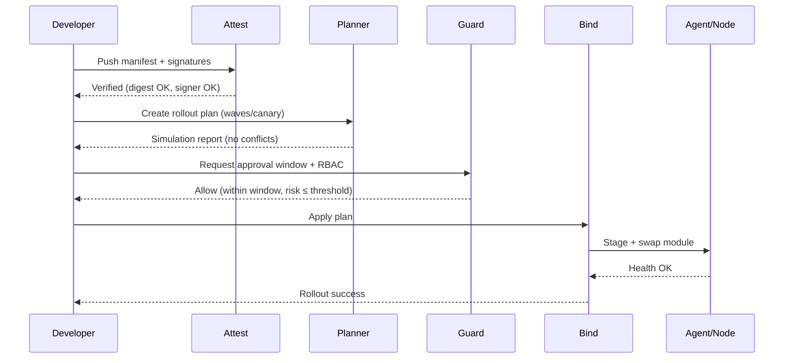

# XPScerpto — Orchestrator

<!-- TOC-BEGIN -->
## Table of Contents

- [Table of Contents](#table-of-contents)
- [Executive Summary](#executive-summary)
- [Table of Contents](#table-of-contents)
- [Quick Start](#quick-start)
  - [Minimal Orchestration (Conceptual)](#minimal-orchestration-conceptual)
- [Architecture](#architecture)
  - [Modules & Responsibilities](#modules--responsibilities)
- [Configuration](#configuration)
  - [1) Patch Manifest (`patch_manifest.json`)](#1-patch-manifest-patchmanifestjson)
  - [2) Trust Store (`trust_store.json`)](#2-trust-store-truststorejson)
  - [3) Policy (`orchestrator.policy.yaml`)](#3-policy-orchestratorpolicyyaml)
  - [4) Rollout Plan (`rollout_plan.yaml`)](#4-rollout-plan-rolloutplanyaml)
- [Rollout Workflows](#rollout-workflows)
  - [A. Hot‑Patch (Zero‑Downtime)](#a-hotpatch-zerodowntime)
  - [B. Key Rotation](#b-key-rotation)
- [Integration (CMake/Modules)](#integration-cmakemodules)
- [Operational Practices](#operational-practices)
- [Troubleshooting](#troubleshooting)
- [Compliance & Audit](#compliance--audit)
- [Appendix](#appendix)
  - [Module Names Detected](#module-names-detected)
  - [Glossary](#glossary)
<!-- TOC-END -->


<!-- TOC-BEGIN -->
## Table of Contents

- [Executive Summary](#executive-summary)
- [Table of Contents](#table-of-contents)
- [Quick Start](#quick-start)
  - [Minimal Orchestration (Conceptual)](#minimal-orchestration-conceptual)
- [Architecture](#architecture)
  - [Modules & Responsibilities](#modules--responsibilities)
- [Configuration](#configuration)
  - [1) Patch Manifest (`patch_manifest.json`)](#1-patch-manifest-patchmanifestjson)
  - [2) Trust Store (`trust_store.json`)](#2-trust-store-truststorejson)
  - [3) Policy (`orchestrator.policy.yaml`)](#3-policy-orchestratorpolicyyaml)
  - [4) Rollout Plan (`rollout_plan.yaml`)](#4-rollout-plan-rolloutplanyaml)
- [Rollout Workflows](#rollout-workflows)
  - [A. Hot‑Patch (Zero‑Downtime)](#a-hotpatch-zerodowntime)
  - [B. Key Rotation](#b-key-rotation)
- [Integration (CMake/Modules)](#integration-cmakemodules)
- [Operational Practices](#operational-practices)
- [Troubleshooting](#troubleshooting)
- [Compliance & Audit](#compliance--audit)
- [Appendix](#appendix)
  - [Module Names Detected](#module-names-detected)
  - [Glossary](#glossary)
<!-- TOC-END -->

**Document Version:** 1.0 &nbsp;|&nbsp; **Last Updated:** 2025-10-26  
**Modules:** `xps.crypto.orchestrator.attest`, `xps.crypto.orchestrator.bind`, `xps.crypto.orchestrator.guard`, `xps.crypto.orchestrator.planner`  
**Status:** **Production‑Lean (Engineering Preview)**

> **Security Advisory**  
> This orchestrator is intended for controlled environments and has not undergone formal certification.  
> Use with staged rollouts, auditing enabled, and strong trust policies.

---

## Executive Summary
The XPS Orchestrator coordinates **secure hot‑patching**, **key rotation**, and **policy‑driven deployments** across your crypto stack.
It separates concerns into four modules:

- **Planner** — builds and simulates rollout plans (waves, canaries, maintenance windows).  
- **Guard** — enforces policy/RBAC/compliance gates and evaluates risk before apply.  
- **Attest** — verifies patch integrity and provenance (signatures, digests, SBOM/metadata).  
- **Bind** — connects repositories/installers/agents to execute the plan with zero‑downtime semantics.

Together they provide an auditable, cryptographically enforced change pipeline.

---

## Table of Contents
1. [Quick Start](#quick-start)  
2. [Architecture](#architecture)  
3. [Configuration](#configuration)  
4. [Rollout Workflows](#rollout-workflows)  
5. [Integration (CMake/Modules)](#integration-cmakemodules)  
6. [Operational Practices](#operational-practices)  
7. [Troubleshooting](#troubleshooting)  
8. [Compliance & Audit](#compliance--audit)  
9. [Appendix](#appendix)

---

## Quick Start

### Minimal Orchestration (Conceptual)
```cpp
import xps.crypto.orchestrator.attest;
import xps.crypto.orchestrator.guard;
import xps.crypto.orchestrator.planner;
import xps.crypto.orchestrator.bind;

int main() {
    using namespace XPScerpto::crypto::orchestrator;

    // 1) Attest: verify manifest + artifacts before planning
    // attest::Verifier verifier = attest::Verifier::from_trust_store("trust_store.json");
    // auto manifest = attest::load_manifest("patch_manifest.json");
    // verifier.require_all(manifest).or_throw();

    // 2) Plan: build rollout plan with waves and canary
    // planner::Plan plan = planner::Plan::from_yaml("rollout_plan.yaml");
    // plan.validate().or_throw();
    // plan.simulate().print_report(std::cout);

    // 3) Guard: evaluate policy gates (RBAC, time windows, risk)
    // guard::Policy p = guard::Policy::from_yaml("orchestrator.policy.yaml");
    // guard::GateResult g = guard::evaluate(p, plan, manifest);
    // if (!g.allow) return 1;

    // 4) Bind: execute via repository + installer adapters
    // bind::Repo repo = bind::Repo::filesystem("/srv/xps/patches");
    // bind::Installer inst = bind::Installer::dynamic();
    // bind::Runner runner(repo, inst);
    // runner.apply(plan, manifest).watch().await();

    return 0;
}
```

> **Note:** Function/class names above are illustrative to show the **control flow** (Attest → Plan → Guard → Bind). Consult your headers for exact symbols.

---

## Architecture

### Modules & Responsibilities
```mermaid
flowchart LR
  A[attest] -- verify --> P[planner]
  P -- emit plan --> G[guard]
  G -- gate allow/deny --> B[bind]
  B -- apply, monitor, rollback --> N[Nodes/Agents]

  subgraph Control Plane
    A
    P
    G
    B
%% par/and/end removed
  subgraph Data Plane
    N
%% par/and/end removed
```

- **`xps.crypto.orchestrator.attest`**  
  Trust store loading, signature verification (developer keys, org CA), digest trees, SBOM hints.
- **`xps.crypto.orchestrator.planner`**  
  Wave definition, canaries, dependency ordering, maintenance windows, concurrency limits, dry‑run simulation.
- **`xps.crypto.orchestrator.guard`**  
  Policy evaluation (RBAC, environment allowlists, time‑based windows), risk thresholding, approval workflows.
- **`xps.crypto.orchestrator.bind`**  
  Repository adapters (filesystem/object store), installer adapters (dynamic module, package), agent coordination, health checks, rollback.

---

## Configuration

### 1) Patch Manifest (`patch_manifest.json`)
```json
{
  "id": "xps-hotpatch-2025-10-26",
  "version": "3.2.1",
  "artifacts": [
    { "name": "xps.crypto.hash.sha256.so", "sha256": "<hex>", "sig": "base64(signature)" },
    { "name": "xps.crypto.hash.shake256.so", "sha256": "<hex>", "sig": "base64(signature)" }
  ],
  "targets": ["validator", "api", "wallet"],
  "metadata": {
    "sbom": "sbom.spdx.json",
    "min_orchestrator": "1.2.0",
    "requires_restart": false
  }
}
```

### 2) Trust Store (`trust_store.json`)
```json
{
  "trusted_signers": [
    { "name": "XPS Release", "ed25519": "public-key-hex" },
    { "name": "Security Hotfix", "ed25519": "public-key-hex" }
  ],
  "min_required_signatures": 1,
  "allow_unsigned": false
}
```

### 3) Policy (`orchestrator.policy.yaml`)
```yaml
rbac:
  required_approvals: 2
  roles:
    - name: security_officer
      approve: ["hotfix", "critical"]
    - name: release_manager
      approve: ["minor", "patch"]

windows:
  allowed:
    - days: [Mon, Tue, Wed, Thu]
      start: "20:00"
      end:   "23:00"
      tz: "Europe/Berlin"

risk:
  max_score: 7
  deny_on:
    - missing_sbom: true
    - unsigned_artifact: true
```

### 4) Rollout Plan (`rollout_plan.yaml`)
```yaml
strategy:
  canary:
    percentage: 5
    halt_on_error: true
  waves:
    - name: wave-1
      match: ["region:eu-central", "tier:canary"]
      concurrency: 10
    - name: wave-2
      match: ["region:eu-*"]
      concurrency: 50
    - name: wave-3
      match: ["*"]
      concurrency: 200
health_check:
  probe: "http+tls://{host}:8443/healthz"
  success_threshold: 3
  failure_threshold: 2
rollback:
  on:
    - probe_timeout
    - policy_violation
  strategy: immediate
```

---

## Rollout Workflows

### A. Hot‑Patch (Zero‑Downtime)


### B. Key Rotation
- Attest rotation bundle (`keyring.json`, signatures)
- Plan staged rollout (control plane first, then data plane)
- Guard ensures quorum approvals + maintenance window
- Bind applies rotation and validates live traffic decryption/signing

---

## Integration (CMake/Modules)

```cmake
# Example: Expose orchestrator modules as public C++ modules
add_library(xps.crypto.orchestrator INTERFACE)

target_sources(xps.crypto.orchestrator INTERFACE
  FILE_SET cxx_modules TYPE CXX_MODULES FILES
    orchestrator/xps.crypto.orchestrator.attest.ixx
    orchestrator/xps.crypto.orchestrator.bind.ixx
    orchestrator/xps.crypto.orchestrator.guard.ixx
    orchestrator/xps.crypto.orchestrator.planner.ixx
)

# Consumers
add_executable(orchestrator_example src/main.cpp)
target_link_libraries(orchestrator_example PRIVATE xps.crypto.orchestrator)
```

**Build Tips**
- Precompile crypto/hashing modules your adapters depend on.  
- Keep orchestrator as a thin control‑plane dependency in apps; field agents can be separate.

---

## Operational Practices

- **Staging First:** Always dry‑run and canary before global waves.  
- **Quorum Approvals:** Enforce RBAC with dual‑control for critical patches.  
- **Immutable Artifacts:** Store artifacts and manifests in a content‑addressed repo.  
- **Audit Everything:** Enable JSONL audit logs and ship to SIEM (indices: patch id, node, result).  
- **Rollbacks:** Keep N‑1 artifacts staged for instant rollback on probe failure.  
- **Time Windows:** Align with SRE windows; block weekends unless critical.  

---

## Troubleshooting

**Attestation fails (UNTRUSTED_SIGNER)**  
- Verify `trust_store.json` keys.  
- Check signature algorithm/encoding.  
- Mismatch between manifest ID and signature scope.

**Guard denies (WINDOW_VIOLATION / RBAC_MISSING)**  
- Ensure current time falls into allowed windows (TZ matters).  
- Obtain missing approvals; verify roles in policy file.

**Rollout stalls on health checks**  
- Tune `success_threshold`/`failure_threshold`.  
- Verify probes (TLS certs, host allowlists, port reachability).

**Installer errors**  
- Validate target ABI and module naming.  
- Ensure agent has permission to stage and swap binaries.

---

## Compliance & Audit

- **Audit Log (JSONL)**
```json
{
  "ts": "2025-10-26T20:31:00Z",
  "patch": "xps-hotpatch-2025-10-26",
  "node": "validator-17",
  "wave": "wave-1",
  "action": "APPLY",
  "result": "SUCCESS",
  "sha256": "<digest>",
  "signers": ["XPS Release"],
  "policy": {"rbac": true, "window": true, "risk_score": 3}
}
```

- **Retention:** 1–3 years depending on regulation.  
- **PII:** Keep node IDs pseudonymous if exporting to external systems.  
- **Time Sync:** Enforce NTP/PTP sync on control and data plane nodes.

---

## Appendix

### Module Names Detected
- `xps.crypto.orchestrator.attest`  
- `xps.crypto.orchestrator.bind`  
- `xps.crypto.orchestrator.guard`  
- `xps.crypto.orchestrator.planner`

### Glossary
- **Canary:** Small subset of nodes for early failure detection.  
- **Wave:** Grouped rollout step with its own concurrency/criteria.  
- **Gate:** A policy check that must pass before proceeding.  
- **Attestation:** Cryptographic verification of artifact authenticity/integrity.

---

**Contact:** xpsio Crypto Team <crypto-team@xpsio.com>  
**Classification:** xpsio Internal — Orchestration Control Plane