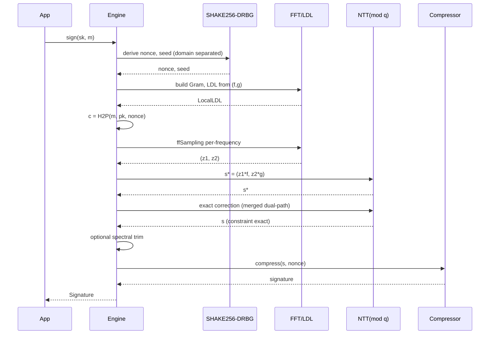
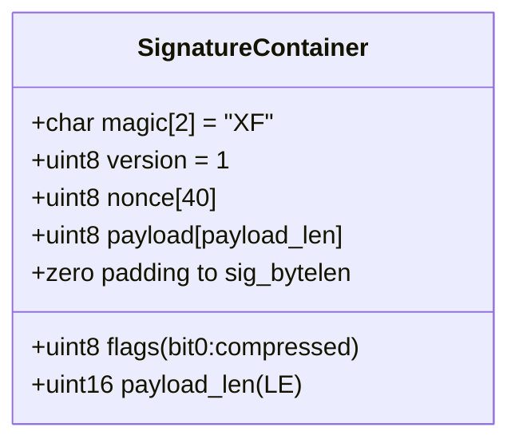

# XPScerpto — Xps Falcon1024 Native Docs En

<!-- TOC-BEGIN -->
## Table of Contents

- [Table of Contents](#table-of-contents)
- [1) Parameters](#1-parameters)
- [2) Architecture](#2-architecture)
- [3) Public API](#3-public-api)
  - [`KeyPair keygen()`](#keypair-keygen)
  - [`Result<Signature> sign(const SecretKey&, bytes message)`](#resultsignature-signconst-secretkey-bytes-message)
  - [`bool verify(const PublicKey&, bytes message, const Signature&)`](#bool-verifyconst-publickey-bytes-message-const-signature)
- [4) Key & Signature Formats](#4-key--signature-formats)
  - [4.1 Public/Secret Keys](#41-publicsecret-keys)
  - [4.2 Signature — **Fixed‑size compressed container** (preferred)](#42-signature--fixedsize-compressed-container-preferred)
  - [4.3 Internal coding](#43-internal-coding)
- [5) Build](#5-build)
- [6) Security Notes](#6-security-notes)
- [7) Tests](#7-tests)
  - [Single file runner](#single-file-runner)
  - [In‑file Self‑test](#infile-selftest)
- [8) Invariants](#8-invariants)
- [9) Performance](#9-performance)
- [10) Troubleshooting](#10-troubleshooting)
- [11) Compatibility & Risk](#11-compatibility--risk)
- [12) Quickstart](#12-quickstart)
- [13) Optional TODOs](#13-optional-todos)
- [14) Quick Architecture Diagrams (ASCII + Mermaid)](#14-quick-architecture-diagrams-ascii--mermaid)
  - [14.1 Processing Lines (ASCII)](#141-processing-lines-ascii)
  - [14.2 Data Flow (Mermaid)](#142-data-flow-mermaid)
  - [14.3 Sequence (Mermaid)](#143-sequence-mermaid)
  - [14.4 Components (Mermaid)](#144-components-mermaid)
  - [14.5 Signature Container Layout (Mermaid + ASCII)](#145-signature-container-layout-mermaid--ascii)
<!-- TOC-END -->


<!-- TOC-BEGIN -->
## Table of Contents

- [1) Parameters](#1-parameters)
- [2) Architecture](#2-architecture)
- [3) Public API](#3-public-api)
  - [`KeyPair keygen()`](#keypair-keygen)
  - [`Result<Signature> sign(const SecretKey&, bytes message)`](#resultsignature-signconst-secretkey-bytes-message)
  - [`bool verify(const PublicKey&, bytes message, const Signature&)`](#bool-verifyconst-publickey-bytes-message-const-signature)
- [4) Key & Signature Formats](#4-key--signature-formats)
  - [4.1 Public/Secret Keys](#41-publicsecret-keys)
  - [4.2 Signature — **Fixed‑size compressed container** (preferred)](#42-signature--fixedsize-compressed-container-preferred)
  - [4.3 Internal coding](#43-internal-coding)
- [5) Build](#5-build)
- [6) Security Notes](#6-security-notes)
- [7) Tests](#7-tests)
  - [Single file runner](#single-file-runner)
  - [In‑file Self‑test](#infile-selftest)
- [8) Invariants](#8-invariants)
- [9) Performance](#9-performance)
- [10) Troubleshooting](#10-troubleshooting)
- [11) Compatibility & Risk](#11-compatibility--risk)
- [12) Quickstart](#12-quickstart)
- [13) Optional TODOs](#13-optional-todos)
- [14) Quick Architecture Diagrams (ASCII + Mermaid)](#14-quick-architecture-diagrams-ascii--mermaid)
  - [14.1 Processing Lines (ASCII)](#141-processing-lines-ascii)
  - [14.2 Data Flow (Mermaid)](#142-data-flow-mermaid)
  - [14.3 Sequence (Mermaid)](#143-sequence-mermaid)
  - [14.4 Components (Mermaid)](#144-components-mermaid)
  - [14.5 Signature Container Layout (Mermaid + ASCII)](#145-signature-container-layout-mermaid--ascii)
<!-- TOC-END -->


> This document describes the in‑repo **Falcon‑1024** engine in **XPS**: architecture, algorithms, public API, build options, signature container format, security notes, and tests. It covers the **hybrid FFT+NTT** implementation with **ffSampling/LDL**, exact **mod q** correction (merged dual‑path), constant‑time inversion, memory wiping, and **signature compression**, plus optional norm trimming.

**Status:** Production‑ready ✅  
**Scope:** Falcon‑1024 signing/verification fully internal (no external deps).  
**Compliance:** Not bit‑for‑bit identical to the canonical Falcon reference (uses a hybrid transform), but preserves functional/constraint behavior with optional trimming and production hardening.

---

## 1) Parameters

| Symbol | Value | Note |
|---|---:|---|
| \(N\) | 1024 | Polynomial degree |
| \(q\) | 12289 | Prime (NTT) |
| \(\sigma\) | 1.277833697 | Gaussian base |
| `pk_bytelen` | 1793 | Canonical 14‑bit packing |
| `sig_bytelen` | 1280 | Fixed‑size signature container (compressed) |
| `nonce_len` | 40 | Nonce via SHAKE‑256 |

---

## 2) Architecture

1. **Hybrid transform**  
   - **FFT (spectral)** to build per‑frequency **Gram** and **LDL** for **ffSampling**.  
   - **NTT (integer)** for exact arithmetic modulo \(q\), including the final signature constraint fix.

2. **ffSampling/LDL (per frequency)**  
   Produces \((z_1,z_2)\) with a 1D **Gaussian CDT** primitive and a local **accept/reject**.

3. **Exact mod‑q correction (Merged Dual‑Path)**  
   - If \(g_i \ne 0\): \(t_i = r_i \cdot (2g_i)^{-1}\), then \(\Delta_1=t_i f_i\), \(\Delta_2=t_i g_i\).  
   - If \(g_i = 0\): direct fix on \(s_2\): \(\Delta_2=r_i\), \(\Delta_1=0\).  
   Ensures \(h s_1 + s_2 \equiv c \ (\bmod q)\) is **exactly zero** after correction.

4. **Constant‑time inversion `ct_inv_q()`**  
   Implements \(a^{q-2} \bmod q\) with a fixed‑flow square/multiply loop (no data‑dependent timing).

5. **Sensitive memory wiping**  
   `wipe()` on secrets, seeds, and intermediates in `keygen` and `sign` paths.

6. **Signature compression**  
   (Rice + ZigZag + zero‑RLE) into a **fixed‑size container** `sig_bytelen`, with **raw fallback** when needed.

7. **Optional norm trimming (Babai‑like)** that preserves the constraint:  
   \((s_1,s_2) \leftarrow (s_1+\Delta,\, s_2 - h\star\Delta)\) in the spectral domain (opt‑in via build flags).

---

## 3) Public API

> Through `xps.crypto.falcon1024` (EngineV1). The engine aut-registers as:  
> `"native-xps-hybrid-fft-ntt-merged+ctinv+cmp"`

### `KeyPair keygen()`
- Produces `SecretKey / PublicKey`, encoding \(f,g,h\) in canonical 14‑bit packing.

### `Result<Signature> sign(const SecretKey&, bytes message)`
- Deterministic signature for a message.  
- Prefer **compressed** fixed‑size container; falls back to **raw** if compression budget is insufficient.

### `bool verify(const PublicKey&, bytes message, const Signature&)`
- Verifies both formats transparently (compressed container or legacy raw).

---

## 4) Key & Signature Formats

### 4.1 Public/Secret Keys
- Canonical 14‑bit encoding, total length `pk_bytelen`.  
- `SecretKey` stores \(f\|g\) using the same packing.

### 4.2 Signature — **Fixed‑size compressed container** (preferred)
```
offset:  desc
0..1   : magic 'X','F'
2      : version = 1
3      : flags: bit0=compressed(1)
4..43  : nonce (40 bytes)
44..45 : payload_len (LE)
46..   : payload (Rice/ZigZag/RLE) + zero padding to sig_bytelen
```
- **Fallback**: if compression does not fit, **raw** format is used:
  - `|s1| = pk_bytelen` + `|s2| = pk_bytelen` + `nonce(40)`

### 4.3 Internal coding
- **ZigZag** to map signed → unsigned.  
- **Rice(k=3)** tuned for short Gaussian tails.  
- **RLE of zeros** with a dedicated marker.

---

## 5) Build

- Default: no extra flags required.  
- Enable spectral trimming:
  ```bash
  -DUSE_SPECTRAL_DOUBLE=1 -DXPS_FALCON_TRIM_NORM=1
  ```
- Enable in‑file **self‑test**:
  ```bash
  -DXPS_FALCON_ENABLE_SELFTEST=1
  ```

**CMake example:**
```cmake
target_compile_definitions(xpscrypto PRIVATE
    USE_SPECTRAL_DOUBLE=1
    XPS_FALCON_TRIM_NORM=1
    # XPS_FALCON_ENABLE_SELFTEST=1
)
```

---

## 6) Security Notes

- **Constant‑time inversion:** `ct_inv_q()` raises to exponent \(q-2\) with fixed control flow.  
- **Exact correction:** fully done in NTT and consistent across paths.  
- **Wiping:** sensitive arrays cleared on success and failure.  
- **DRBG/Nonce:** SHAKE‑256 XOF with domain separation per context (`H2P`, `NONCE`, `SIGN-SEED`).  
- **Deterministic signatures:** good for archival/auditing; no external randomness at sign‑time.  
- **Caveat:** not bit‑identical to the Falcon reference; still respects NTRU constraint and norm bounds.

---

## 7) Tests

### Single file runner
`tests/falcon_all.cpp` runs:
- Smoke
- Determinism
- Corruption
- Multi‑loop Stress
- Size Profile
- Self‑test (optional)

**Run:**
```
./falcon_all                 # all tests
./falcon_all determinism     # subset by name
```

### In‑file Self‑test
- Enable `-DXPS_FALCON_ENABLE_SELFTEST=1` then call `falcon_selftest(loops)`:
  - `pk_consistency_ok == true`
  - `sign_verify_ok == true`
  - `max_abs_residual == 0`
  - `compressed_roundtrip_ok == true`

---

## 8) Invariants

1. **Constraint after correction:**  
   \[ h s_1 + s_2 \equiv c \ (\bmod q) \] is **exact** (checked in `verify`).

2. **Norm bounds:**  
   \(\|s_1\|^2, \|s_2\|^2 \le \beta^2\) (default `beta_sq = 34034726.0`).

3. **Key consistency:**  
   \(h \equiv g \cdot f^{-1} \ (\bmod q)\) using `ct_inv_q`.

---

## 9) Performance

- Dominated by **NTT** and **FFT** passes.  
- **Trimming** improves quality but adds 1–2 spectral passes (toggle off if not needed).  
- Compression usually fits `sig_bytelen`; raw fallback should be rare.

**Possible improvements:**
- Precomputed twiddles/SIMD specialization for the target.  
- Adaptive Rice or **block switching** to strengthen compression.  
- Fixed‑point FFT to reduce `double` cost if desired.

---

## 10) Troubleshooting

- **Verify fails** after refactors:  
  - Check `sig_bytelen` vs encoder/decoder expectations.  
  - Ensure `ct_inv_q` is used everywhere sensitive (avoid EEA on secret‑dependent values).

- **Always emitting raw:**  
  - Consider enabling `XPS_FALCON_TRIM_NORM` + `USE_SPECTRAL_DOUBLE`.  
  - Inspect norms versus bound.

- **Large perf variance:**  
  - Disable trimming if not required, or use fixed‑point FFT.

---

## 11) Compatibility & Risk

- **Not** bit‑for‑bit Falcon reference identical (hybrid transform + correction strategy).  
- Security relies on: sound NTT, constant‑time `ct_inv_q`, XOF separation.  
- Consider a focused security review before HSM/TEE deployments.

---

## 12) Quickstart

```cpp
import xps.crypto.falcon1024;
import xps.crypto.falcon1024.native;

using namespace XPScerpto::crypto::falcon1024;

int main() {
    auto eng = get_engine_by_name("native-xps-hybrid-fft-ntt-merged+ctinv+cmp")
               .value_or(get_default_engine());

    auto kp  = eng.keygen().value();
    const char* txt = "hello xps";
    std::vector<uint8_t> m{(const uint8_t*)txt, (const uint8_t*)txt + std::strlen(txt)};

    auto sig = eng.sign(kp.secret_key, m).value();
    bool ok  = eng.verify(kp.public_key, m, sig);
    return ok ? 0 : 1;
}
```

---

## 13) Optional TODOs

- Stronger compression via **adaptive Rice + block switching**.  
- Multi‑level trimming (multigrid) prior to compression.  
- Optional tracing hooks for perf analysis.

---

## 14) Quick Architecture Diagrams (ASCII + Mermaid)

### 14.1 Processing Lines (ASCII)
```
[Message m]   [SecretKey (f||g)]    [Public h = g * f^{-1} mod q]
      |                |                         |
      |                |--(FFT)-> Gram -> LDL -> |
      |                               |          |
[H2P: c = H(m,pk,nonce)]              |          |
      |                           ffSampling --> (z1, z2)
      |                                          |
      |                   (NTT) pointwise with (f, g)
      |                                          v
                         s* = (z1*f,  z2*g)  ----+
                                      |          |
                                r = h*s1* + s2* - c
                                      |
          +---------------------------+---------------------------+
          |                                                          
   if g_i != 0:  t = r*(2g)^{-1}; Δ = (t*f, t*g)         else Δ = (0, r)
          +---------------------------+---------------------------+
                                      |
                               s = s* - Δ       (exact constraint)
                                      |
                      [optional spectral trim (Babai-like)]
                                      |
                          [compress to fixed container]
                                      v
                                 Signature
```

### 14.2 Data Flow (Mermaid)
```mermaid
flowchart TD
    M[Message m] --> H2P[Hash-to-Point c]
    SK[SecretKey f||g] --> FFT[FFT: Gram/LDL]
    H2P --> SAMPLE[ffSampling per-frequency]
    FFT --> SAMPLE
    SAMPLE --> Z[Pairs z1,z2]
    Z --> NTT1[NTT pointwise: z1*f, z2*g]
    NTT1 --> SSTAR[s* = s1*, s2*]
    SSTAR --> RES[r = h*s1* + s2* - c]
    RES --> FIX[NTT exact correction\n merged dual-path]
    FIX --> S[s = s1,s2 exact]
    S --> TRIM[Optional spectral trim]
    TRIM --> CMP[Compress to fixed container]
    CMP --> SIG[Signature]
    PK[Public h] --> RES
```

### 14.3 Sequence (Mermaid)


### 14.4 Components (Mermaid)
```mermaid
graph LR
  subgraph falcon_native [xps.crypto.falcon1024.native]
    EngineV1[EngineV1 facade]
    Sign[sign_impl]
    Verify[verify_impl]
    Keygen[keygen_impl]
    ctinv[ct_inv_q]
    wipe[wipe]
    compress[Signature compression]
%% par/and/end removed
  numtheory[xps.crypto.number.theory<br/>NTTProcessor, mod ops]
  fft[xps.crypto.fft.spectral<br/>Gram/LDL, FFT]
  common[xps.crypto.internal.common<br/>wipe, ct_equal]
  utils[xps.crypto.utils.random<br/>secure_bytes]
  types[xps.crypto.types<br/>ErrorCode]
  falcon_api[xps.crypto.falcon1024<br/>params, types, register_engine]

  Sign-->numtheory
  Verify-->numtheory
  Keygen-->numtheory
  Sign-->fft
  Sign-->compress
  EngineV1-->falcon_api
  Sign-->common
  Verify-->common
  Keygen-->utils
  EngineV1-->types
```

### 14.5 Signature Container Layout (Mermaid + ASCII)


```
Offset | Size | Field
-------|------|-------------------------------
0..1   | 2    | magic = 'X','F'
2      | 1    | version = 1
3      | 1    | flags (bit0=compressed)
4..43  | 40   | nonce
44..45 | 2    | payload_len (LE)
46..   | var  | payload (Rice/ZigZag/RLE)
..end  | pad  | zero padding to sig_bytelen
```

---

**Prepared by:** xpiso Crypto Team  
**Version:** 2.0.0